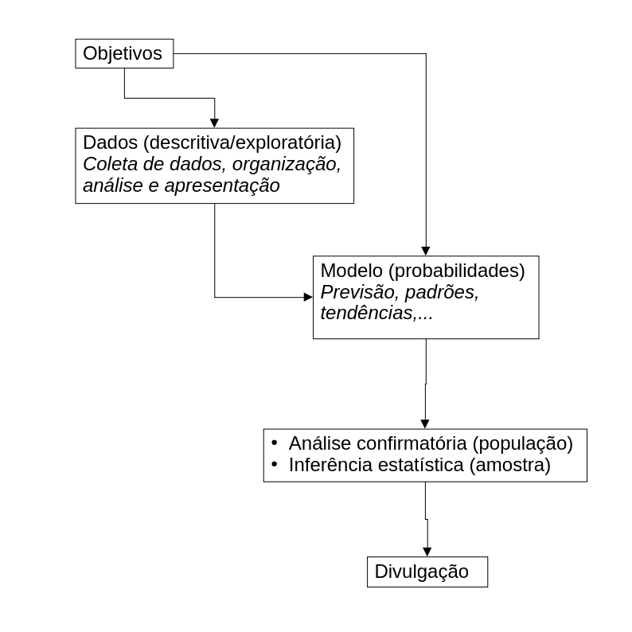
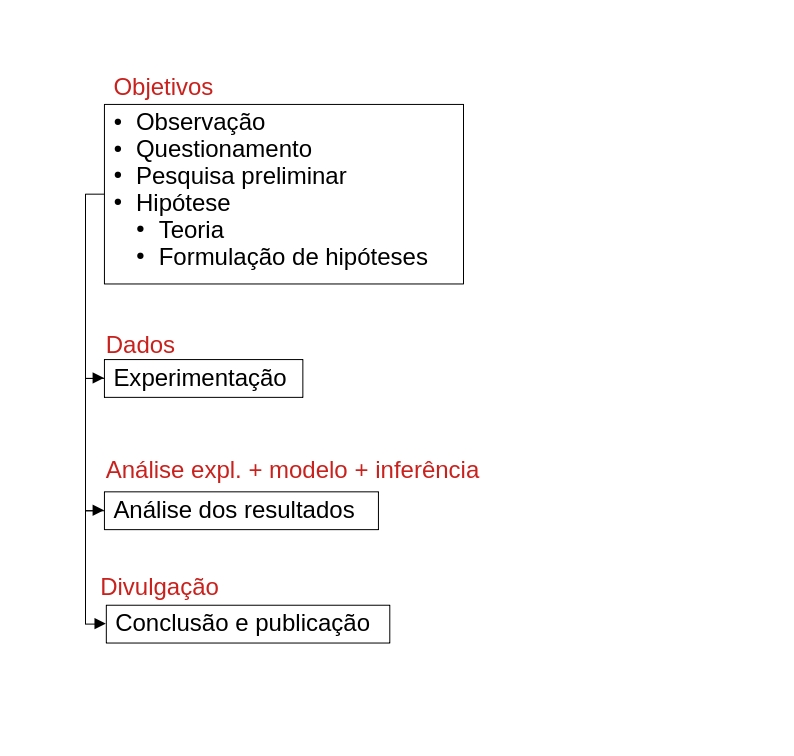
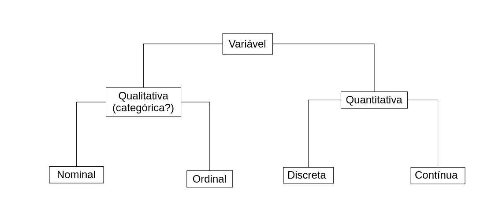
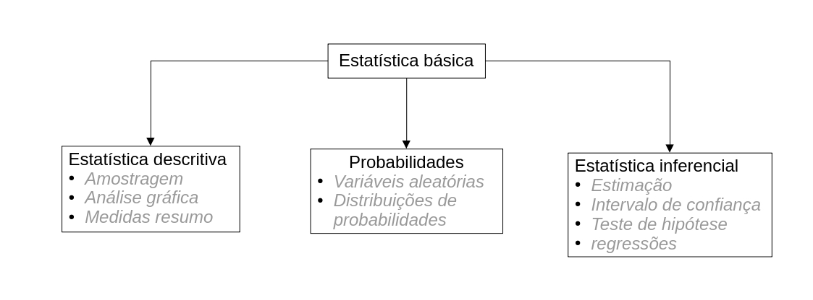

# O que é a estatística?

> Parte da matemática responsável pela coleta, organização, descrição, análise e interpretação de dados e sua utilização na tomada de decisão [@Crespo2009].

{width=80%}

# O método científico

{width=80%}

# Estabelecendo os objetivos da pesquisa

1. Qual é a pergunta da pesquisa?

    - Aulas demonstrativas auxiliam na aprendizagem dos alunos?
    - Caso sim, a aprendizagem melhora com a idade ou gênero dos alunos?

2. Qual é o sujeito de interesse?

    - Alunos do ensino médio no Brasil;
  
    - Alunos do IFPR, campus Irati.
  
3. Qual é a população desse sujeito?

    - Todos os alunos do ensino médio no Brasil;
  
    - Alunos do IFPR, campus Irati.
  
4. Existe a necessidade de fazer amostram?

    - Sim
    - Não
    
5. Quantos dados devo obter? Qual o tamanho da amostra?

6. Como devo obter os dados?

7. Quais características de interesse dos indivíduos (variáveis) serão obtidas?

    - Nota dos alunos
    
8. Quais informações da população devo obter?

    - Média, mediana, moda, variância, proporção e frequência
    
# Variáveis

## O que são variáveis em estatística?

São características do indivíduo da população e que podem assumir valores diferentes de um indivíduo para o outro.

{width=80%}

# Estatística descritiva

{width=80%}

## O que é estatística descritiva?

Emprega métodos numéricos afim de descrever e resumir um conjunto de dados obtidos a partir de uma amostra ou população.