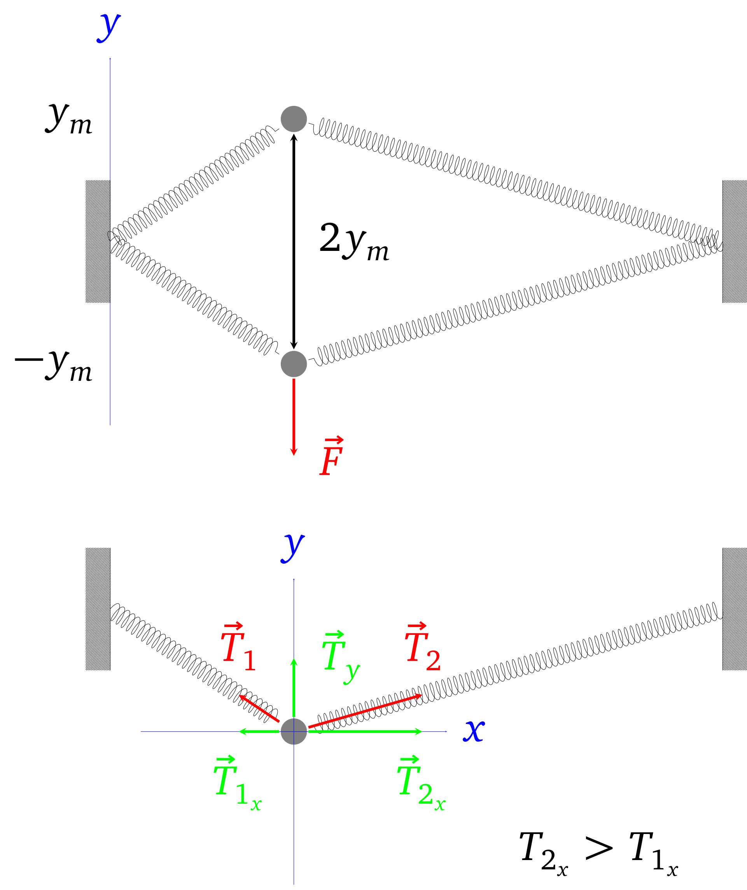
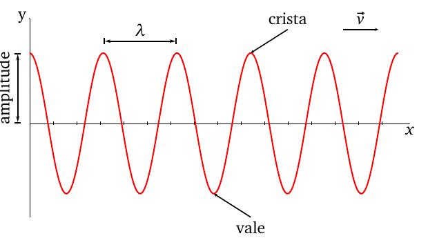
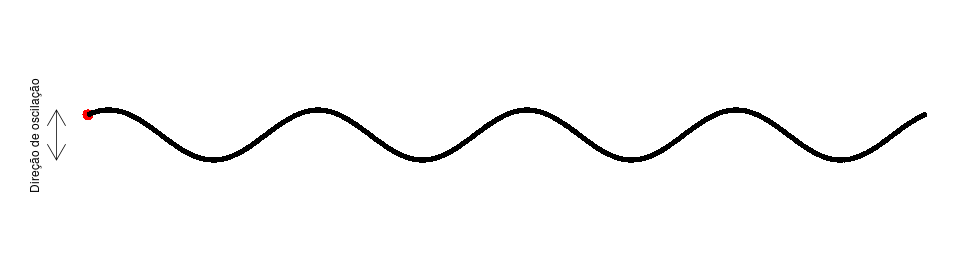
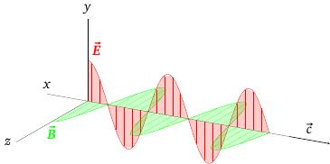

layout: true
background-size: contain

<div class="my-footer"><span>Flaviano Williams Fernandes</span></div>

```{r, include=FALSE, eval=FALSE, echo=FALSE}
  xaringan::inf_mr()
```

```{r setup, include=FALSE}
  options(htmltools.dir.version = FALSE)
  library("ggplot2")
  library("gganimate")
  library("latex2exp")
#  knitr::opts_chunk$set(fig.path = 'img')
```

```{r, load_refs, echo=FALSE, message=FALSE}
  library(RefManageR)
  BibOptions(check.entries = FALSE, bib.style = "authoryear", style = "markdown",
           dashed = TRUE)
  bib <- ReadBib("references.bib", check = FALSE)
```

---
class: middle

<div class="my-header"><span>Sumário</span></div>

.pull-left[

1. Ondas progressivas
  + Pulso em uma corda
  + Formação de uma onda progressiva
  + Tipos de onda

2. A equação da onda

3. Reflexão e refração da onda

4. O princípio da superposição
  * Interferência
  * Fasores e o plano complexo
  * Ondas estacionárias
  * Pacotes de onda
]
.pull-right[
<ol start="5">
<li> Apêndice A

<li> Bibliografia
</ol>
]

<div class="footnote">
  <ul>
  <hr>
  <li> Esta apresentação está disponível para download em <a href="https://flavianowilliams.github.io/education">flavianowilliams.github.io/education</a>;
  <li> Este material está sujeito a modificações. Recomenda-se acompanhamento permanente.
  </ul>
</div>

---
class: middle

<div class="my-header"><span>Ondas progressivas - Pulso em uma corda</span></div>

.pull-left[
* As forças nas direções x e y produz um pulso de energia que se propaga na horizontal com velocidade $\vec{v}$;

* O pulso propaga energia mas não propaga matéria;

* A força na direção y	produz um movimento harmônico simples que faz oscilar o fragmento da mola de massa m na vertical.
```{r, echo=FALSE, fig.align='center',fig.cap='Origem de um pulso em uma corda elástica.',out.width="90%",fig.asp=1,fig.ncol=2}
  knitr::include_graphics("img/pulso.gif")
```
]
.pull-right[
```{r, echo=FALSE, fig.align='center',fig.cap='Propagação de um pulso em uma corda elástica.',out.width="90%",fig.asp=1,fig.ncol=2}
  
```
]

---
class: middle

<div class="my-header"><span>Ondas progressivas - Formação de uma onda progressiva</span></div>

.pull-left[
* Uma onda progressiva é formada a partir de vários pulsos se propagando em um meio na mesma direção e com a mesma velocidade.

* O intervalo de tempo entre dois pulsos corresponde ao período do MHS na direção vertical

* A distância entre dois pulsos corresponde ao comprimento de onda
```{r, echo=FALSE, fig.align='center',fig.cap='Características de uma onda progressiva.',out.width="80%",fig.asp=1,fig.ncol=2}
  
```
]
.pull-right[
```{r, echo=FALSE, fig.align='center',fig.cap='Vários pulsos se propagando com a mesma velocidade.',out.width="100%",fig.asp=1,fig.ncol=2}
  
```
Uma onda progressiva possui as seguintes propriedades:
* Amplitude $y_m$: A mesma amplitude da oscilação vertical.
* Frequência $\nu$: A mesma frequência da oscilação vertical.
* Comprimento de onda $\lambda$: Distância que a onda percorre durante um período T.

Sendo v a velocidade da onda e T o período, temos por MRU que $\lambda = vT$, e sabendo que $T=1/\nu$ teremos
\begin{align}
 \boxed{v = \lambda\nu}
\end{align}
]

---
class: middle

<div class="my-header"><span>Ondas progressivas - Tipos de onda</span></div>

* As ondas mecânicas necessitam de um meio material para se propagar, enquanto que as ondas eletromagnéticas se propagam no vácuo;

* Chamamos de ondas longitudinais aquelas onde a direção de oscilação é paralela a direção de propagação (Exemplo: som);

* Chamamos de ondas transversais aquelas onde a direção de oscilação é perpendicular a direção de propagação (Exemplo: ondas na corda).

.pull-left[
```{r, echo=FALSE, fig.align='center',fig.cap='Onda eletromagnética formada a partir da propagação de duas ondas transversais referentes a amplitude de oscilação dos campos elétrico e magnético.',out.width="90%",fig.asp=1,fig.ncol=2}
  
```
]
.pull-right[
```{r, echo=FALSE, fig.align='center',fig.cap='Representações de ondas longitudinal e transversal.',out.width="85%",fig.asp=1,fig.ncol=2}
  knitr::include_graphics("img/ondas.jpeg")
```
]

---
class: middle

<div class="my-header"><span>A equação da onda</span></div>

---
class: middle

<div class="my-header"><span>Refração e reflexão de uma onda</span></div>

---
class: middle

<div class="my-header"><span>O princípio da superposição</span></div>

---
class: middle

<div class="my-header"><span>O princípio da superposição - Interferência</span></div>

---
class: middle

<div class="my-header"><span>O princípio da superposição - Fasores e o plano complexo</span></div>

---
class: middle

<div class="my-header"><span>O princípio da superposição - Ondas estacionárias</span></div>

---
class: middle

<div class="my-header"><span>O princípio da superposição - Pacotes de onda</span></div>

---
class: middle

<div class="my-header"><span>Bibliografia</span></div>

```{r, results='asis', echo=FALSE, message=FALSE}
PrintBibliography(bib)
```

