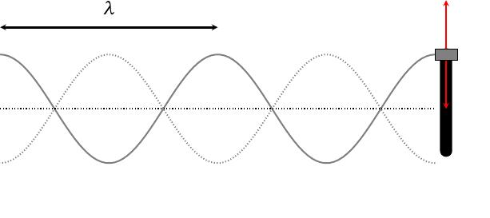

layout: true
background-size: contain

<div class="my-footer"><span>Flaviano Williams Fernandes</span></div>

```{r, include=FALSE, eval=FALSE, echo=FALSE}
  xaringan::inf_mr()
```

```{r setup, include=FALSE}
  options(htmltools.dir.version = FALSE)
  library("ggplot2")
  library("gganimate")
  library("latex2exp")
#  knitr::opts_chunk$set(fig.path = 'img')
```

```{r, load_refs, echo=FALSE, message=FALSE}
  library(RefManageR)
  BibOptions(check.entries = FALSE, bib.style = "authoryear", style = "markdown",
           dashed = TRUE)
  bib <- ReadBib("references.bib", check = FALSE)
```

---
class: middle

<div class="my-header"><span>Sumário</span></div>

.pull-left[

1. Ondas progressivas
  + Pulso em uma corda
  + Formação de uma onda progressiva
  + Tipos de onda

2. A equação da onda

3. Reflexão e refração da onda

4. O princípio da superposição
  * Interferência
  * Fasores e o plano complexo
  * Ondas estacionárias
  * Pacotes de onda
]
.pull-right[
<ol start="5">
<li> Apêndice A

<li> Bibliografia
</ol>
]

<div class="footnote">
  <ul>
  <hr>
  <li> Esta apresentação está disponível para download em <a href="https://flavianowilliams.github.io/education">flavianowilliams.github.io/education</a>;
  <li> Este material está sujeito a modificações. Recomenda-se acompanhamento permanente.
  </ul>
</div>

---
class: middle

<div class="my-header"><span>Ondas progressivas - Pulso em uma corda</span></div>

.pull-left[
* As forças nas direções x e y produz um pulso de energia que se propaga na horizontal com velocidade $\vec{v}$;

* O pulso propaga energia mas não propaga matéria;

* A força na direção y	produz um movimento harmônico simples que faz oscilar o fragmento da mola de massa m na vertical.
```{r, echo=FALSE, fig.align='center',fig.cap='Origem de um pulso em uma corda elástica.',out.width="90%",fig.asp=1,fig.ncol=2}
  knitr::include_graphics("img/pulso.gif")
```
]
.pull-right[
```{r, echo=FALSE, fig.align='center',fig.cap='Propagação de um pulso em uma corda elástica.',out.width="90%",fig.asp=1,fig.ncol=2}
  knitr::include_graphics("img/pulso.jpeg")
```
]

---
class: middle

<div class="my-header"><span>Ondas progressivas - Formação de uma onda progressiva</span></div>

.pull-left[
* Uma onda progressiva é formada a partir de vários pulsos se propagando em um meio na mesma direção e com a mesma velocidade.

* O intervalo de tempo entre dois pulsos corresponde ao período do MHS na direção vertical

* A distância entre dois pulsos corresponde ao comprimento de onda
```{r, echo=FALSE, fig.align='center',fig.cap='Características de uma onda progressiva.',out.width="80%",fig.asp=1,fig.ncol=2}
  
```
]
.pull-right[
```{r, echo=FALSE, fig.align='center',fig.cap='Vários pulsos se propagando com a mesma velocidade.',out.width="100%",fig.asp=1,fig.ncol=2}
  knitr::include_graphics("img/wave.gif")
```
Uma onda progressiva possui as seguintes propriedades:
* Amplitude $y_m$: A mesma amplitude da oscilação vertical.
* Frequência $\nu$: A mesma frequência da oscilação vertical.
* Comprimento de onda $\lambda$: Distância que a onda percorre durante um período T.

Sendo v a velocidade da onda e T o período, temos por MRU que $\lambda = vT$, e sabendo que $T=1/\nu$ teremos
\begin{align}
 \boxed{v = \lambda\nu}
\end{align}
]

---
class: middle

<div class="my-header"><span>Ondas progressivas - Tipos de onda</span></div>

* As ondas mecânicas necessitam de um meio material para se propagar, enquanto que as ondas eletromagnéticas se propagam no vácuo;

* Chamamos de ondas longitudinais aquelas onde a direção de oscilação é paralela a direção de propagação (Exemplo: som);

* Chamamos de ondas transversais aquelas onde a direção de oscilação é perpendicular a direção de propagação (Exemplo: ondas na corda).

.pull-left[
```{r, echo=FALSE, fig.align='center',fig.cap='Onda eletromagnética formada a partir da propagação de duas ondas transversais referentes a amplitude de oscilação dos campos elétrico e magnético.',out.width="90%",fig.asp=1,fig.ncol=2}
  knitr::include_graphics("img/onda-eletromagnetica.jpeg")
```
]
.pull-right[
```{r, echo=FALSE, fig.align='center',fig.cap='Representações de ondas longitudinal e transversal.',out.width="85%",fig.asp=1,fig.ncol=2}
  knitr::include_graphics("img/ondas.jpeg")
```
]

---
class: middle

<div class="my-header"><span>A função de onda - o número de onda k</span></div>

.pull-left[
Analisando o movimento da onda, podemos dizer que o movimento vertical por ser um MHS a amplitude da onda deve ser uma função senoidal do tempo, do tipo $y\sim \cos\omega t$, e sabendo que a onda se propaga na direção x, então a amplitude da onda também deve também apresentar uma dependência da posição x. Portanto, a função no qual descreve a amplitude da onda (que chamamos de "função de onda") deve ser uma função de duas variáves, x e t,
\begin{align}
  y \equiv y(x,t).
\end{align}

Existem várias maneiras de obter a expressão $y(x,t)$. Aqui usaremos uma estratégia muito empregada por físicos para a solução de problemas. Primeiramente iremos obter uma equação matemática (que a princípio é uma equação diferencial contendo derivadas em sua expressão), no qual a partir da sua solução encontraremos $y(x,t)$.
]
.pull-right[
Observando a onda, onde para cada instante de tempo teremos uma curva senoidal ao longo de x, então a amplitude da onda deverá se repetir para cada distância $\lambda$, de modo que
\begin{align}
  y_m\cos kx = y_m\cos k(x+\lambda),
\end{align}
onde k é uma constante arbitrária. Portanto
\begin{align}
  y_m\cos kx = y_m\cos (kx+k\lambda).
\end{align}
De acordo com o comportamento periódico da função cosseno, podemos ver que a igualdade será satisfeita se $k\lambda = 2\pi$, ou seja,
\begin{align}
  k = \frac{2\pi}{\lambda}\quad\text{(número de onda)}.
\end{align}
O parâmetro k é chamado de número de onda e sua a unidade no SI é o radiano por metro
ou $m^{-1}$.
]

---
class: middle

<div class="my-header"><span>A função de onda - a velocidade da onda</span></div>

.pull-left[
Supondo que a função de onda deve possuir como variáveis independentes x e t, e considerando que as seguintes condições devem acontecer
\begin{align}
  y(x,0) & = y_m\cos (kx-\phi),\\
  y(0,t) & = y_m\cos (\omega t - \phi'),
\end{align}
então podemos imaginar que a função $y(x,t)$ deve ser algo do tipo
\begin{align}
  y(x,t) \Rightarrow \cos kx\cos \omega t.
\end{align}
Usando a identidade $\cos A\cos B = \frac{1}{2}(\cos (A+B) + \cos (A-B))$ podemos dizer que
\begin{align}
  y(x,t) \Rightarrow \cos (kx + \omega t)+ \cos (kx - \omega t),
\end{align}
onde $A = kx$ e $B = \omega t$. Portanto
\begin{align}
  y(x,t) = y_m\cos (kx + \omega t)+ y_m\cos (kx - \omega t).
\end{align}
]
.pull-right[
Assim para qualquer onda, onde a sua amplitude se repete a cada intervalo $kx \pm \omega t$, podemos supor pela característica de periodicidade da função cosseno que
\begin{align}
  kx\pm\omega t = \text{constante}.
\end{align}
Derivando em relação ao tempo o primeiro termo, onde $kx-\omega t$, teremos
\begin{align}
 k\frac{dx}{dt}-\omega & = 0,\\
 \frac{dx}{dt} = \frac{\omega}{k}.
\end{align}
Sabendo que $\frac{dx}{dt}=v$, onde v é a velocidade da onda e $k = \frac{2\pi}{\lambda}$ e $\omega = 2\pi\nu$, teremos
\begin{align}
 v = \frac{\omega}{k} = \lambda\nu\quad\text{(velocidade da onda)}.
\end{align}
Para $kx+\omega t$ teremos $v=-\lambda\nu$, ou seja, uma onda se propagando no sentido contrário.
]

---
class: middle

<div class="my-header"><span>A equação da onda</span></div>

.pull-left[
Supomos que na figura anterior, temos uma pequena parte da mola de comprimento dx e massa dm, onde $dm=\mu dx$, e $\mu$ é a densidade de massa. Podemos dizer que ao aplicar a segunda lei de Newton para o seu movimento vertical teremos a sequinte expressão abaixo,
\begin{align}
  T_{2y}+T_{1y} = dma_y.
\end{align}
Se que a mola estiver esticada próxima ao seu começo, podemos sugerir que $T_1<<T_2$, portanto
\begin{align}
  T_{2y} \approx \mu dxa_y.
\end{align}
Porém podemos ver que $\frac{T_{2y}}{T_{2x}}=\tan\theta$. E pela definição de derivada teremos $\tan\theta = \frac{dy}{dx}$. Assim
\begin{align}
  T_{2y} & = T_{2x}\left(\frac{dy}{dx}\right).
\end{align}
]
.pull-right[
```{r, echo=FALSE, fig.align='center',fig.cap='Propagação de um pulso em uma corda elástica.',out.width="90%",fig.asp=1,fig.ncol=2}
  knitr::include_graphics("img/pulso2.jpeg")
```
]

---
class: middle

<div class="my-header"><span>A equação da onda (continuação)</span></div>

.pull-left[
Substituindo $T_{2y}$ definido anteriormente
\begin{align}
  T_{2x}\left(\frac{dy}{dx}\right) \approx \mu dxa_y.
\end{align}
Supondo que a amplitude da onda é muito pequena em relação ao comprimento da mola, onde $T_{2x}\approx T_2$, então
\begin{align}
  T_{2}\left(\frac{dy}{dx}\right) & = \mu dxa_y,\\
  \frac{dy}{dx} & = \left(\frac{\mu}{T_2}\frac{d^2y}{dt^2}\right)dx.
\end{align}
Pela definição de derivada chegamos a conclusão que
\begin{align}
  \frac{d^2y}{dx^2} & = \frac{\mu}{T_2}\frac{d^2y}{dt^2},\\
  \frac{\partial^2y}{\partial x^2} & = \frac{1}{v^2}\frac{\partial^2y}{\partial t^2},\quad\text{(equação da onda)},
\end{align}
onde v é a velocidade da onda na mola (veja o apêndice).
]
.pull-right[
```{r, echo=FALSE, fig.align='center',fig.cap='Propagação de um pulso em uma corda elástica.',out.width="90%",fig.asp=1,fig.ncol=2}
  knitr::include_graphics("img/pulso.jpeg")
```
]

---
class: middle

<div class="my-header"><span>A equação da onda (continuação)</span></div>

.pull-left[
Vamos verificar se $y(x,t)$ satisfaz a equação da onda. Primeiramente, vamos representá-la em uma forma mais geral, onde a mesma pode ter uma fase inicial $\phi$,
\begin{align}
  y(x,t) = y_m\cos (kx - \omega t+\phi)
\end{align}
Derivando em relação x e t teremos
\begin{align}
  \frac{\partial y(x,t)}{\partial x} & = -k\sin (kx-\omega t+\phi),\\
  \frac{\partial^2 y(x,t)}{\partial x^2} & = -k^2\cos (kx-\omega t+\phi),\\
  \frac{\partial y(x,t)}{\partial t} & = \omega\sin (kx-\omega t+\phi),\\
  \frac{\partial^2 y(x,t)}{\partial t^2} & = -\omega^2\cos (kx-\omega t+\phi).
\end{align}
Substitundo na equação da onda teremos
\begin{align}
  -k^2\cos (kx-\omega t+\phi) = \frac{-\omega^2}{v^2}\cos (kx-\omega t+\phi)
\end{align}
]
.pull-right[
Cancelando os termos remanescentes em ambos os lados da equação chegaremos a
\begin{align}
  k^2 & = \frac{\omega^2}{v^2},\\
  v^2 & = \frac{\omega^2}{k^2}.
\end{align}
Assim podemos perceber que $y(x,t)$ somente satisfaz a equação se $v=\pm\frac{\omega}{k}$, o que é verdade, como foi demonstrado anteriormente.

O mesmo é válido para a função $y(x,t)=y_m\cos (kx+\omega t+\phi)$. Substituindo na equação de onda teremos a equação abaixo,
\begin{align}
  -k^2\cos (kx+\omega t+\phi) = \frac{-\omega^2}{v^2}\cos (kx+\omega t+\phi),
\end{align}
ou seja, somente será solução da equação se $v=\pm \frac{\omega}{k}$.
]

---
class: middle

<div class="my-header"><span>Reflexão de uma onda</span></div>

# Reflexão da onda

* Na extremidade móvel, o pulso é refletido e retorna igual ao pulso incidente;
* Na extremidade fixa, o pulso é refletido e retorna invertido ao pulso incidente;
* Numa corda com ambas as extremidades fixas ou móveis, somente pode existir números inteiros de comprimentos de onda.

.pull-left[
```{r, echo=FALSE, fig.align='center',fig.cap='Extremidade móvel. A onda se propaga livremente na corda, e para manter o seu movimento ela é refletida para a esquerda.',out.width="90%",fig.asp=1,fig.ncol=2}
  
```
]
.pull-right[
```{r, echo=FALSE, fig.align='center',fig.cap='Extremidade fixa. Afim de satisfazer a conservação do momento, a onda refletida deve estar em sentido oposto ao onda incidente.',out.width="90%",fig.asp=1,fig.ncol=2}
  
```
]

---
class: middle

<div class="my-header"><span>Refração de uma onda</span></div>

# Refração da onda

* A velocidade de uma onda diminui quando ela atravessa o meio 1 (mais fino) para o meio 2 (mais grosso) (v2 < v1);
* O comprimento de onda também diminui quando ela atravessa um meio mais fino para o mais grosso, λ2 < λ1;
* Parte do pulso é refratado e parte é refletido;
* A frequência é a mesma da fonte geradora do pulso, portanto ela não se altera no processo.

.pull-left[
```{r, echo=FALSE, fig.align='center',fig.cap='Propagação de um pulso em uma corda elástica.',out.width="100%",fig.asp=1,fig.ncol=2}
  
```
]
.pull-right[
```{r, echo=FALSE, fig.align='center',fig.cap='Propagação de um pulso em uma corda elástica.',out.width="100%",fig.asp=1,fig.ncol=2}
  
```
]

---
class: middle

<div class="my-header"><span>O princípio da superposição - Definição</span></div>

# Princípio da superposição

*"Qualquer combinação linear de soluções também é solução."*

.pull-left[
```{r, echo=FALSE, fig.align='center',fig.cap='Interferência construtiva.',out.width="80%",fig.asp=1,fig.ncol=2}
  
```
]
.pull-right[
```{r, echo=FALSE, fig.align='center',fig.cap='Interferência destrutiva.',out.width="80%",fig.asp=1,fig.ncol=2}
  
```
]

---
class: middle

<div class="my-header"><span>O princípio da superposição - Regra dos fasores</span></div>

.pull-left[
A soma de duas ondas da forma indicada no slide anterior só pode ser executada se as ondas tiverem a mesma amplitude. Caso as ondas tenham o **mesmo número de onda**, **frequência** e **velocidade**, porém com amplitudes diferentes e uma defasagem $\phi$ entre ambas, precisamos recorrer a métodos mais gerais. Um desses métodos é o uso de fasores para representar as ondas, que a princípio usa técnica de adição de vetores. Considere duas ondas com o número de onda $k$ e frequência $\omega$, a função de onda de ambas é dada por
\begin{align}
y_1(x,t) & = y_{m1}\cos (kx-\omega t)\Rightarrow y_{m1}\cos\theta_1,\\
y_2(x,t) & = y_{m2}\cos (kx-\omega t+\phi)\Rightarrow y_{m2}\cos\theta_2.
\end{align}
Porém, representando no plano cartesiano, podemos considerar que o termo cosseno seria a projeção do vetor $\vec{y}_1$ no eixo x, ou seja, $y_{1x}$, etc. Assim, podemos dizer que a onda resultante $y$, onde $y(x,t)=y_1(x,t)+y_2(x,t)$ seria
]
.pull-right[
\begin{align}
y(x,t) & = y_{m1}\cos\theta_1+y_{m2}\cos\theta_2,\\
y(x,t) & = y_{1_{x}}+y_{2_{x}}.
\end{align}
Pela regra do paralelogramo temos que
\begin{align}
|\vec{y}|^2 & = |\vec{y}_1|^2+|\vec{y}_2|^2+2|\vec{y}_1||\vec{y}_2|\cos\phi,\\
y_{m}^2 & = y_{m1}^2+y_{m2}^2+2y_{m1}y_{m2}\cos\phi,
\end{align}
onde $y_{m}$, $y_{m1}$ e $y_{m2}$ são os módulos dos vetores.

```{r, echo=FALSE, fig.align='center',fig.cap='Regra dos fasores aplicado a dois vetores.',out.width="100%",fig.asp=1,fig.ncol=2}
  
```
]

---
class: middle

<div class="my-header"><span>O princípio da superposição - Interferência</span></div>

.pull-left[
Pela regra dos fasores podemos perceber que a amplitude de duas ondas com a mesma velocidade, número de onda e frequência poderá atingir um valor máximo ou mínimo. A partir da equação anterior, que representa a amplitude máxima da onda resultante, teremos
\begin{align}
y_{m}^2 & = y_{m1}^2+y_{m2}^2+2y_{m1}y_{m2}\cos\phi.
\end{align}
Pela propriedade da função cosseno, podemos perceber que $y_m$ será mínimo (*interferência destrutiva*) se o terceiro termo for zero, e sabendo que $y_{m1}\neq 0$ e $y_{m2}\neq 0$, isso somente é possível se $\cos\phi = -1$. Situação idêntica também acontece quando $y_m$ assume um valor máximo (*interferência construtiva*), onde somente é possível se $\cos\phi = 1$. Pelas propriedades da função cosseno temos que isso poderá acontecer se
\begin{align}
\phi = \begin{cases}
						n\lambda & \text{(Construtiva)},\\
						\left(n+\frac{1}{2}\right)\lambda & \text{(Destrutiva)},
					\end{cases}
\end{align}
]
.pull-right[
onde n é um número inteiro. Para outros valores de $\phi$, $y_m$ irá assumir valores entre $|y_{m1}-y_{m2}|$ e $y_{m1}+y_{m2}$.
```{r, echo=FALSE, fig.align='center',fig.cap='Interferência de ondas na água.',out.width="90%",fig.asp=1,fig.ncol=2}
  
```
]

---
class: middle

<div class="my-header"><span>O princípio da superposição - Ondas estacionárias</span></div>

.pull-left[
Supondo duas ondas se propagando com a mesma amplitude, número de onda e frequência e mesma velocidade mas em sentidos contrários, a função de onda de cada uma é dado como mostra a equação abaixo,
\begin{align}
y_1(x,t) & =y_{m}\cos (kx-\omega t),\\
y_2(x,t) & =y_{m}\cos (kx+\omega t - \pi).
\end{align}
Neste caso a onda $y_2$, além de se mover no sentido contrário a $y_1$, ela também possui uma defasagem $\pi$. Isso foi feito afim de reproduzir o efeito de uma onda $y_1$ sendo refletida no contrário, assim como mostra o slide xxx. A onda resultante é dado pela soma $y=y_1+y_2$,
\begin{align}
y(x,t) & = y_1(x,t)+y_2(x,t),\\
       & = y_{m}\cos (kx-\omega t)+y_{m}\cos (kx+\omega t+\pi),\\
       & = y_{m}\cos \left[\left(kx+\pi/2\right)-\left(\omega t+\pi/2\right)\right]+\\
       & + y_{m}\cos \left[\left(kx+\pi/2\right)+\left(\omega t+\pi/2\right)\right]
\end{align}
]
.pull-right[
Fazendo a substituição $A=kx+\pi/2$ e $B=\omega t+\pi/2$ teremos
\begin{align}
y(x,t) & = y_{m}\cos (A-B)+y_{m}\cos (A+B),\\
       & = y_{m}\left[\cos (A-B)+\cos (A+B)\right].
\end{align}

Usando a propriedade trigonométrica $\cos(A+B)+\cos(A-B)=2\cos A\cos B$ teremos
\begin{align}
y(x,t) & = 2y_{m}\cos A\cos B,\\
       & = 2y_{m}\cos(kx+\pi/2)\cos(\omega t+\pi/2).
\end{align}
Usando também a identidade trigonométrica que $\cos(A+\pi/2)=\sin A$, teremos
\begin{align}
\boxed{y(x,t) = 2y_{m}\sin(kx)\sin(\omega t).}
\end{align}
A função de onda resultante resulta em uma onda que não se propaga no espaço e no tempo, no qual chamamos de **onda estacionária**. A seguir veremos a imagem de uma onda estacionária.
]

---
class: middle

<div class="my-header"><span>O princípio da superposição - Ondas estacionárias (continuação)</span></div>

.pull-left[
A figura abaixo mostra a onda estacionária a partir da superposição de duas ondas progressivas. Neste caso podemos imaginar que as a amplitude da onda se anula nas extremidades e em diversos pontos ao longo do comprimento. Esses pontos são denominados de nós.
```{r, echo=FALSE, fig.align='center',fig.cap='Onda estacionária a partir de duas ondas progressivas.',out.width="75%",fig.asp=1,fig.ncol=2}
  
```
]
.pull-right[
Esse tipo de onda possui aplicação em teoria musical, mais especificamente em cordas vibrantes, onde as notas musicais são reproduzidas a partir dos modos normais de vibração da corda. Usando o princípio que a onda resultante deve ter números inteiros de comprimentos de onda, podemos formar ondas estacionárias, como mostra o vídeo abaixo.
<iframe width="560" height="315" src="https://www.youtube.com/embed/5ICHZjnxgTs" title="YouTube video player" frameborder="0" allow="accelerometer; autoplay; clipboard-write; encrypted-media; gyroscope; picture-in-picture" allowfullscreen></iframe>
]

---
class: middle

<div class="my-header"><span>O princípio da superposição - Modos normais de vibração</span></div>

.pull-left[
Em uma onda estacionária em uma corda com extremidades fixas e densidade linear de massa $\mu$, podemos formar ondas estacionárias dependendo da relação entre o seu comprimento de onda e o comprimento da corda. A figura ao lado mostra o caso onde temos vários tipos de onda com comprimento de onda diferente. Porém considerando que na ida e vinda o percurso completo da onda seria 2L, teremos
\begin{align}
  n\lambda & = 2L,\\
  \lambda & = \frac{2L}{n},
\end{align}
onde n representa o modo normal de vibração. Sabemos que a onda se propagando na corda possui velocidade de $v=\lambda\nu$, ou seja, $\lambda = v/\nu$, portanto
\begin{align}
  \frac{v}{\nu} & = \frac{2L}{n},\\
  \nu & = \frac{nv}{2L}.
\end{align}
]
.pull-right[
Porém, para a corda a velocidade é dado por $\sqrt{\frac{T}{\nu}}$, onde T é a tração na corda, portanto
\begin{align}
  \boxed{\nu = \frac{n}{2L}\sqrt{\frac{T}{\nu}}\quad (n=1,2,3,\cdots).}
\end{align}
```{r, echo=FALSE, fig.align='center',fig.cap='Modos normais de vibração em uma corda esticada.',out.width="70%",fig.asp=1,fig.ncol=2}
  
```
]

---
class: middle

<div class="my-header"><span>O princípio da superposição - Tubos sonoros</span></div>

No caso de um tubo sonoro com uma das extremidades aberta, ao contrário das cordas vibrantes, a amplitude da onda será máxima ao invés de ser nula. Além disso, teremos n+1 comprimentos de onda completos a cada duas voltas (ida e vinda), assim como mostra a figura abaixo. Portanto
\begin{align}
  (2n-1)\lambda = 4L.
\end{align}
De maneira análoga ao que foi feito para as cordas vibrantes chegaremos ao resultado
\begin{align}
  \nu = \frac{(2n-1)v}{4L}.
\end{align}
.pull-left[
```{r, echo=FALSE, fig.align='center',fig.cap='Tubo aberto em ambas as extremidades.',out.width="60%",fig.asp=1,fig.ncol=2}
  knitr::include_graphics("img/tubos-sonoros.jpeg")
```
]
.pull-right[
```{r, echo=FALSE, fig.align='center',fig.cap='Tubo fechado em uma das extremidades.',out.width="60%",fig.asp=1,fig.ncol=2}
  knitr::include_graphics("img/tubos-sonoros2.jpeg")
```
]

---
class: middle

<div class="my-header"><span>O princípio da superposição - Pacotes de onda</span></div>

.pull-left[
Considere duas ondas harmônicas que possuem números de onda $k_1$ e $k_2$ e frequência angular $\omega_1$ e $\omega_2$, respectivamente. A superposição do encontro dessas duas ondas é dado por
\begin{aligned}
  y(x,t) & = y_1(x,t)+y_2(x,t),\\\
         & = y_m\cos(k_1x-\omega_1t)+y_m\cos(k_2x-\omega_2t).
\end{aligned}
Definindo as diferenças $\Delta k=k_2-k_1$ e $\Delta \omega = \omega_2-\omega_1$, e os valores médios $\bar{k}=(k_1+k_2)/2$ e  $\bar{\omega}=(\omega_1+\omega_2)/2$, podemos fazer as substituições
\begin{aligned}
  k_1 & = \bar{k}-\Delta K;\quad k_2 = \bar{k}+\Delta K,\\\
  \omega_1 & = \bar{\omega}-\Delta \omega;\quad \omega_2 = \bar{\omega}+\Delta \omega.
\end{aligned}
Após a substituição em $y(x,t)$ teremos (para maiores detalhes, veja o Apêndice A)
\begin{aligned}
  y(x,t) = 2y_m\cos\left(\frac{\Delta k}{2}x-\frac{\Delta \omega}{2}t\right)\cos\left(\bar{k}x-\bar{\omega}t\right).
\end{aligned}
]
.pull-right[
Na figura abaixo, a curva preta representa a onda $y_1$ e a curva vermelha a onda $y_2$. O encontro de ambas as ondas remete a fenômenos de interferência, e o resultado é a formação de um pacote de onda,
```{r, echo=FALSE, fig.align='center',fig.cap='Superposição de duas ondas harmônicas com números de onda e frequências angulares diferentes.',out.width="90%",fig.asp=1,fig.ncol=2}
  
```
]

---
class: middle

<div class="my-header"><span>O princípio da superposição - O plano complexo (em construção...)</span></div>

---
class: middle

<div class="my-header"><span>Apêndice A</span></div>

.pull-left[
Definindo as diferenças $\Delta k=k_2-k_1$ e $\Delta \omega = \omega_2-\omega_1$, e os valores médios $\bar{k}=(k_1+k_2)/2$ e  $\bar{\omega}=(\omega_1+\omega_2)/2$ podemos dizer que
\begin{aligned}
  k_1 & = \bar{k}-\Delta K;\quad k_2 = \bar{k}+\Delta K,\\\
  \omega_1 & = \bar{\omega}-\Delta \omega;\quad \omega_2 = \bar{\omega}+\Delta \omega.
\end{aligned}
Para obter a função de onda resultante é conveniente usarmos a fórmula de Euler, $e^{i\theta}=\cos\theta+i\sin\theta$, onde apenas nos interessa a parte real,
\begin{aligned}
  \Psi(x,t) & = y_m\left[\cos(k_1x-\omega_1t)+\cos(k_2x-\omega_2t)\right],\\
         & = y_m\Re\left[e^{i(k_1x-\omega_1t)}+e^{i(k_2x-\omega_2t)}\right],\\
         & = y_m\Re\left[e^{i[(\bar{k}-\Delta k)x-(\bar{\omega}-\Delta \omega)t]}+e^{i[(\bar{k}+\Delta K)x-(\bar{\omega}+\Delta \omega)t]}\right],\\
         & = y_m\Re\left[e^{i(\bar{k}x-\Delta Kx-\bar{\omega}t+\Delta \omega t)}+e^{i(\bar{k}x+\Delta Kx-\bar{\omega}t-\Delta \omega t)}\right],\\
         & = y_m\Re\left[e^{i(\bar{k}x-\bar{\omega}t)}e^{-i(\Delta Kx-\Delta \omega t)}\right.+\\
         & + \left.e^{i(\bar{k}x-\bar{\omega}t)}e^{i(\Delta Kx-\Delta \omega t)}\right],
\end{aligned}
]
.pull-right[
\begin{aligned}
  \Psi(x,t) & = y_m\left(e^{-i(\Delta Kx-\Delta \omega t)}+e^{i(\Delta Kx-\Delta \omega t)}\right)\Re\left[e^{i(\bar{k}x-\bar{\omega}t)}\right].
\end{aligned}
Pela fórmula de Euler, podemos usar a identidade
\begin{aligned}
  \cos\theta = \frac{e^{i\theta}+e^{-i\theta}}{2}.
\end{aligned}
Substituindo teremos
\begin{aligned}
  \Psi(x,t) & = y_m\left(2\cos\left(\Delta Kx-\Delta \omega t\right)\right)\Re\left[e^{i(\bar{k}x-\bar{\omega}t)}\right].
\end{aligned}
Isolando a parte real do termo $e^{i(\bar{k}x-\bar{\omega}t)}$ chegaremos na função de onda resultante,
\begin{aligned}
  \boxed{\Psi(x,t) = 2y_m\cos\left(\frac{\Delta k}{2}x-\frac{\Delta \omega}{2}t\right)\cos\left(\bar{k}x-\bar{\omega}t\right).}
\end{aligned}
]

---
class: middle

<div class="my-header"><span>Bibliografia</span></div>

```{r, results='asis', echo=FALSE, message=FALSE}
PrintBibliography(bib)
```

