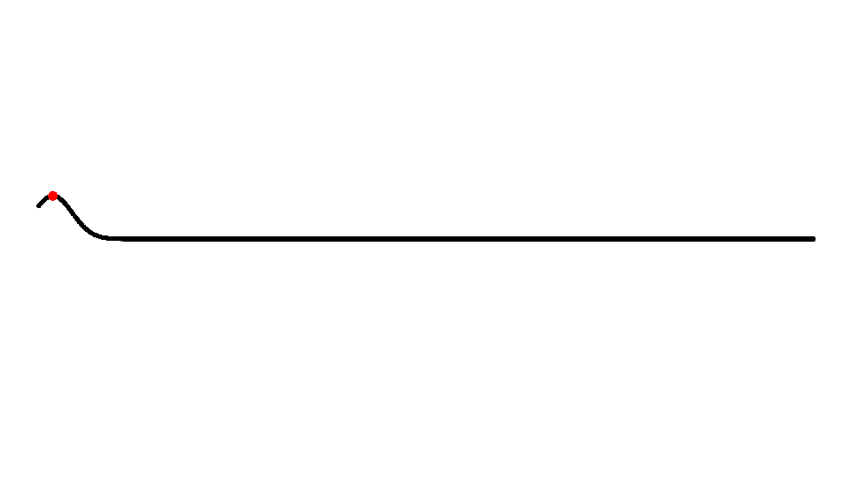
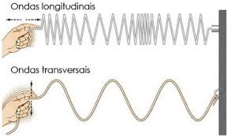
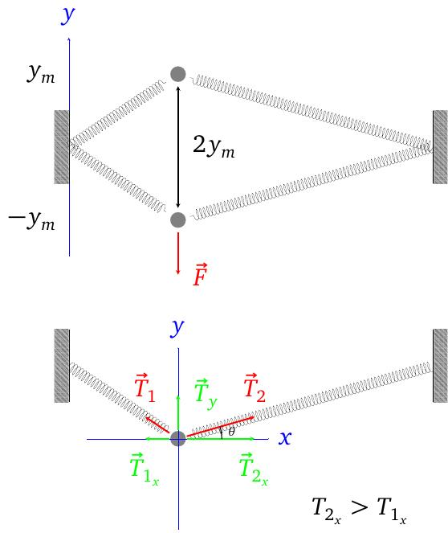

layout: true
background-size: contain

<div class="my-footer"><span>Flaviano Williams Fernandes</span></div>

```{r, include=FALSE, eval=FALSE, echo=FALSE}
  xaringan::inf_mr()
```

```{r setup, include=FALSE}
  options(htmltools.dir.version = FALSE)
  library("ggplot2")
  library("gganimate")
  library("latex2exp")
#  knitr::opts_chunk$set(fig.path = 'img')
```

```{r, load_refs, echo=FALSE, message=FALSE}
  library(RefManageR)
  BibOptions(check.entries = FALSE, bib.style = "authoryear", style = "markdown",
           dashed = TRUE)
  bib <- ReadBib("references.bib", check = FALSE)
```

---
class: middle

<div class="my-header"><span>Sumário</span></div>

.pull-left[

1. Ondas progressivas
  + Pulso em uma corda
  + Formação de uma onda progressiva
  + Tipos de onda

2. A equação da onda

3. Reflexão e refração da onda

4. O princípio da superposição
  * Interferência
  * Fasores e o plano complexo
  * Ondas estacionárias
  * Pacotes de onda
]
.pull-right[
<ol start="5">
<li> Apêndice A

<li> Bibliografia
</ol>
]

<div class="footnote">
  <ul>
  <hr>
  <li> Esta apresentação está disponível para download em <a href="https://flavianowilliams.github.io/education">flavianowilliams.github.io/education</a>;
  <li> Este material está sujeito a modificações. Recomenda-se acompanhamento permanente.
  </ul>
</div>

---
class: middle

<div class="my-header"><span>Ondas progressivas - Pulso em uma corda</span></div>

.pull-left[
* As forças nas direções x e y produz um pulso de energia que se propaga na horizontal com velocidade $\vec{v}$;

* O pulso propaga energia mas não propaga matéria;

* A força na direção y	produz um movimento harmônico simples que faz oscilar o fragmento da mola de massa m na vertical.
```{r, echo=FALSE, fig.align='center',fig.cap='Origem de um pulso em uma corda elástica.',out.width="90%",fig.asp=1,fig.ncol=2}
  
```
]
.pull-right[
```{r, echo=FALSE, fig.align='center',fig.cap='Propagação de um pulso em uma corda elástica.',out.width="90%",fig.asp=1,fig.ncol=2}
  knitr::include_graphics("img/pulso.jpeg")
```
]

---
class: middle

<div class="my-header"><span>Ondas progressivas - Formação de uma onda progressiva</span></div>

.pull-left[
* Uma onda progressiva é formada a partir de vários pulsos se propagando em um meio na mesma direção e com a mesma velocidade.

* O intervalo de tempo entre dois pulsos corresponde ao período do MHS na direção vertical

* A distância entre dois pulsos corresponde ao comprimento de onda
```{r, echo=FALSE, fig.align='center',fig.cap='Características de uma onda progressiva.',out.width="80%",fig.asp=1,fig.ncol=2}
  knitr::include_graphics("img/onda.jpeg")
```
]
.pull-right[
```{r, echo=FALSE, fig.align='center',fig.cap='Vários pulsos se propagando com a mesma velocidade.',out.width="100%",fig.asp=1,fig.ncol=2}
  
```
Uma onda progressiva possui as seguintes propriedades:
* Amplitude $y_m$: A mesma amplitude da oscilação vertical.
* Frequência $\nu$: A mesma frequência da oscilação vertical.
* Comprimento de onda $\lambda$: Distância que a onda percorre durante um período T.

Sendo v a velocidade da onda e T o período, temos por MRU que $\lambda = vT$, e sabendo que $T=1/\nu$ teremos
\begin{align}
 \boxed{v = \lambda\nu}
\end{align}
]

---
class: middle

<div class="my-header"><span>Ondas progressivas - Tipos de onda</span></div>

* As ondas mecânicas necessitam de um meio material para se propagar, enquanto que as ondas eletromagnéticas se propagam no vácuo;

* Chamamos de ondas longitudinais aquelas onde a direção de oscilação é paralela a direção de propagação (Exemplo: som);

* Chamamos de ondas transversais aquelas onde a direção de oscilação é perpendicular a direção de propagação (Exemplo: ondas na corda).

.pull-left[
```{r, echo=FALSE, fig.align='center',fig.cap='Onda eletromagnética formada a partir da propagação de duas ondas transversais referentes a amplitude de oscilação dos campos elétrico e magnético.',out.width="90%",fig.asp=1,fig.ncol=2}
  
```
]
.pull-right[
```{r, echo=FALSE, fig.align='center',fig.cap='Representações de ondas longitudinal e transversal.',out.width="85%",fig.asp=1,fig.ncol=2}
  
```
]

---
class: middle

<div class="my-header"><span>A função de onda - o número de onda k</span></div>

.pull-left[
Analisando o movimento da onda, podemos dizer que o movimento vertical por ser um MHS a amplitude da onda deve ser uma função senoidal do tempo, do tipo $y\sim \cos\omega t$, e sabendo que a onda se propaga na direção x, então a amplitude da onda também deve também apresentar uma dependência da posição x. Portanto, a função no qual descreve a amplitude da onda (que chamamos de "função de onda") deve ser uma função de duas variáves, x e t,
\begin{align}
  y \equiv y(x,t).
\end{align}

Existem várias maneiras de obter a expressão $y(x,t)$. Aqui usaremos uma estratégia muito empregada por físicos para a solução de problemas. Primeiramente iremos obter uma equação matemática (que a princípio é uma equação diferencial contendo derivadas em sua expressão), no qual a partir da sua solução encontraremos $y(x,t)$.
]
.pull-right[
Observando a onda, onde para cada instante de tempo teremos uma curva senoidal ao longo de x, então a amplitude da onda deverá se repetir para cada distância $\lambda$, de modo que
\begin{align}
  y_m\cos kx = y_m\cos k(x+\lambda),
\end{align}
onde k é uma constante arbitrária. Portanto
\begin{align}
  y_m\cos kx = y_m\cos (kx+k\lambda).
\end{align}
De acordo com o comportamento periódico da função cosseno, podemos ver que a igualdade será satisfeita se $k\lambda = 2\pi$, ou seja,
\begin{align}
  k = \frac{2\pi}{\lambda}\quad\text{(número de onda)}.
\end{align}
O parâmetro k é chamado de número de onda e sua a unidade no SI é o radiano por metro
ou $m^{-1}$.
]

---
class: middle

<div class="my-header"><span>A função de onda - a velocidade da onda</span></div>

.pull-left[
Supondo que a função de onda deve possuir como variáveis independentes x e t, e considerando que as seguintes condições devem acontecer
\begin{align}
  y(x,0) & = y_m\cos (kx-\phi),\\
  y(0,t) & = y_m\cos (\omega t - \phi'),
\end{align}
então podemos imaginar que a função $y(x,t)$ deve ser algo do tipo
\begin{align}
  y(x,t) \Rightarrow \cos kx\cos \omega t.
\end{align}
Usando a identidade $\cos A\cos B = \frac{1}{2}(\cos (A+B) + \cos (A-B))$ podemos dizer que
\begin{align}
  y(x,t) \Rightarrow \cos (kx + \omega t)+ \cos (kx - \omega t),
\end{align}
onde $A = kx$ e $B = \omega t$. Portanto
\begin{align}
  y(x,t) = y_m\cos (kx + \omega t)+ y_m\cos (kx - \omega t).
\end{align}
]
.pull-right[
Assim para qualquer onda, onde a sua amplitude se repete a cada intervalo $kx \pm \omega t$, podemos supor pela característica de periodicidade da função cosseno que
\begin{align}
  kx\pm\omega t = \text{constante}.
\end{align}
Derivando em relação ao tempo o primeiro termo, onde $kx-\omega t$, teremos
\begin{align}
 k\frac{dx}{dt}-\omega & = 0,\\
 \frac{dx}{dt} = \frac{\omega}{k}.
\end{align}
Sabendo que $\frac{dx}{dt}=v$, onde v é a velocidade da onda e $k = \frac{2\pi}{\lambda}$ e $\omega = 2\pi\nu$, teremos
\begin{align}
 v = \frac{\omega}{k} = \lambda\nu\quad\text{(velocidade da onda)}.
\end{align}
Para $kx+\omega t$ teremos $v=-\lambda\nu$, ou seja, uma onda se propagando no sentido contrário.
]

---
class: middle

<div class="my-header"><span>A equação da onda</span></div>

.pull-left[
Supomos que na figura anterior, temos uma pequena parte da mola de comprimento dx e massa dm, onde $dm=\mu dx$, e $\mu$ é a densidade de massa. Podemos dizer que ao aplicar a segunda lei de Newton para o seu movimento vertical teremos a sequinte expressão abaixo,
\begin{align}
  T_{2y}+T_{1y} = dma_y.
\end{align}
Se que a mola estiver esticada próxima ao seu começo, podemos sugerir que $T_1<<T_2$, portanto
\begin{align}
  T_{2y} \approx \mu dxa_y.
\end{align}
Porém podemos ver que $\frac{T_{2y}}{T_{2x}}=\tan\theta$. E pela definição de derivada teremos $\tan\theta = \frac{dy}{dx}$. Assim
\begin{align}
  T_{2y} & = T_{2x}\left(\frac{dy}{dx}\right).
\end{align}
]
.pull-right[
```{r, echo=FALSE, fig.align='center',fig.cap='Propagação de um pulso em uma corda elástica.',out.width="90%",fig.asp=1,fig.ncol=2}
  
```
]

---
class: middle

<div class="my-header"><span>A equação da onda (continuação)</span></div>

.pull-left[
Substituindo $T_{2y}$ definido anteriormente
\begin{align}
  T_{2x}\left(\frac{dy}{dx}\right) \approx \mu dxa_y.
\end{align}
Supondo que a amplitude da onda é muito pequena em relação ao comprimento da mola, onde $T_{2x}\approx T_2$, então
\begin{align}
  T_{2}\left(\frac{dy}{dx}\right) & = \mu dxa_y,\\
  \frac{dy}{dx} & = \left(\frac{\mu}{T_2}\frac{d^2y}{dt^2}\right)dx.
\end{align}
Pela definição de derivada chegamos a conclusão que
\begin{align}
  \frac{d^2y}{dx^2} & = \frac{\mu}{T_2}\frac{d^2y}{dt^2},\\
  \frac{\partial^2y}{\partial x^2} & = \frac{1}{v^2}\frac{\partial^2y}{\partial t^2},\quad\text{(equação da onda)},
\end{align}
onde v é a velocidade da onda na mola (veja o apêndice).
]
.pull-right[
```{r, echo=FALSE, fig.align='center',fig.cap='Propagação de um pulso em uma corda elástica.',out.width="90%",fig.asp=1,fig.ncol=2}
  knitr::include_graphics("img/pulso.jpeg")
```
]

---
class: middle

<div class="my-header"><span>A equação da onda (continuação)</span></div>

.pull-left[
Agora iremos checar se a função $y(x,t)$ satisfaz a equação da onda, e assim concretizando-se como função de onda. Derivando em relação x teremos
\begin{align}
  \frac{\partial y(x,t)}{\partial x} & = -k\sin (kx-\omega t),\\
  \frac{\partial^2 y(x,t)}{\partial x^2} & = -k^2\cos (kx-\omega t).
\end{align}
Derivando em relação a t teremos
\begin{align}
  \frac{\partial y(x,t)}{\partial t} & = \omega\sin (kx-\omega t),\\
  \frac{\partial^2 y(x,t)}{\partial t^2} & = -\omega^2\cos (kx-\omega t).
\end{align}
Substitundo na equação da onda teremos
\begin{align}
  -k^2\cos (kx-\omega t) = \frac{-\omega^2}{v^2}\cos (kx-\omega t)
\end{align}
]
.pull-right[
Cancelando os termos remanescentes em ambos os lados da equação chegaremos a
\begin{align}
  k^2 & = \frac{\omega^2}{v^2},\\
  v^2 & = \frac{\omega^2}{k^2}.
\end{align}
Assim podemos perceber que $y(x,t)$ somente satisfaz a equação se $v=\pm\frac{\omega}{k}$, o que é verdade, como foi demonstrado anteriormente.

O mesmo é válido para a função $y(x,t)=y_m\cos (kx+\omega t)$. Substituindo na equação de onda teremos a equação abaixo,
\begin{align}
  -k^2\cos (kx+\omega t) = \frac{-\omega^2}{v^2}\cos (kx+\omega t),
\end{align}
ou seja, somente será solução da equação se $v=\pm \frac{\omega}{k}$.
]

---
class: middle

<div class="my-header"><span>Refração e reflexão de uma onda</span></div>

---
class: middle

<div class="my-header"><span>O princípio da superposição</span></div>

---
class: middle

<div class="my-header"><span>O princípio da superposição - Interferência</span></div>

---
class: middle

<div class="my-header"><span>O princípio da superposição - Fasores e o plano complexo</span></div>

---
class: middle

<div class="my-header"><span>O princípio da superposição - Ondas estacionárias</span></div>

---
class: middle

<div class="my-header"><span>O princípio da superposição - Pacotes de onda</span></div>

---
class: middle

<div class="my-header"><span>Bibliografia</span></div>

```{r, results='asis', echo=FALSE, message=FALSE}
PrintBibliography(bib)
```

