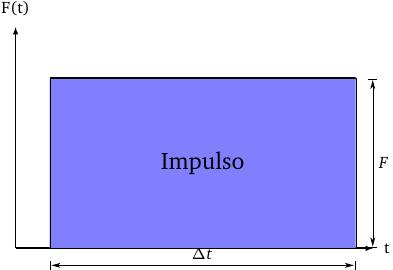
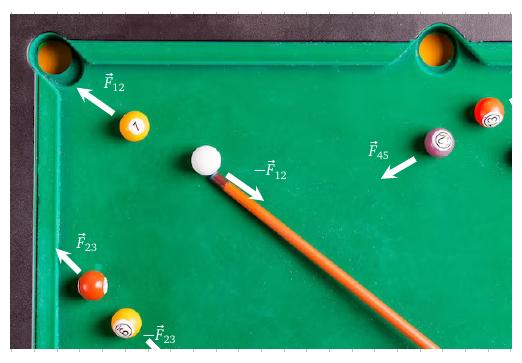
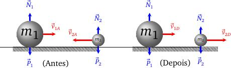
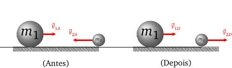

layout: true
background-size: contain

<div class="my-footer">
  
</div>

<div class="my-footer"><span>Flaviano Williams Fernandes</span></div>

```{r, include=FALSE, eval=FALSE, echo=FALSE}
  xaringan::inf_mr()
```

```{r setup, include=FALSE}
  options(htmltools.dir.version = FALSE)
  library("ggplot2")
  library("gganimate")
  library("latex2exp")
#  knitr::opts_chunk$set(fig.path = 'img')
```

```{r, load_refs, echo=FALSE, message=FALSE}
  library(RefManageR)
  BibOptions(check.entries = FALSE, bib.style = "authoryear", style = "markdown",
           dashed = TRUE)
  bib <- ReadBib("references.bib", check = FALSE)
```

---
class: middle

<div class="my-header"><span>Sumário</span></div>

1. Quantidade de movimento

2. Conservação da quantidade de movimento

3. Aplicações

4. Bibliografia

<div class="footnote">
  <ul>
  <hr>
  <li> Esta apresentação está disponível para download em <a href="https://flavianowilliams.github.io/education">flavianowilliams.github.io/education</a>;
  <li> Este material está sujeito a modificações. Recomenda-se acompanhamento permanente.
  </ul>
</div>

---
class: middle

<div class="my-header"><span>Quantidade de movimento - O que é a quantidade de movimento?</span></div>

.pull-left[

Em física desejamos sempre definir uma grandeza física através do seu conceito e de maneira quantitativa, sendo obtida através de uma fórmula matemática. Mas como podemos quantificar a quantidade de movimento de um objeto? A fórmula da quantidade de movimento p é definida como
\begin{equation}
  \boxed{\vec{q} = m\vec{v}.}
\end{equation}
Mas como poderemos chegar nessa expressão? Conhecemos a segunda lei de Newton na forma $F=ma$. No entanto, a forma original seria
\begin{equation}
  \vec{F} = \frac{\Delta \vec{q}}{\Delta t}.
\end{equation}
onde $\Delta p$ é a variação da quantidade de movimento.
"*Outro fato importante é que o movimento pode mudar dependendo da sua orientação, portanto a quantidade de movimento é uma grandeza vetorial.*"

]
.pull-right[

A variação da quantidade de movimento desse objeto é dado por
\begin{aligned}
  \Delta q & = q_{final}-q_{inicial},\\
           & = m\left(v_{final}-v_{inicial}\right).
\end{aligned}
Substituindo na segunda lei de Newton teremos
\begin{equation}
  F = m\frac{\left(v_{final}-v_{inicial}\right)}{\Delta t}.
\end{equation}
E sabendo que $\Delta V=v_{final}-v_{inicial}$ teremos
\begin{equation}
  F = m\frac{\Delta v}{\Delta t}.
\end{equation}
E pela definição da aceleração $a=\frac{\Delta v}{\Delta t}$ chegamos a expressão conhecida da segunda lei de Newton.
\begin{equation}
  F = ma.
\end{equation}

]

---
class: middle

<div class="my-header"><span>Quantidade de movimento - Impulso</span></div>

.pull-left[

Definimos impulso como a rapidez que uma força consegue alterar a quantidade de movimento de um objeto, ou seja,
\begin{equation}
  \vec{I} = \Delta \vec{q}.
\end{equation}
Agora, qual é a relação do impulso com a força e o tempo? Para isso, usaremos a expressão da força demonstrada anteriormente,
\begin{equation}
  F = \frac{\Delta p}{\Delta t}.
\end{equation}
Isolando $\Delta V$ nessa equação chegamos à
\begin{equation}
  I = F\Delta t.
\end{equation}
No entanto, a quantidade de movimento é grandeza vetorial, então a sua variação também será, portanto o impulso também será uma grandeza vetorial. A maneira correta de representar a equação acima seria

]
.pull-right[

\begin{equation}
  \vec{I} = \vec{F}\cdot\Delta t.
\end{equation}
E graficamente, como poderíamos determinar o impulso aplicado em um objeto por uma força? Assim como no trabalho, basta determinar a área entre a linha que representa a força e o eixo das abscissas. A diferença em relação ao caso do trabalho é que o eixo das abscissas representa a evolução no tempo ao invés do deslocamento.

```{r, echo=FALSE, fig.align='center', fig.cap='Gráfico de uma força constante em função do tempo.', out.width='70%'}

```

]

---
class: middle

<div class="my-header"><span>Quantidade de movimento - sistema de partículas</span></div>

.pull-left[
Vimos anteriormente que a quantidade de movimento de um objeto vale $q=mv$. Mas se tivermos um sistema contendo vários objetos, como mostra a figura abaixo.

```{r, echo=FALSE, fig.align='center', fig.cap='Representação de um sistema de particulas.', out.width='63%'}

```

A quantidade de movimento desse sistema, ou seja, a quantidade de movimento total, é obtida pela soma vetorial das quantidades de movimento de cada objeto que compõem o sistema. Portanto
\begin{equation}
  \vec{Q} = \vec{q}_1+\vec{q}_1+\vec{q}_1+\therefore \vec{Q} = \sum\vec{q}.
\end{equation}

]
.pull-right[

No entanto, as partículas podem interagir entre elas, através de colisões ou de outras formas. As interações que o ocorrem entre partículas que pertencem a esse sistema são chamadas de forças internas, enquanto as interações que ocorrem entre os objeto do sistemas com aqueles fora dele são chamadas de forças externas.

Agora, um fato curioso é que a resultante das forças internas do sistema assume valor igual a zero. Por quê isso acontece? Imagine a figura abaixo. Quando a partícula 1 colide com a partícula 2, ocorre duas forças de mesma intensidade mas direção e sentido opostos, como mostra a terceira lei de Newton. Assim, apesar de cada uma assumir valor não nulo para cada partícula, ao somar todos os pares, eles irão se anular mutuamente, resultando em uma força resultante nula,
\begin{equation}
  \vec{F}_R = \vec{F}_{12}-\vec{F}_{12}+\vec{F}_{23}-\vec{F}_{23}+\cdots = \vec{0}.
\end{equation}

]

---
class: middle

<div class="my-header"><span>Conservação da quantidade movimento</span></div>

.pull-left[

Vimos pela segunda lei de Newton que $\vec{F}_R=\frac{\Delta q}{\Delta t}$. Com isso podemos dizer que somente haverá uma variação da quantidade de movimento total do sistema se houver uma força resultante não nula atuando nele. Entretanto, vimos que a somatória das forças internas de um sistema de partículas é zero, portanto podemos dizer o seguinte:

"**As forças internas podem provocar variações nas quantidades de movimento de cada partícula de um sistema, mas não provocam variação na quantidade de movimento total do sistema.**"

]
.pull-right[

Portanto, podemos dizer que somente haverá variação na quantidade de movimento total de um sistema se houver forças externas. Com isso chegamos ao enunciado da lei da conservação da quantidade de movimento `r Citep(bib, "Alvarenga2000")``:

"**Se for nula a resultante das forças externas que atuam em um sistema de partículas, a quantidade de movimento total desse sistema se conserva.**"

]

---
class: middle

<div class="my-header"><span>Aplicações - colisões</span></div>

.pull-left[

Neste slide iremos aplicar os conceitos vistos anteriormente em um sistema de partículas contendo dois objetos. Além disso, esses objetos estarão se movendo em apenas uma direção. Esse é um exemplo clássico de aplicação da lei de conservação da quantidade de movimento de um sistema de partículas.

A figura abaixo mostra dois estados das duas partículas antes e depois de colidirem entre sim. Podemos ver que a resultante das forças externas é zero, pois a reação normal se anula com a força peso, portanto a quantidade de movimento total Q deve ser igual antes e depois da colisão.
```{r, echo=FALSE, fig.align='center', fig.cap='Colisão envolvendo duas particulas.', out.width='85%'}

```

]
.pull-right[

Consideremos $m_1=2\;kg$ e $m_2=1\;kg$. Se as velocidades antes da colisão são dadas por $v_{1A}=3\;m/s$ e $v_{2A}=-2\;m/s$, poderemos dizer que a quantidade de movimento total é dado por
\begin{align}
  \vec{Q} & = \vec{q}_1+\vec{q}_2,\\
  \vec{Q} & = m_1\vec{v}_1+m_2\vec{v}_2,\\
  Q & = 2\cdot 3+1\cdot (-2),\\
  Q & = 4\;kg\cdot m/s.
\end{align}
Consideremos que após a colisão as velocidades mudaram para $v_{1D}=0,5\;m/s$ e $v_{2D}=3\;m/s$
\begin{align}
  Q & = 2\cdot 0,5+1\cdot (3),\\
  Q & = 4\;kg\cdot m/s.
\end{align}
Não necessariamente $v_{1D}$ e $v_{2D}$ sempre assumirão esses valores, mas o importante é que a quantidade de movimento se mantenha constante.

]

---
class: middle

<div class="my-header"><span>Aplicações - colisões elásticas e inelásticas</span></div>

.pull-left[

Agora, consideremos a colisão mostrada anteriormente, como mostra a figura abaixo,
```{r, echo=FALSE, fig.align='center', fig.cap='Colisão envolvendo duas particulas.', out.width='85%'}

```

Determinamos anteriormente a quantidade de movimento total, mas e a energia cinética desse sistema? Definimos a energia cinética total do sistema como a soma das energias cinéticas de cada partícula, ou seja,
\begin{equation}
  E_c = E^{(1)}_c+E^{(2)}_c.
\end{equation}
Considerandos os valores antes da colisão teremos

]
.pull-right[

\begin{align}
  E_c & = \frac{1}{2}m_1v^2_{1A}+\frac{1}{2}m_2v^2_{2A},\\
  E_c & = \frac{1}{2}\cdot 2\cdot 3^2+\frac{1}{2}\cdot 1\cdot 2^2,\\
  E_c & = 11\;J.
\end{align}
Agora, depois da colisão teremos
\begin{align}
  E_c & = \frac{1}{2}m_1v^2_{1D}+\frac{1}{2}m_2v^2_{2D},\\
  E_c & = \frac{1}{2}\cdot 2\cdot 0,5^2+\frac{1}{2}\cdot 1\cdot 3^2,\\
  E_c & = 4,75\;J.
\end{align}
Podemos ver que a energia cinética depois da colisão é **MENOR** que a energia cinética antes da colisão, pois parte da energia cinética foi perdida no ato da colisão e convertida outra forma de energia, calor, energia sonora, etc. Essas colisões são chamadas de **colisões inelásticas**. As colisões onde a energia cinética também é conservada são chamadas de **colisões elásticas**.

]

---
class: middle

<div class="my-header"><span>Bibliografia</span></div>

```{r, results='asis', echo=FALSE, message=FALSE}
PrintBibliography(bib)
```
