layout: true
background-size: contain

<div class="my-footer">
  
</div>

<div class="my-footer"><span>Flaviano Williams Fernandes</span></div>

```{r, include=FALSE, eval=FALSE, echo=FALSE}
  xaringan::inf_mr()
```

```{r setup, include=FALSE}
  options(htmltools.dir.version = FALSE)
  library("ggplot2")
  library("gganimate")
  library("latex2exp")
#  knitr::opts_chunk$set(fig.path = 'img')
```

```{r, load_refs, echo=FALSE, message=FALSE}
  library(RefManageR)
  BibOptions(check.entries = FALSE, bib.style = "authoryear", style = "markdown",
           dashed = TRUE)
  bib <- ReadBib("references.bib", check = FALSE)
```

---
class: middle

<div class="my-header"><span>Sumário</span></div>

1. O que é energia?

2. Trabalho de uma força

3. Potência

4. Conservação da energia

5. Energia potencial

6. Bibliografia

<div class="footnote">
  <ul>
  <hr>
  <li> Esta apresentação está disponível para download em <a href="https://flavianowilliams.github.io/education">flavianowilliams.github.io/education</a>;
  <li> Este material está sujeito a modificações. Recomenda-se acompanhamento permanente.
  </ul>
</div>

---
class: middle

<div class="my-header"><span>O que é energia? - conceito de energia</span></div>

.pull-left[

Dizemos que todo fenômeno físico que se manifesta na natureza como a eletricidade que corre por um fio condutor e faz funcionar um ventilador, a água que cai de uma cachoeira e movimenta um moinho, o aquecimento de um chuveiro elétrico ou uma lâmpada que se acende dentre outros está associado a uma entidade física, que está nesse fenômeno e não necessariamente se manifesta materialmente, chamada energia. Sabemos que ela está lá porque com ela uma força pode realizar trabalho.

```{r, echo=FALSE, fig.align='center', fig.cap='Tipos de energia (solar, bioenergia, eólica e hidrelétricas). Direitos autorais: IStock.', out.width="70%"}

```

]
.pull-right[

Em física também dizemos que a energia representa a capacidade de realizar trabalho, como exemplo uma pessoa é capaz de empurrar um carrinho de supermercado devido à energia que lhe é fornecida pelos alimentos que ingere.

Assim como a natureza pode se expressar de diversas maneiras distintas, também existem diversos tipos de energia: química, mecânica, térmica, elétrica, nuclear, etc. No caso da pessoa empurrando um carrinho de supermercado, os alimentos que ela ingere sofre reações químicas que armazena essa energia química nas células do nosso corpo.

Como veremos em vários exemplos à seguir a energia assume o mesmo valor independente da orientação dos fenômemos envolvidos, portanto dizemos que a energia é uma grandeza escalar. No SI a unidade de medida utilizada para representar a energia é o **Joule (J)**.

]

---
class: middle

<div class="my-header"><span>O que é energia? - energia cinética</span></div>

.pull-left[

A energia cinética é a energia associada ao movimento dos objetos. Quanto mais depressa o objeto se move e quanto maior a sua massa, maior será a sua energia cinética. Como exemplo podemos imaginar um automóvel de massa 500 kg se movendo a uma velocidade de 50 km/h, assim como mostra a figura ao lado. Podemos ver que ele possui energia cinética e que ela depende da sua velocidade, de modo que o estrago causado pela colisão será maior se ele estiver a 200 km/h ao invés de 50 km/h. O estrago também será maior se a colisão for de um caminhão que possui massa maior que o automóvel, mostrando assim que a energia cinética depende também da massa.

]
.pull-right[

```{r, echo=FALSE, fig.align='center', fig.cap='Colisão de uma automóvel que possui energia cinética. Fonte: www.deviante.com.br/noticias.', out.width="90%"}
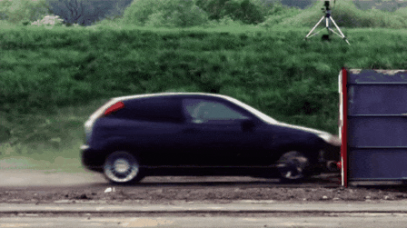
```

Como mostraremos à seguir, podemos definir a expressão da energia cinética assim como mostra a equação abaixo.
\begin{equation}
  Ec = \frac{1}{2}mv^2
\end{equation}

]

---
class: middle

<div class="my-header"><span>Trabalho de uma força - variação da energia cinética</span></div>

.pull-left[

Consideremos o caso da pessoa empurrando um carrinho de supermercado, supondo que o carrinho estava em repouso antes da pessoa empurra-lo então ele não possuia algum tipo de energia cinetica já que a sua velocidade é zero. Após a pessoa aplicar uma força no carrinho, ele adquire velocidade e assim energia cinética. Agora, de onde vem a sua energia cinética já que antes o carrinho não tinha?
```{r, echo=FALSE, fig.align='center', fig.cap='Uma pessoa aplicando uma força no carrinho faz ele adquirir energia cinética.', out.width='80%'}
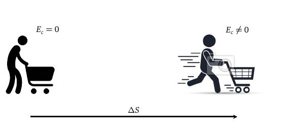
```

]
.pull-right[

Podemos dizer que de alguma maneira a força aplicada pela pessoa no carrinho transferiu a energia quimica armazenada no corpo da pessoa para o carrinho na forma de energia cinética. Portanto, dizemos que a força realizou trabalho convertendo a energia quimica da pessoa em energia cinética para o carrinho. De maneira mais geral, dizemos que **trabalho** realizado por uma força é a capacidade de transferir um tipo de energia de um objeto para outro objeto como outra forma de energia. No caso do carrinho, dizemos que o trabalho $\tau$ seria equivalente a variação da energia cinética, ou seja, a diferença da energia cinética no final do percurso pela energia cinética do inicio do percurso,
\begin{equation}
  \tau = \Delta E_c,
\end{equation}
ou de maneira equivalente,
\begin{equation}
  \boxed{\tau = E_c^{(final)}-E_c^{(inicial)}.}
\end{equation}

]

---
class: middle

<div class="my-header"><span>Trabalho de uma força - relação com a força e o deslocamento</span></div>

.pull-left[

Bem, se existe uma relação entre trabalho e força, então também existir uma expressão do trabalho envolvendo a grandeza força. Para isso vamos usar a definição de trabalho mostrada anteriormente com a equação de torricelli e a segunda lei de Newton. Pela definição de trabalho e variação da energia cinética temos
\begin{aligned}
  \tau & = E_c^{(final)}-E_c^{(inicial)},\\
  \tau & = \frac{1}{2}mv²_{(final)}-\frac{1}{2}mv²_{(inicial)}.
\end{aligned}
Colocando m/2 em evidência teremos
\begin{aligned}
  \tau & = \frac{1}{2}m\left(v²_{(final)}-v²_{(inicial)}\right).
\end{aligned}
Pela equação de Torricelli temos que $v^2_{(final)}=v^2_{(final)}+2a\Delta S$, ou seja,
\begin{aligned}
  v^2_{(final)}-v^2_{(final)}=2a\Delta S
\end{aligned}

]
.pull-right[

Substituindo na expressão do trabalho teremos
\begin{aligned}
  \tau & = \frac{1}{2}m\left(2a\Delta s\right),\\
  \tau & = \left(ma\right)\Delta s.
\end{aligned}
Agora, pela segunda lei de Newton temos que $F=ma$. Substituindo na equação acima chegamos na expressão do trabalho envolvendo a força e deslocamento,
\begin{equation}
  \boxed{\tau = F\Delta s.}
\end{equation}
```{r, echo=FALSE, fig.align='center', fig.cap='Uma pessoa aplicando uma força no carrinho faz ele adquirir energia cinética.', out.width='80%'}
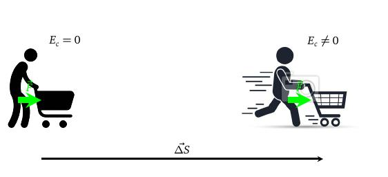
```

]

---
class: middle

<div class="my-header"><span>Trabalho de uma força - influência da orientação entre a força e o deslocamento</span></div>

.pull-left[

Agora, existe alguma situação onde a força não realiza trabalho? Imagina um automóvel em movimento retilineo uniforme ao longo de uma estrada, assim como mostra a figura abaixo, neste caso podemos ver que existem apenas duas forças atuando no veículo, a força peso $\vec{P}$ e a normal $\vec{N}$. Ambas são perpendiculares em relação a direção de deslocamento de um automóvel, que no caso seria ao longo da estrada.

```{r, echo=FALSE, fig.align='center', fig.cap='Movimento de um automóvel na estrada. Direitos autorais: IStock.', out.width='80%'}
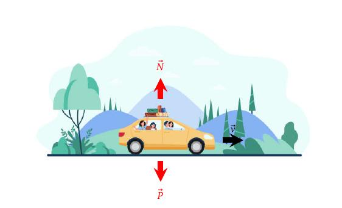
```

]
.pull-right[

Neste caso podemos dizer que nem a força peso ou a normal estão realizando trabalho sobre o automóvel, pois o mesmo possui sempre a mesma energia cinética devido ao fato da sua velocidade permanecer constante ao longo do percurso. Isso acontece porque somente as componentes das forças paralelas ao deslocamento realizam trabalho

```{r, echo=FALSE, fig.align='center', fig.cap='Movimento de um automóvel na estrada. Direitos autorais: IStock.', out.width='80%'}
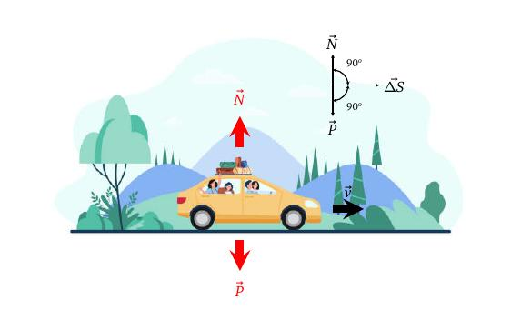
```

]

---
class: middle

<div class="my-header"><span>Trabalho de uma força - influência da orientação entre a força e o deslocamento</span></div>

.pull-left[

A figura abaixo mostra um boneco puxando um objeto pesado, aplicando uma força $\vec{F}$ sobre ele. Essa força possui duas componentes, $\vec{F}_x$ e $\vec{F}_y$. $\vec{F}_y$ é perpendicular enquanto que $\vec{F}_x$ está paralelo a $\Delta S$. Usando trigonometria teremos $F_x=F\cos\theta$, substituindo na expressão do trabalho teremos,
\begin{equation}
  \boxed{\tau = F\Delta s\cos\theta.}
\end{equation}

```{r, echo=FALSE, fig.align='center', fig.cap='Direitos autorais: Twoellis.', out.width='80%'}
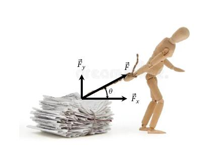
```

]
.pull-right[

Agora, existe alguma situação onde o trabalho é negativo? Considere um automóvel na estrada e de repente freia com a intenção de parar, a única força que realiza trabalho sobre ele é a força de atrito entre os pneus e a estrada. Como o automóvel pára após um deslocamento $\Delta S$ na pista, podemos dizer que o mesmo perdeu energia cinética. Como trabalho é a variação da energia cinética, então neste caso ele será negativo. Assim quando trabalho é negativo significa que energia cinética está sendo removida do objeto e transformada em outro tipo de energia.

```{r, echo=FALSE, fig.align='center', fig.cap='Fonte: blog.professorferretto.com.br.', out.width='80%'}
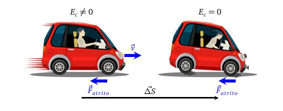
```

]

---
class: middle

<div class="my-header"><span>Trabalho de uma força - trabalho da força resultante</span></div>

.pull-left[

Suponha que um objeto esteja se deslocando sob a ação de várias forças. O trabalho que cada uma dessas forças realiza é determinado pela mesma expressão que vimos anteriormente, $\tau = F\Delta S\cos\theta$. Neste caso $\theta$ seria o ângulo entre cada força e o deslocamento (lembrando que força e deslocamento são grandezas vetoriais, portanto as suas orientações no espaço importam).

```{r, echo=FALSE, fig.align='center', fig.cap='Fonte:pt.123rf.com.', out.width='90%'}
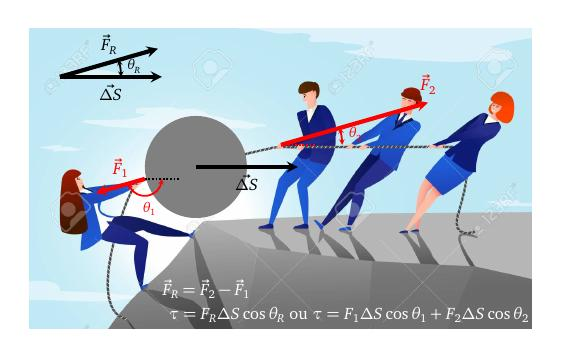
```

]
.pull-right[

Podemos calcular o trabalho total de duas maneiras distintas, mas que chegarão ao mesmo resultado: a primeira seria somar o trabalho $\tau_1$, $\tau_2$,... realizado por cada força sobre o objeto, ou seja,
\begin{aligned}
  \tau_{total} & = \tau_1+\tau_2+\cdots+\tau_N,\\
  \tau_{total} & = F_1\Delta S\cos\theta_1+F_2\Delta S\cos\theta_2+\cdots.
\end{aligned}
A segunda maneira seria determinar a força resultante $F_R$ de todas as forças $F_1$, $F_2$, etc, e calcular o trabalho realizado somente pela força resultante. No caso seria
\begin{equation}
  \tau_{total} = F_{R}\Delta S\cos\theta_R.
\end{equation}
Geralmente a primeira opção costuma ser mais simples, uma vez que estamos somando grandezas escalares que representa uma maneira mais simples de fazer do que somar grandezas vetoriais, que seria a maneira de determinar a força resultante na segunda opção.

]

---
class: middle

<div class="my-header"><span>Potência</span></div>

.pull-left[

Para determinar o trabalho no final do processo não é necessário conhecer o tempo decorrido na realização desse trabalho. Agora, imagina duas pessoas em uma academia como mostra a figura ao lado levantando o mesmo peso p a mesma altura h, ambas realizarão o mesmo trabalho equivalente à ph. Entretanto, se a primeira gasta um minuto para levantar o peso enquanto que a segunda gasta 5 minutos podemos dizer que a primeira pessoa será capaz de fazer 5 vezes mais repetições no mesmo intervalo de tempo que a segunda e portanto terá melhores resultados no seu condicionamento físico. Para medir a rapidez com que se realiza certo trabalho, utilizamos a grandeza denominada **potência (P)**,
\begin{aligned}
  P = \frac{\Delta \tau}{\Delta t},
\end{aligned}
onde $\Delta t$ é o intervalo de tempo que uma força realiza uma quantidade de trabalho $\Delta \tau$.

]

.pull-right[

Além disso, sabendo a força e a velocidade que ela realiza o trabalho podemos determinar a potência utilizando a expressão do trabalho $\Delta \tau = F\Delta S$,
\begin{aligned}
  P &= F \frac{\Delta S}{\Delta t},\\
  P &= Fv.
\end{aligned}
onde $v = \frac{\Delta S}{\Delta t}$.

```{r, echo=FALSE, fig.align='center', fig.cap='Pessoa realizando um trabalho em uma academia.', out.width='50%'}
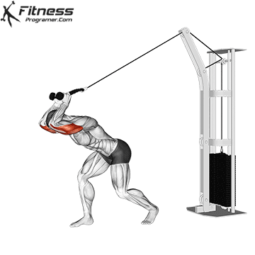
```

]

---
class: middle

<div class="my-header"><span>Conservação da energia - forças dissipativas e conservativas</span></div>

.pull-left[

Consideremos o caso do automóvel que freia bruscamente em uma estrada, neste caso a energia cinética do automóvel é perdida (dissipada) em outro tipo de energia. Agora, existe alguma situação onde podemos recuperar essa energia cinética?

Agora, imagina uma pessoa lançando um objeto para cima como mostra a figura ao lado. Em certo momento o objeto pára de subir e começa a cair e surpreendentemente ele retorma para a mão da pessoa com a mesma velocidade e mesma energia cinética, ou seja, conseguimos recuperar a energia cinética que tinha inicialmente. Entretanto, no alto da sua trajetória o objeto pára, ou seja, não possui energia cinética. Para onde foi a energia cinética que tinha inicialmente e retornou quando retornou para a mão da pessoa? Dizemos que neste caso a força peso atuando na bolinha converteu a energia cinética em um tipo de energia chamada **energia potencial**.

]
.pull-right[

Quando a força é capaz de converter a energia cinética em energia potencial de modo que possa ser recuperado posteriormente chamamos de **força conservativa**, do contrário chamamos ela de **força dissipativa**. Um exemplo de força dissipativa é a força de atrito que converte a energia cinética em calor.

```{r, echo=FALSE, fig.align='center', fig.cap='Lançamento vertical de uma bolinha.', out.width='60%'}
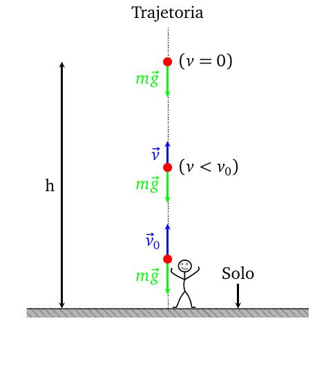
```

]

---
class: middle

<div class="my-header"><span>Conservação da energia - independência do caminho</span></div>

.pull-left[

Outro fato curioso sobre forças conservativas é que o trabalho por ela realizado independe da trajetória realizada pelo objeto. Considere um carrinho no alto de uma montanha, esse carrinho chegará no posição C com a mesma energia cinética se ele estivesse descido a ladeira do posição A até o C (<span style="color:blue">azul</span>) ou se estivesse seguido do posição A até o B e depois caido em queda livre até o C (<span style="color:red">vermelho</span>). Portanto, podemos dizer que a força peso realizará o mesmo trabalho se o carrinho fizesse qualquer uma das trajetórias citadas, pois a variação da sua energia cinética será a mesma.

Agora, se a energia cinética independe da trajetória feito pelo objeto, então podemos associá-la a sua posição no espaço no caso do carrinho na montanha dizemos que no posição A tem uma energia potencial $E^A_p$ e no posição B possui a energia potencial $E^B_p$. Portanto, o valor da energia potencial irá depender apenas da posição do objeto no espaço.

]
.pull-right[

Como a força conservativa converte energia cinética em energia potencial podemos dizer que $\Delta E_c = -\Delta E_p$, onde
\begin{equation}
  \tau = -(E^A_p-E^B_p)\quad\therefore\quad\tau = -\Delta E_p.
\end{equation}
O sinal negativo significa que este trabalho está retirando energia cinética do objeto e convertendo em energia potencial.

```{r, echo=FALSE, fig.align='center', fig.cap='Carrinho descendo a montanha.', out.width='80%'}
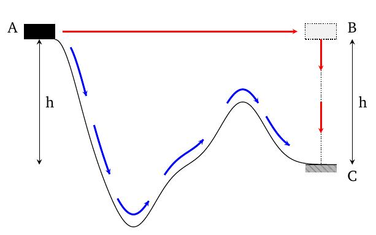
```

]

---
class: middle

<div class="my-header"><span>Conservação da energia - Energia mecânica</span></div>

.pull-left[

Vimos anteriormente que o trabalho é definido como a variação da energia cinética $(\tau = \Delta E_c)$. Porém, quando a força é conservativa dizemos também que o trabalho pode ser definido como $\tau = - \Delta E_p$. Unindo as duas definições teremos
\begin{aligned}
  \Delta E_c & = -\Delta E_p,\\
  E_c^B-E_c^A & = - (E_p^B-E_p^A).
\end{aligned}
Separando do lado esquerdo os valores da energia cinética e a potencial encontradas no posição A e do lado direito esses valores encontrados no posição B, teremos
\begin{aligned}
  E_c^A-E_p^A & = E_c^B-E_p^B = \text{constante}.
\end{aligned}
A equação acima mostra que a soma das energias encontradas no posição A tem o mesmo valor da soma no posição B o que vale para qualquer posição, ou seja, é uma constante. 
]
.pull-right[

Esse valor constante chamamos de energia mecânica $E_m$.
\begin{equation}
  \boxed{E_m = E_c-E_p.}
\end{equation}
"*Se apenas forças conservativas atuam sobre um objeto em movimento, sua energia mecânica permanece constante para qualquer posição da trajetória, ou seja, a energia mecânica do objeto se conserva.*"

]

---
class: middle

<div class="my-header"><span>Energia potencial - energia potencial gravitacional</span></div>

.pull-left[

No caso da bolinha sendo lançada para cima, ao alcançar a altura máxima a energia cinética é totalmente convertida em outra forma de energia que chamamos de energia potencial. Considerando que a bolinha possui uma massa m podemos dizer que a energia potencial gravitacional é definida como
\begin{aligned}
  \boxed{E_p = mgh.}
\end{aligned}
Mais detalhes poderão ser vistos no livro da Beatriz Alvarenga e colaboradores [`r Citep(bib, c("Alvarenga2000"))`].

]
.pull-right[

```{r, echo=FALSE, fig.align='center', fig.cap='Lançamento vertical de uma bolinha.', out.width='80%'}
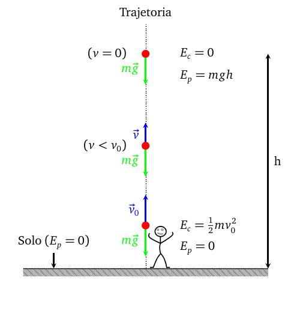
```

]

---
class: middle

<div class="my-header"><span>Energia potencial - energia potencial elástica</span></div>

.pull-left[

A figura ao lado mostra uma mola que possui uma certa elasticidade, ou seja, a capacidade de esticar sem produzir deformações permanentes em sua forma. Uma extremidade está conectada a um objeto de massa m e a outra está presa a uma parede fixa. Ao retirar o objeto da sua posição de equilíbrio $x_0$, a mola é esticada e a mesma tenta retornar para a sua posição de equilíbrio. Para isso é aplicado sobre o bloco uma força que de acordo com Robert Hooke, um físico inglês, é proporcional a deformação $\Delta x$ da mola,
\begin{aligned}
  F_R = k\Delta x.
\end{aligned}
$\Delta x$ seria a deformação da mola, ou seja, $\Delta x=x-x_0$. Se considerarmos que a posição de equilíbrio está na origem $(x_0=0)$, teremos
\begin{aligned}
  \boxed{F_R = kx.}
\end{aligned}

]
.pull-right[

Definimos k como a constante elástica da mola. Uma mola dura possui um valor de alto k, enquanto que um valor de k baixo representa uma mola mais macia.
```{r, echo=FALSE, fig.align='center', fig.cap='Sistema massa-mola.', out.width='100%'}
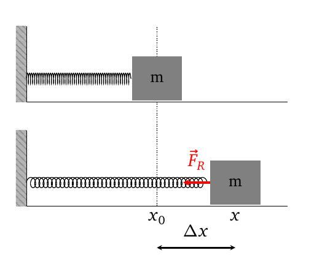
```

]

---
class: middle

<div class="my-header"><span>Energia potencial - trabalho a partir do gráfico</span></div>

.pull-left[

Graficamente podemos obter o valor do trabalho a partir do gráfico da força em função do deslocamento. Para isso é necessário determinar a área que se forma entre a curva que representa o valor da força e o eixo x do gráfico (que representa o valor do deslocamento).


Como exemplo usamos a força elástica da mola. Podemos ver que a força representa uma função linear em relação ao deslocamento $\Delta x$. A figura ao lado mostra o gráfico dessa função onde a mola sofre uma deformação x. Podemos observar que a área hachura em azul representa a área de um triângulo retângulo onde os catetos valem respectivamente kx e x. Utilizando a área do triângulo retângulo poderemos chegar a
\begin{aligned}
  \tau & = \frac{1}{2}(-kx)(x),\\
       & = -\frac{1}{2}kx^2.
\end{aligned}

]
.pull-right[

Sabemos que $\tau=E_p(x_0)-E_p(x)$. No entanto, como podemos ver no gráfico, a mola partiu da sua posição de equilíbrio onde $x_0=0$, onde F=0 e portanto $E_p(x_0)=0$, assim poderemos dizer que
\begin{equation}
      \boxed{E_p = \frac{1}{2}kx^2.}
\end{equation}

```{r, echo=FALSE, fig.align='center', fig.cap='Gráfico da força elástica em função do deslocamento x.', out.width='100%'}
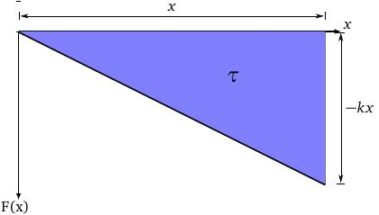
```

]

---
class: middle

<div class="my-header"><span>Bibliografia</span></div>

```{r, results='asis', echo=FALSE, message=FALSE}
PrintBibliography(bib)
```

