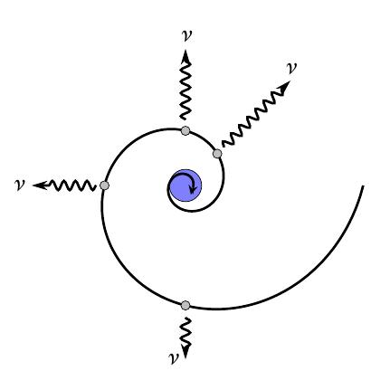
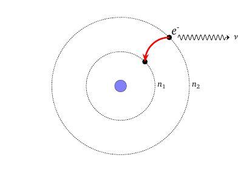
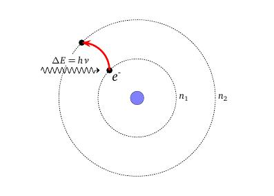

layout: true
background-size: contain

<div class="my-footer"><span>Flaviano Williams Fernandes</span></div>

```{r, include=FALSE, eval=FALSE, echo=FALSE}
  xaringan::inf_mr()
```

```{r setup, include=FALSE}
  options(htmltools.dir.version = FALSE)
  library("tidyverse")
  library("ggplot2")
  library("gganimate")
  library("latex2exp")
#  knitr::opts_chunk$set(fig.path = 'img')
```

```{r, load_refs, echo=FALSE, message=FALSE}
  library(RefManageR)
  BibOptions(check.entries = TRUE, bib.style = "authoryear", style = "markdown",
           dashed = TRUE)
  bib <- ReadBib("./references.bib", check = FALSE)
```

---
class: middle

<div class="my-header"><span>Sumário</span></div>

1. Modelo clássico do átomo de hidrogênio

2. Modelo de Bohr do átomo de hidrogênio

2. Espectro do átomo de hidrogênio

3. Princípio da correspondência

2. Apêndice - xxxxx

6. Bibliografia

<div class="footnote">
  <ul>
  <hr>
  <li> Esta apresentação está disponível para download em <a href="https://flavianowilliams.github.io/education">flavianowilliams.github.io/education</a>;
  <li> Este material está sujeito a modificações. Recomenda-se acompanhamento permanente.
  </ul>
</div>

---
class: left, middle

<div class="my-header"><span>Modelo clássico do átomo de hidrogênio - Modelos atômicos</span></div>

* O modelo de Thompson é chamado de pudim de passas. O átomo seria uma massa carregada positivamente e os elétrons estariam mergulhados, como as passas de um pudim. [`r Citep(bib, c("nussenzveig","tipler","mcquarrie","braga","eisberg"))`];
* No modelo de Rutherford, as cargas positivas estariam concentradas em uma pequena região que chamamos de núcleo atômico, e os elétrons orbitariam ao redor do núcleo. Rutherford desenvolveu o seu modelo a partir do experimento de Geiger-Marsden.

.pull-left[
```{r, echo=FALSE, fig.align='center',fig.cap='Modelo de Thompson.',out.width="40%",fig.asp=1,fig.ncol=2}
  knitr::include_graphics("img/modelo-thompson.png")
```
]
.pull-right[
```{r, echo=FALSE, fig.align='center',fig.cap='Modelo de Rutherford.',out.width="40%",fig.asp=1,fig.ncol=2}
  knitr::include_graphics("img/modelo-rutheford.jpg")
```
]

---
class: left, middle

<div class="my-header"><span>Modelo clássico do átomo de hidrogênio - discrepâncias com os valores observados</span></div>

.pull-left[
  Pela lei de Coulomb, o elétron de carga -e ao redor do núcleo que possui uma carga elétrica Ze, sendo e a carga elementar, é submetido a uma força dado pela equação abaixo,
  \begin{aligned}
    F = \frac{Kze^2}{r^2}=\frac{mv^2}{r}.
  \end{aligned}
  Isolando a velocidade na equação teremos
  \begin{aligned}
    v= \left(\frac{kze^2}{mr}\right)^{1/2}.
  \end{aligned}
  Substituindo a velocidade do elétron na expressão da energia cinética K temos
  \begin{aligned}
    K = \frac{kze^2}{2r},
  \end{aligned}
  Considerando que a energia potencial U é dado por
]
.pull-right[
  \begin{aligned}
    U &= -\frac{kze^2}{r},
  \end{aligned}
  temos que a energia total E, somando a energia cinética e potencial, é dado por
  \begin{aligned}
    E = \frac{kze^2}{2r}-\frac{kze^2}{r} = -\frac{kze^2}{2r},
  \end{aligned}
  onde podemos considerar que
  \begin{aligned}
    E\;\sim -\frac{1}{r}.
  \end{aligned}
* <font class="red">Se o elétron perdesse energia cinética K devido a emissão de radiação, então o raio r da órbita diminuiria sucessivamente. Assim a colisão seria inevitável!!!;
* Seguindo o modelo clássico, o elétron poderia assumir qualquer valor de energia até a sua colisão com o núcleo.</font>
]

---
class: left, middle

<div class="my-header"><span>Modelo clássico do átomo de hidrogênio - discrepâncias com os valores observados</span></div>

.pull-left[
Do movimento circular podemos dizer que
\begin{aligned}
  \nu & = \frac{v}{2\pi r},\\\
      & = \left(\frac{kZe^2}{rm}\right)\frac{1}{2\pi r},\\\
      & = \left(\frac{kZe^2}{4\pi^2m}\right)\frac{1}{r^{3/2}}.
\end{aligned}
  onde podemos considerar que
  \begin{aligned}
    \nu\;\sim \frac{1}{r^{3/2}}.
  \end{aligned}
  <p class="red">De acordo com a física clássica, à medida que o elétron perde energia por emissão de radiação, a frequência da radiação emitida torna-se cada vez maior, terminando apenas quando o elétron se choca com o núcleo.</p>
]
.pull-right[
```{r, echo=FALSE, fig.align='center',fig.cap='Modelo clássico do átomo de hidrogênio.',out.width="80%",fig.asp=1,fig.ncol=2}
  
```
]

---
class: left, middle

<div class="my-header"><span>Modelo de Bohr do átomo de hidrogênio - Postulados de Bohr</span></div>

Todas as discrepâncias do modelo clássico foram resolvidas por Bohr através dos seguintes postulados:

* Os elétrons se movem em certas órbitas sem irradiar energia (Essas órbitas foram chamadas de estados estacionários.);
* O átomo emite radiação quando um elétron faz uma transição de um estado estacionário para outro,

\begin{aligned}
    h\nu = E_f-E_i.
\end{aligned}

* No limite de grandes órbitas e altas energias, os resultados quânticos devem coincidir com os resultados classicos.

.pull-left[
```{r, echo=FALSE, fig.align='center',fig.cap='Emissão de um fóton quando o elétron salta para uma órbita menos energética.',out.width="65%",fig.asp=1,fig.ncol=2}
  
```
]
.pull-right[
```{r, echo=FALSE, fig.align='center',fig.cap='O elétron salta para uma órbita mais energética quando ele absorve um fóton de energia equivalente.',out.width="65%",fig.asp=1,fig.ncol=2}
  
```
]

---
class: left, middle

<div class="my-header"><span>Modelo de Bohr do átomo de hidrogênio - Quantização do momento angular</span></div>

.pull-left[
De acordo com Bohr, para que o modelo faça sentido, o elétron que se move ao redor do núcleo em órbitas circulares com velocidade v, não poderia assumir qualquer valor, ou seja, ele é <font class="red">quantizado</font>,
\begin{aligned}
  L = n\hbar,\quad n=1,2,3,\cdots,
\end{aligned}
onde $\hbar = h/2\pi$ e h é a constante de Planck. Do movimento circular temos que
\begin{aligned}
  L & = \vec{r}\times\vec{p},\\\
  L & = mvr.
\end{aligned}
Substituindo $v= \left(\frac{kze^2}{mr}\right)^{1/2}$ teremos
\begin{aligned}
  L & = mr\left(\frac{KZe^2}{mr}\right)^{1/2},\\\
  n\hbar & = mr\left(\frac{KZe^2}{mr}\right)^{1/2}.
\end{aligned}
]
.pull-right[
  Isolando r na equação teremos
  \begin{aligned}
    r = \left(\frac{\hbar^2}{mKe^2}\right)\frac{n^2}{Z}
  \end{aligned}
  Podemos ver que o termo entre parêntesis é uma constante, cujo valor correspende exatamente ao raio do átomo de hidrogênio $a_0$, onde $a_0=0,0594\; nm$.

```{r, echo=FALSE, fig.align='center',fig.cap='O movimento do elétron deve ser equivalente a números inteiros de comprimentos de onda.',out.width="50%",fig.asp=1,fig.ncol=2}
  knitr::include_graphics("img/momento-angular.jpeg")
```
]

---
class: left, middle

.pull-left[
Substituindo r na expressão da energia encontramos
\begin{aligned}
  E_n & = -\frac{KZe^2}{2r_n},\\\
      & = -\left(\frac{mK^2e^4}{2\hbar^2}\right)\frac{Z^2}{n^2},\\\
      & = - E_0\frac{Z^2}{n^2},\quad n=1,2,3,\cdots.
\end{aligned}
Podemos ver que o termo entre parêntesis é uma constante e seu valor corresponde a energia do estado fundamental do átomo de hidrogênio, ou seja, $E_0 = -13,6\; eV$.
* <font class="red">De acordo com o modelo de Bohr, as órbitas estacionárias são comprovadas pela relação r ~ n<sup>2</sup> assumindo valores discretos com valores de n;</font>
* <font class="red">Cada órbita possui valor discreto de energia E<sub>n</sub>, onde E<sub>n</sub> ~ 1/n<sup>2</sup>, como mostra a equação acima.</font>
]
.pull-right[
```{r, echo=FALSE, fig.align='center',fig.cap='Movimento ondulatório do elétron de acordo com o número quântico n, demonstrando assim que o modelo de Bohr concorda com os postulados de de Broglie.',out.width="100%"}
myfuncx <- function(A,n,t){
  (A+0.5*cos(n*t))*cos(t)
}
myfuncy <- function(A,n,t){
  (A+0.5*cos(n*t))*sin(t)
}

smpl=400
nt=9
t=rep(0,nt*smpl)
n=rep(0,nt*smpl)
for (nx in 3:nt) {
  t[nx*smpl+1]=2*(nx+1)*pi/smpl
  n[nx*smpl+1]=nx
  for (i in 2:smpl) {
    t[nx*smpl+i] = t[nx*smpl+i-1]+2*(nx+1)*pi/smpl
    n[nx*smpl+i]=nx
  }
}

smpl=0.5*smpl
t2=rep(0,smpl)
t2[1]=2*pi/smpl
for (i in 2:smpl) {
  t2[i] = t2[i-1]+2*pi/smpl
}

my_data2 = data.frame(t2) %>%
  mutate(x2=myfuncx(3.5,0,t2),y2=myfuncy(3.5,0,t2))

my_data <- data.frame(n,t) %>%
  mutate(x=myfuncx(4,n,t),y=myfuncy(4,n,t))

  ggplot()+
    geom_point(data=my_data2,mapping = aes(x=x2,y=y2),size=0.5,shape=21)+
    geom_point(data=my_data,mapping=aes(x=x,y=y),color='red')+
    theme(legend.position = "none")+
    labs(title = 'n: {previous_state}')+
    transition_states(as.factor(n))
```
]

---
class: left, middle

<div class="my-header"><span>Espectro do átomo de hidrogênio</span></div>

---
class: left, middle

<div class="my-header"><span>Princípio da correspondência</span></div>

---
class: middle

<div class="my-header"><span>Bibliografia</span></div>

```{r, results='asis', echo=FALSE, message=FALSE}
PrintBibliography(bib)
```

