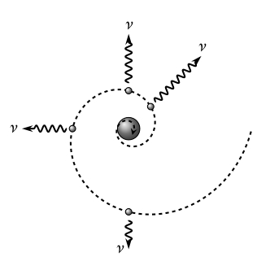
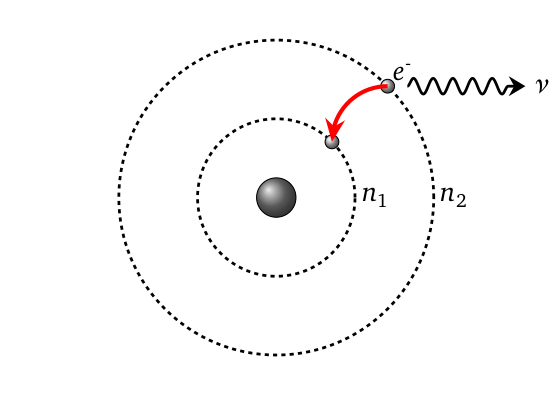
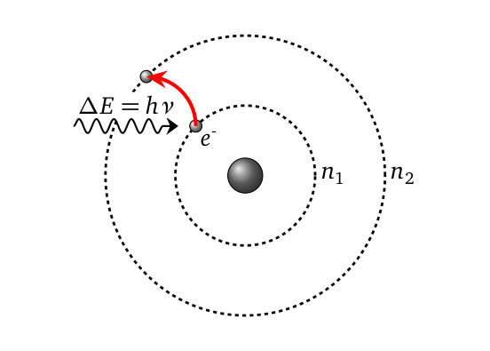
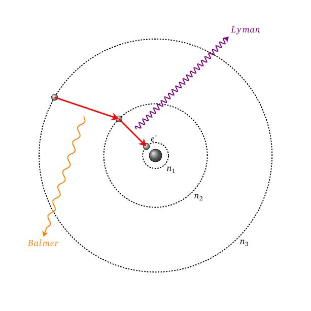

layout: true
background-size: contain

<div class="my-footer"><span>Flaviano Williams Fernandes</span></div>

```{r, include=FALSE, eval=FALSE, echo=FALSE}
  xaringan::inf_mr()
```

```{r setup, include=FALSE}
  options(htmltools.dir.version = FALSE)
  library("tidyverse")
  library("ggplot2")
  library("gganimate")
  library("latex2exp")
#  knitr::opts_chunk$set(fig.path = 'img')
```

```{r, load_refs, echo=FALSE, message=FALSE}
  library(RefManageR)
  BibOptions(check.entries = TRUE, bib.style = "authoryear", style = "markdown",
           dashed = TRUE)
  bib <- ReadBib("./references.bib", check = FALSE)
```

---
class: middle

<div class="my-header"><span>Sumário</span></div>

1. Modelo clássico do átomo de hidrogênio

2. Modelo de Bohr do átomo de hidrogênio

2. Espectro do átomo de hidrogênio

3. Princípio da correspondência

6. Bibliografia

<div class="footnote">
  <ul>
  <hr>
  <li> Esta apresentação está disponível para download em <a href="https://flavianowilliams.github.io/education">flavianowilliams.github.io/education</a>;
  <li> Este material está sujeito a modificações. Recomenda-se acompanhamento permanente.
  </ul>
</div>

---
class: left, middle

<div class="my-header"><span>Modelo clássico do átomo de hidrogênio - Modelos atômicos</span></div>

* O modelo de Thompson é chamado de pudim de passas. O átomo seria uma massa carregada positivamente e os elétrons estariam mergulhados, como as passas de um pudim. [`r Citep(bib, c("nussenzveig","tipler","mcquarrie","braga","eisberg"))`];
* No modelo de Rutherford, as cargas positivas estariam concentradas em uma pequena região que chamamos de núcleo atômico, e os elétrons orbitariam ao redor do núcleo. Rutherford desenvolveu o seu modelo a partir do experimento de Geiger-Marsden.

.pull-left[
```{r, echo=FALSE, fig.align='center',fig.cap='Modelo de Thompson.',out.width="40%",fig.asp=1,fig.ncol=2}
  knitr::include_graphics("img/modelo-thompson.png")
```
]
.pull-right[
```{r, echo=FALSE, fig.align='center',fig.cap='Modelo de Rutherford.',out.width="40%",fig.asp=1,fig.ncol=2}
  knitr::include_graphics("img/modelo-rutheford.jpg")
```
]

---
class: left, middle

<div class="my-header"><span>Modelo clássico do átomo de hidrogênio - Discrepâncias com os valores observados</span></div>

.pull-left[
  Pela lei de Coulomb, o elétron de carga -e ao redor do núcleo que possui uma carga elétrica Ze, sendo e a carga elementar, é submetido a uma força dado pela equação abaixo,
  \begin{aligned}
    F = \frac{Kze^2}{r^2}=\frac{mv^2}{r}.
  \end{aligned}
  Isolando a velocidade na equação teremos
  \begin{aligned}
    v= \left(\frac{kze^2}{mr}\right)^{1/2}.
  \end{aligned}
  Substituindo a velocidade do elétron na expressão da energia cinética K temos
  \begin{aligned}
    K = \frac{kze^2}{2r},
  \end{aligned}
  Considerando que a energia potencial U é dado por
]
.pull-right[
  \begin{aligned}
    U &= -\frac{kze^2}{r},
  \end{aligned}
  temos que a energia total E, somando a energia cinética e potencial, é dado por
  \begin{aligned}
    E = \frac{kze^2}{2r}-\frac{kze^2}{r},
  \end{aligned}
  onde podemos considerar que
  \begin{aligned}
    E\sim -\frac{1}{r}.
  \end{aligned}
* <font class="red">Se o elétron perdesse energia cinética K devido a emissão de radiação, então o raio r da órbita diminuiria sucessivamente. Assim a colisão seria inevitável!!!;
* Seguindo o modelo clássico, o elétron poderia assumir qualquer valor de energia até a sua colisão com o núcleo.</font>
]

---
class: left, middle

<div class="my-header"><span>Modelo clássico do átomo de hidrogênio - Discrepâncias com os valores observados</span></div>

.pull-left[
Do movimento circular podemos dizer que
\begin{aligned}
  \nu & = \frac{v}{2\pi r},\\\
      & = \left(\frac{kZe^2}{rm}\right)\frac{1}{2\pi r},\\\
      & = \left(\frac{kZe^2}{4\pi^2m}\right)\frac{1}{r^{3/2}}.
\end{aligned}
  onde podemos considerar que
  \begin{aligned}
    \nu\;\sim \frac{1}{r^{3/2}}.
  \end{aligned}
  <p class="red">De acordo com a física clássica, à medida que o elétron perde energia por emissão de radiação, a frequência da radiação emitida torna-se cada vez maior, terminando apenas quando o elétron se choca com o núcleo.</p>
]
.pull-right[
```{r, echo=FALSE, fig.align='center',fig.cap='Modelo clássico do átomo de hidrogênio.',out.width="80%",fig.asp=1,fig.ncol=2}
  
```
]

---
class: left, middle

<div class="my-header"><span>Modelo de Bohr do átomo de hidrogênio - Postulados de Bohr</span></div>

Todas as discrepâncias do modelo clássico foram resolvidas por Bohr através dos seguintes postulados:

* Os elétrons se movem em certas órbitas sem irradiar energia (Essas órbitas foram chamadas de estados estacionários.);
* O átomo emite radiação quando um elétron faz uma transição de um estado estacionário para outro,

\begin{aligned}
    h\nu = E_f-E_i.
\end{aligned}

* No limite de grandes órbitas e altas energias, os resultados quânticos devem coincidir com os resultados classicos.

.pull-left[
```{r, echo=FALSE, fig.align='center',fig.cap='Emissão de um fóton quando o elétron salta para uma órbita menos energética.',out.width="65%",fig.asp=1,fig.ncol=2}
  
```
]
.pull-right[
```{r, echo=FALSE, fig.align='center',fig.cap='O elétron salta para uma órbita mais energética quando ele absorve um fóton de energia equivalente.',out.width="65%",fig.asp=1,fig.ncol=2}
  
```
]

---
class: left, middle

<div class="my-header"><span>Modelo de Bohr do átomo de hidrogênio - Quantização do momento angular</span></div>

.pull-left[
De acordo com Bohr, o elétron que se move ao redor do núcleo em órbitas circulares possuindo um movimento ondulatório de acordo com a hipótese de de Brogile. Do movimento circular temos que L = rp. Da hipótese de de Broglie temos $\lambda = h/p$ e sabendo que o comprimento de cada órbita é dado por $C=2\pi r$, onde cada órbita somente pode corresponder a $n\lambda$, chegamos a
\begin{aligned}
  L & \left(\frac{n\lambda}{2\pi}\right)\left(\frac{h}{\lambda}\right),\\
  L & = n\hbar,\quad n=1,2,3,\cdots,
\end{aligned}
onde $\hbar = h/2\pi$ e h é a constante de Planck. Substituindo $v= \left(\frac{kze^2}{mr}\right)^{1/2}$ teremos
\begin{aligned}
  L & = mr\left(\frac{KZe^2}{mr}\right)^{1/2},\\\
  n\hbar & = mr\left(\frac{KZe^2}{mr}\right)^{1/2}.
\end{aligned}
]
.pull-right[
  Isolando r na equação teremos
  \begin{aligned}
    r_n = \left(\frac{\hbar^2}{mKe^2}\right)\frac{n^2}{Z}
  \end{aligned}
  Podemos ver que o termo entre parêntesis é uma constante, cujo valor correspende exatamente ao raio do átomo de hidrogênio $a_0$, onde $a_0=0,0594\; nm$.

```{r, echo=FALSE, fig.align='center',fig.cap='O movimento completo do elétron deve ser equivalente a números inteiros de comprimentos de onda.',out.width="50%",fig.asp=1,fig.ncol=2}
  
```
]

---
class: left, middle

<div class="my-header"><span>Modelo de Bohr do átomo de hidrogênio - Quantização dos níveis de energia</span></div>

.pull-left[
Substituindo r na expressão da energia encontramos
\begin{aligned}
  E_n & = -\frac{KZe^2}{2r_n},\\\
      & = -\left(\frac{mK^2e^4}{2\hbar^2}\right)\frac{Z^2}{n^2},\\\
      & = - E_0\frac{Z^2}{n^2},\quad n=1,2,3,\cdots
\end{aligned}
Podemos ver que o termo entre parêntesis é uma constante e seu valor corresponde a energia do estado fundamental do átomo de hidrogênio (-13,6 eV).
* <font class="red">De acordo com o modelo de Bohr, as órbitas estacionárias são comprovadas pela relação r ~ n<sup>2</sup>, assumindo valores discretos com valores de n;</font>
* <font class="red">Cada órbita possui valor discreto de energia E<sub>n</sub>, onde E<sub>n</sub> ~ 1/n<sup>2</sup>, como mostra a equação acima.</font>
]
.pull-right[
```{r, message=FALSE, echo=FALSE, fig.align='center',fig.cap='Movimento ondulatório do elétron de acordo com o número quântico n, demonstrando assim que o modelo de Bohr concorda com os postulados de de Broglie.',out.width="100%"}
myfuncx <- function(A,n,t){
  (A+0.5*cos(n*t))*cos(t)
}
myfuncy <- function(A,n,t){
  (A+0.5*cos(n*t))*sin(t)
}
#
smpl=1000
nt=9
t=rep(0,nt*smpl)
n=rep(0,nt*smpl)
for (nx in 2:nt) {
  t[nx*smpl+1]=2*(nx+1)*pi/smpl
  n[nx*smpl+1]=nx
  for (i in 2:smpl) {
    t[nx*smpl+i] = t[nx*smpl+i-1]+2*(nx)*pi/smpl
    n[nx*smpl+i]=nx
  }
}
#
smpl=0.5*smpl
t2=rep(0,smpl)
t2[1]=2*pi/smpl
for (i in 2:smpl) {
  t2[i] = t2[i-1]+2*pi/smpl
}
#
my_data2 = data.frame(n=rep(0,length(t2)),t2) %>%
  mutate(x2=myfuncx(3.5,0,t2),y2=myfuncy(3.5,0,t2))
#
my_data <- data.frame(n,t) %>%
  mutate(x=myfuncx(4,n,t),y=myfuncy(4,n,t))

library(plotly)

#fig = plot_ly(type = 'scatter', mode = 'markers', width = 500, height = 450,
#              marker = list(size = 5)) %>%
#  add_markers(data = my_data2, x = ~x2, y = ~y2, name = 'n=1') %>%
#  add_markers(data = filter(my_data, n == 3), x = ~x, y = ~y, name = 'n=3') %>%
#  add_markers(data = filter(my_data, n == 5), x = ~x, y = ~y, name = 'n=5') %>%
#  add_markers(data = filter(my_data, n == 7), x = ~x, y = ~y, name = 'n=7') %>%
#  add_markers(data = filter(my_data, n == 9), x = ~x, y = ~y, name = 'n=9')

fig = plot_ly(data = my_data, type = 'scatter', mode = 'markers', width = 450, height = 450, marker = list(size = 5, color = 'red'),  x = ~x, y = ~y, frame = ~n, showlegend = FALSE) %>%
  add_markers(data = my_data2, x = ~x2, y = ~y2, marker = list(color = 'gray', size = 2))

fig %>%
  layout(
    xaxis = list(title = 'x'),
    yaxis = list(title = 'y')
  )

#
#  ggplot()+
#    geom_point(data=my_data2,mapping = aes(x=x2,y=y2),size=0.5,shape=21)+
#    geom_point(data=my_data,mapping=aes(x=x,y=y),color='red')+
#    theme(legend.position = "none")+
#    labs(title = 'n: {previous_state}',x='x',y='y')+
#    transition_states(as.factor(n))
```
]

---
class: left, middle

<div class="my-header"><span>Modelo de Bohr do átomo de hidrogênio - Cálculo dos níveis de energia do átomo de hidrogênio</span></div>

.pull-left[
Supondo que o elétron realize um salto do nível $n_i$ para outro nível menos energético $n_f$, pelo postulado de Bohr para que o elétron faça essa transição, ele obrigatoriamente deverá emitir um fóton com energia equivalente a diferença de energia $\Delta E = E_{n_i} - E_{n_f}$,
\begin{aligned}
  \Delta E & = -E_0\frac{Z^2}{n^2_i}-\left(-E_0\frac{Z^2}{n^2_f}\right),\\\
           & = E_0Z^2\left(\frac{1}{n^2_f}-\frac{1}{n^2_i}\right)
\end{aligned}
Mas sabemos, a partir do efeito fotoelétrico, que a energia do fóton é dado por $E=h\nu$, onde $\nu$ é a sua frequência, assim
\begin{aligned}
  \nu = \frac{E_0Z^2}{h}\left(\frac{1}{n^2_f}-\frac{1}{n^2_i}\right).
\end{aligned}
]
.pull-right[
Além do mais, sabemos também que $c=\nu\lambda$, onde substituindo na equação anterior resulta em
\begin{aligned}
  \frac{c}{\lambda} & = \frac{E_0Z^2}{h}\left(\frac{1}{n^2_f}-\frac{1}{n^2_i}\right),\\\
  \frac{1}{\lambda} & = \frac{E_0Z^2}{hc}\left(\frac{1}{n^2_f}-\frac{1}{n^2_i}\right).
\end{aligned}
Podemos observar que $E_0$, $Z$ e $h$ são constantes, onde podemos substituir por uma única constante R, chamada de constante de Rydberg,
\begin{aligned}
\frac{1}{\lambda} & = R\left(\frac{1}{n^2_f}-\frac{1}{n^2_i}\right).
\end{aligned}
Bohr calculou teoricamente o valor da constante de Rydberg e surpreendentemente obteve boa concordância com os dados experimentais obtidos à partir da espectroscopia.
]

---
class: left, middle

<div class="my-header"><span>Modelo de Bohr do átomo de hidrogênio - Espectro do átomo de hidrogênio</span></div>

.pull-left[
```{r, echo=FALSE, fig.align='center',fig.cap='Espectro do átomo de hidrogênio  e as transições de Lyman, Balmer e Paschen.',out.width="90%",fig.asp=1,fig.ncol=2}
  
```
]
.pull-right[
```{r, echo=FALSE, fig.align='center',fig.cap='Órbitas circulares de Bohr e emissões K e L.',out.width="95%",fig.asp=1,fig.ncol=2}
  
```
]

---
class: left, middle

<div class="my-header"><span>Princípio da correspondência</span></div>

.pull-left[
De acordo com o princípio da correspondência, se os níveis de energia estão mais próximos, a quantização não é importante e os cálculos quânticos e clássicos devem conduzir ao mesmo resultado. Podemos ver isso claramente no espectro do átomo de hidrogênio, onde os níveis de energia vão se tornando cada vez mais próximos à medida que n aumenta. Para verificar o princípio da correspondência vamos tomar como exemplo a frequência do fóton emitido quando o elétron salta da órbita $n_i=n$ para a órbita subsequente $n_f=n-1$,
\begin{aligned}
  \nu & = \frac{E_0Z^2}{h}\left(\frac{1}{n^2_f}-\frac{1}{n^2_i}\right),\\\
    & = \frac{E_0Z^2}{h}\left(\frac{1}{(n-1)^2}-\frac{1}{n^2}\right),\\\
    & = \frac{E_0Z^2}{h}\left(\frac{2n-1}{n^2(n-1)^2}\right).
\end{aligned}
]
.pull-right[
Considerando que a transição ocorre entre grandes números quânticos, ou seja, no limite $n>>1$,
\begin{aligned}
  \nu & \approx \frac{E_0Z^2}{h}\left(\frac{2n}{n^3}\right),\\\
  \nu & \approx \left(\frac{mk^2Z^2e^4}{2\pi\hbar^3n^3}\right),
\end{aligned}
onde $E_0=mk^2e^4/2\hbar^2$ e $h=2\pi\hbar$. Entretanto $r=\hbar^2n^2/mKZe^2$ e $v=\left(\frac{kze^2}{mr}\right)^{1/2}$, ou seja,
\begin{aligned}
  \nu & = \left(\frac{1}{2\pi}\right)\underbrace{\left(\frac{mkZe^2}{\hbar^2n^2}\right)}_{1/r}\underbrace{\left(\frac{kZe^2}{\hbar n}\right)}_{v},\\\
  \nu & = \frac{v}{2\pi r}\Rightarrow r = \frac{v}{2\pi\nu}.
\end{aligned}
ou seja, a frequência da radiação emitida corresponde a frequência do movimento da carga elétrica.
]

---
class: left, middle

<div class="my-header"><span>Aplicações - O teste da chama</span></div>

.pull-left[
xxxxxxxxxxxxx

]
.pull-right[

<iframe width="560" height="315" src="https://www.youtube.com/embed/5aX46i91ktM?si=EbhBY_15fPbzitc_" title="YouTube video player" frameborder="0" allow="accelerometer; autoplay; clipboard-write; encrypted-media; gyroscope; picture-in-picture; web-share" referrerpolicy="strict-origin-when-cross-origin" allowfullscreen></iframe>

]

---
class: middle

<div class="my-header"><span>Bibliografia</span></div>

```{r, results='asis', echo=FALSE, message=FALSE}
PrintBibliography(bib)
```

