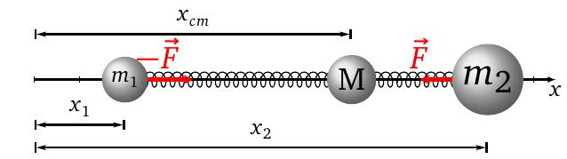
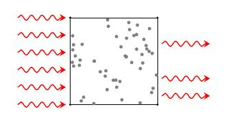
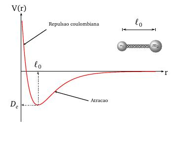

layout: true
background-size: contain

<div class="my-footer"><span>Flaviano Williams Fernandes</span></div>

```{r, include=FALSE, eval=FALSE, echo=FALSE}
  xaringan::inf_mr()
```

```{r setup, include=FALSE}
  options(htmltools.dir.version = FALSE)
  library("ggplot2")
  library("gganimate")
  library("latex2exp")
  library("tidyverse")
  library("plotly")
#  knitr::opts_chunk$set(fig.path = 'img')
```

```{r, load_refs, echo=FALSE, message=FALSE}
  library(RefManageR)
  BibOptions(check.entries = FALSE, bib.style = "authoryear", style = "markdown",
           dashed = TRUE)
  bib <- ReadBib("references.bib", check = FALSE)
```

---
class: middle

<div class="my-header"><span>Sumário</span></div>

1. Oscilador harmônico clássico

2. Oscilador quântico

3. Aplicações

4. Oscilador anarmônico

5. Aplicações

6. Apêndice A. Regra de seleção

7. Apêndice B. Função de Morse e o potencial de ligação

<div class="footnote">
  <ul>
  <hr>
  <li> Esta apresentação está disponível para download em <a href="https://flavianowilliams.github.io/education">flavianowilliams.github.io/education</a>;
  <li> Este material está sujeito a modificações. Recomenda-se acompanhamento permanente.
  </ul>
</div>

---
class: middle

<div class="my-header"><span>Oscilador harmônico clássico. Sistema de uma partícula</span></div>

.pull-left[

Supondo um oscilador harmônico constituído por um objeto de massa m conectado a uma mola de constante elástica k, definimos a sua energia potencial como $U(r)=\frac{1}{2}kr^2$ `r Citep(bib, c("tipler","mcquarrie","braga"))`. Considerando que a frequência angular é dada por $\omega = \sqrt{k}{m}$, podemos dizer que $k=m\omega^2$, ou seja, de maneira equivale à

\begin{aligned}
U(r) = \frac{1}{2}kr^2 = \frac{1}{2}m\omega^2r^2.
\end{aligned}

Na mecânica clássica, uma partícula submetida a esse potencial encontra-se em equilíbrio na posição x = 0, e fora desse ela é submetida a uma força $\vec{F}=-k\vec{r}$. A energia de uma partícula sob esse potencial seria equivalente à $E=\frac{1}{2}kr_m^2$, e nesse caso, a sua energia poderia assumir qualque valor, sem restrição, dependendo somente da amplitude de oscilação $r_m$ e da constante elástica $k$.

]
.pull-right[

A figura abaixo mostra a energia potencial do oscilador harmônico simples. Neste caso, a partícula somente pode se mover na região $-r_m<x<r_m$, que na figura está sendo mostrado pela linha vermelha.

```{r, echo=FALSE, fig.align='center',fig.cap='Gráfico da energia do oscilador harmônico clássico.',out.width="60%",fig.asp=1}
  knitr::include_graphics("img/mhs-classico.jpeg")
```

]

---
class: middle

<div class="my-header"><span>Oscilador harmônico clássico. Sistema de duas partículas</span></div>

.pull-left[

Considerando o referencial na origem (x=0), podemos dizer que pela lei de Hooke

\begin{aligned}
  m_1\frac{d^2x_1}{dt^2} & = -F = k(x_2-x_1-\ell_0),\\
  m_2\frac{d^2x_2}{dt^2} & = F = -k(x_2-x_1-\ell_0).
\end{aligned}

$\ell_0$ seria neste caso a distância relativa de equilíbrio entre as partículas, onde a energia potencial é nula. Somando ambas as equações teremos

\begin{equation}
  m_1\frac{d^2x_1}{dt^2} + m_2\frac{d^2x_2}{dt^2} = -F+F = 0.
\end{equation}

Aplicando as propriedades inversas de derivação teremos

\begin{equation}
  \frac{d^2(m_1x_1)}{dt^2} + \frac{d^2(m_2x_2)}{dt^2} = 0,
\end{equation}

]

.pull-right[

Agora, sabendo que $\frac{d^2(F+G)}{dt^2}=\frac{d^2F}{dt^2}+\frac{d^2G}{dt^2}$ teremos

\begin{equation}
  \frac{d^2(m_1x_1+m_2x_2)}{dt^2} = 0,
\end{equation}

Entretanto, pela definição do centro de massa, temos que $x_{cm}=\frac{m_1x_1+m_2x_2}{M}$, onde $M=m_1+m_2$, portanto

\begin{equation}
  M\frac{d^2x_{cm}}{dt^2} = 0,
\end{equation}

ou seja, a contribuição do centro de massa para o MHS é nula.

```{r, echo=FALSE, fig.align='center',fig.cap='Sistema de duas partículas.',out.width="100%",fig.asp=1}
  
```

]

---
class: middle

<div class="my-header"><span>Oscilador harmônico clássico. Sistema de duas partículas</span></div>

.pull-left[

Agora, dividindo ambas as equações por $m_1$ e $m_2$ teremos

\begin{aligned}
  \frac{d^2x_1}{dt^2} & = -\frac{F}{m_1},\\
  \frac{d^2x_2}{dt^2} & = \frac{F}{m_2}.
\end{aligned}

Subtraindo e aplicando as regras de derivação teremos

\begin{aligned}
  \frac{d^2(x_2)}{dt^2} - \frac{d^2(x_1)}{dt^2}  & = F\left(\frac{1}{m_1}+\frac{1}{m_2}\right),\\
  \frac{d^2(x_2-x_1)}{dt^2}  & = -\left(\frac{1}{m_1}+\frac{1}{m_2}\right)k(x_2-x_1-\ell_0).
\end{aligned}

Identificando $r=x_2-x_1$ como a coordenada relativa entre $m_1$ e $m_2$, teremos

\begin{aligned}
  \frac{d^2r}{dt^2}  & = -\left(\frac{1}{m_1}+\frac{1}{m_2}\right)k(r-\ell_0).
\end{aligned}

]

.pull-right[

\begin{aligned}
  \frac{d^2r}{dt^2}  & = -\left(\frac{m_1+m_2}{m_1m_2}\right)k(r-\ell_0).
\end{aligned}

Adotando $\mu = \frac{m_1m_2}{m_1+m_2}$, onde $\mu$ é a chamada massa reduzida teremos

\begin{aligned}
  \mu\frac{d^2r}{dt^2} +k(r-\ell_0) = 0.
\end{aligned}

Dessa maneira, conseguimos reduzir o problema de dois corpos ao problema de um corpo, onde teremos o MHS realizado por apenas um objeto de massa $\mu$.

```{r, echo=FALSE, fig.align='center',fig.cap='Duas partículas conectadas por uma mola de constante elástica k.',out.width="100%",fig.asp=1}
  knitr::include_graphics("img/mhs-2particulas.jpeg")
```

]

---
class: middle

<div class="my-header"><span>Oscilador quântico. A função de onda do oscilador quântico</span></div>

.pull-left[

Considere duas particulas sujeitas a uma interação similar a um MHS, como por exemplo dois átomos de uma molecula de hidrogênio. A solução desse sistema deve satisfazer as condições da mecânica quântica, onde a equação de Schrödinger fica na forma

\begin{aligned}
  -\frac{\hbar^2}{2\mu}\frac{d^2\psi}{dr^2}+\frac{1}{2}kr^2\psi = E\psi.
\end{aligned}

Assim resolvendo essa equação encontraremos a sua função de onda $\psi$. Primeiramente deveremos deixá-la no formato que seja possível econtrar a sua solução do ponto de vista da matemática. Portanto segue os seguintes passos à seguir.

Primeiro multiplicamos por $-2\mu/\hbar^2$,

\begin{aligned}
  \frac{d^2\psi}{dr^2}-\frac{\mu k}{\hbar^2}r^2\psi+\frac{2\mu E}{\hbar^2}\psi = 0.
\end{aligned}

]

.pull-right[

Substituindo $\lambda = 2\mu E/\hbar^2$ e $\alpha^2 = \mu k/\hbar^2$ teremos

\begin{aligned}
  \frac{d^2\psi}{dr^2}+\left(\lambda-\alpha^2r^2\right)\psi = 0.
\end{aligned}

Para que essa equação seja resolvida, devemos em uma forma mais conveniente. Primeiramente fazemos a substituição

\begin{aligned}
  \psi(r) = e^{-\frac{1}{2}\alpha r^2}y(r)
\end{aligned}

Com essa substituição, a equação acima torna-se

\begin{aligned}
  \frac{d^2 y}{dr^2}-2\alpha r\frac{dy}{dr}+\left(\lambda-\alpha\right)y = 0.
\end{aligned}

Para alcançar a equação na forma desejada, ainda fazemos outra substituição, $\epsilon=\alpha^{1/2} r$,

\begin{aligned}
  \frac{d^2 y}{d\epsilon^2}-2\epsilon\frac{dy}{d\epsilon}+\left(\lambda/\alpha-1\right)y = 0.
\end{aligned}

]

---
class: middle

<div class="my-header"><span>Oscilador quântico. A função de onda do oscilador quântico</span></div>

.pull-left[

A equação mostrada anteriormente somente tem solução se

\begin{aligned}
  \left(\frac{\lambda}{\alpha}-1\right) = 2n,
\end{aligned}

e a solução são conhecidas como polinômios de Hermite $H_n(r)$. Portanto, a função de onda do oscilador quântico possuem a forma mostrada abaixo,

\begin{aligned}
  \psi_n(r) = \left[\left(\frac{\alpha}{\pi}\right)^{1/2}\frac{1}{2^nn!}\right]e^{-\frac{\alpha^2x^2}{2}}H_n(r).
\end{aligned}

A densidade de probabilidade é obtida aplicando a famosa operação $|\psi(x)|^2$,

\begin{aligned}
  |\psi_n(r)|^2 = \frac{\alpha}{\pi}\left(\frac{1}{2^nn!}\right)^2e^{-\alpha^2r^2}|H_n(r)|^2.
\end{aligned}

]

.pull-right[

```{r, message=FALSE, echo=FALSE, fig.align='center',fig.cap='Densidade de probabilidade do estado fundamental e dos três primeiros estados excitados do oscilador.'}

myfunc1 <- function(k,x0,x){
  0.5*k*(x-x0)**2
}

myfunc2 <- function(x){
  sqrt(5/pi)*exp(-5*x**2)
}
#
myfunc3 <- function(x){
  sqrt(4*5**3/pi)*x**2*exp(-5*x**2)
}
#
myfunc4 <- function(x){
  sqrt(5/(4*pi))*(2*5*x**2-1)**2*exp(-5*x**2)
}
#
myfunc5 <- function(x){
  sqrt(5**3/(9*pi))*(2*5*x**3-3*x)**2*exp(-5*x**2)
}
#
smpl=100
xm = 1.5
nt=9
#
k = sqrt(5)
x=seq(-xm,xm,2*xm/(smpl-1))
#
potencial = data.frame(x=x, n=0, y = myfunc1(k,0,x), y2 = myfunc2(x))
potencial = rbind(potencial, data.frame(x= x, n =1 , y = myfunc1(k,0,x), y2 = myfunc3(x)))
potencial = rbind(potencial, data.frame(x= x, n =2 , y = myfunc1(k,0,x), y2 = myfunc4(x)))
potencial = rbind(potencial, data.frame(x= x, n =3 , y = myfunc1(k,0,x), y2 = myfunc5(x)))
#
fig = plot_ly(
  data = filter(potencial, n == 1), type = 'scatter', mode = 'lines', line = list(size = 5, color = 'gray'),  x = ~x, y = ~y, width = 500, height = 500, showlegend = FALSE
  ) %>%
  add_lines(
  data = potencial, type = 'scatter', mode = 'lines', line = list(size = 5, color = 'red'),  x = ~x, y = ~y2, frame = ~n)
#
fig = fig %>%
  layout(
    xaxis = list(title = 'r'),
    yaxis = list(title = 'V(r)')
  )

fig

```

]

---
class: middle

<div class="my-header"><span>Oscilador quântico. Os níveis de energia do oscilador quântico</span></div>

.pull-left[

Substituindo $\alpha$ e $\lambda$ na equação $\left(\frac{\lambda}{\alpha}-1\right) = 2n$ teremos

\begin{aligned}
  \frac{\lambda}{\alpha} = \frac{\frac{2\mu E}{\hbar^2}}{\frac{(\mu k)^1/2}{\hbar}} & = 2n+1,\\
  \frac{2\mu E}{(\mu k)^1/2} & = 2n+1,\\
  E & = \left(n+\frac{1}{2}\right)\left(\frac{k}{m}\right)^{1/2}\hbar.
\end{aligned}

Mas pelo sistema massa-mola temos que $\omega^2=k/\mu $. Substituindo teremos

\begin{aligned}
  E_n = \left(n+\frac{1}{2}\right)\hbar\omega.
\end{aligned}

**Assim, podemos perceber que a energia do oscilador quântico é quantizada**.

]

.pull-right[

```{r, echo=FALSE, fig.align='center',fig.cap='Níveis de energia do oscilador quântico.',out.width="100%",fig.asp=1}
  knitr::include_graphics("img/energia-mhs-quantico.jpeg")
```

]

---
class: middle

<div class="my-header"><span>Oscilador quântico. Regra de seleção</span></div>

.pull-left[
Vimos no slide anterior que os níveis de energia do oscilador quântico, são quantizados na forma $E_n=\hbar\omega(n+1/2)$. Fisicamente a transição eletrônica do nível n para outro n' somente ocorre se a molécula interagir com a radiação eletromagnética (através do processo de absorção da radiação). Essa interação ocorre pelo acoplamento do momento dipolo elétrico da molécula com o campo elétrico da radiação eletromagnética,
\begin{aligned}
  H = \vec{\mu}\cdot \vec{E}
\end{aligned}
Assim é de se esperar que antes e após a absorção da radiação, deve ocorrer uma mudança no momento de dipolo elétrico da molécula. Na mecânica quântica, a mudança no momento de dipolo elétrico somente não irá se anular se o fóton absorvido tiver uma energia equivalente a diferença dos níveis de energia referente a transição $\Delta n=\pm 1$ do oscilador (*veja o Apêndice A*).

]

.pull-right[

```{r, echo=FALSE, fig.align='center',fig.cap='Níveis de energia do oscilador quântico.',out.width="100%",fig.asp=1}
  knitr::include_graphics("img/energia-niveis.jpeg")
```

]

---
class: middle

<div class="my-header"><span>Aplicação. A técnica de espectroscopia por absorção (espectrofotometria)</span></div>

.pull-left[
A nível subatômico o período de vibração de um modo de estiramento é da ordem de $10^{-15}\;s$, o que corresponde a uma frequência vibracional de $10^{14}\;\text{Hz}$. No espectro eletromagnético, essa frequência estaria na faixa do infravermelho ( $3\times 10^{12}$ à $4\times 10^{14}\;\text{Hz}$ ).

Considerando que a interação intramolecular de uma molécula diatômica como um oscilador harmônico, os níveis de energia são dados por
\begin{aligned}
  E_n = \hbar\omega\left(n+1/2\right),\quad n=0,1,2,\cdots
\end{aligned}
A molécula após absorver a radiação de determinada frequência de acordo com a hipótese de Bohr dado por $\Delta E = h\nu$. Um esquema parecido pode ser visto na figura ao lado, onde a diferença entre a intensidade do feixe incidente e o feixe transmitido fornece a quantidade de fótons absorvidos por cada molécula.

]

.pull-right[

```{r, echo=FALSE, fig.align='center',fig.cap='Esquema de espectroscopia por absorção.',out.width="100%",fig.asp=1}
  
```

Entretanto, vimos anteriormente que a regra de seleção do oscilador quântico impõe que a transição somente ocorre se $\Delta n = \pm 1$. Portanto para a absorção acontecer, o fóton deverá possuir energia equivalente a
\begin{aligned}
  \Delta E & = \hbar\omega = h\nu.
\end{aligned}
ou seja, a frequência independe de n.
]

---
class: middle

<div class="my-header"><span>Aplicação. Análise vibracional de moléculas diatômicas</span></div>

.pull-left[

Pelo oscilador harmônico temos que
\begin{aligned}
\nu = \frac{1}{2\pi}\left(\frac{k}{\mu}\right)^{1/2}\quad (Hz).
\end{aligned}
A frequência vibracional calculada é da ordem de $10^{14}\;\text{Hz}$, um valor um pouco complicado de trabalhar. Assim, é de costume obter uma análise vibracional à partir do número de onda ao invés da frequência $\nu$ diretamente. Isso pode ser obtido dividindo a frequência pela constante c,
\begin{aligned}
\bar{\omega} = \frac{1}{2\pi c}\left(\frac{k}{\mu}\right)^{1/2}\quad (cm^{-1}).
\end{aligned}
Assim, os valores dos modos de estiramento são representados na faixa de 0 a $4000\;cm^{-1}$. 

Além disso, podemos obter a constante de força k, associado com a intensidade da ligação química.

]

.pull-right[

Através da frequência obtemos o valor de k, como mostra abaixo,
\begin{aligned}
  k = (2\pi c\omega)^2\mu.
\end{aligned}
Como exemplo, supomos a molécula HCl, que possui uma ligação iônica entre os átomos de hidrogênio (1 au) e cloro (35 au). A frequência vibracional da ligação é $2886\;cm^{-1}$, assim
\begin{aligned}
  k & = \mu(2\pi c\omega)^2,\\
    & = \frac{(1\;au)(35\;au)}{(35+1)\;au}(1,661\times 10^{-27}\; kg/au)\times,\\
    & \times (2\pi)^2(2,998\times 10^{10}\;cm/s)^2(2886\;cm^{-1})^2,\\
    & = 478\;N/m.
\end{aligned}
Entretanto a molécula $Cl_2$ que tem uma ligação covalente mais fraca entre os átomos de cloro, possui uma frequência vibracional da ordem de $560\;cm^{-1}$, o que corresponde à $k=319\;N/m$.

]

---
class: middle

<div class="my-header"><span>Oscilador anarmônico. Correções do oscilador quântico</span></div>

.pull-left[

Como vimos no slide anterior, o modelo do oscilador harmônico prevê que a molécula HCl absorve radiação de frequência equivalente a $2886\;cm^{-1}$. Essa previsão teórica concorda perfeitamente com os resultados experimentais. Entretanto, certas ocasiões produz desvios do resultado teórico em comparação ao experimental. Esses desvios geralmente são mais pronunciados em moléculas que possuem uma fraca constante de força k e nos caso onde o comprimento da ligação é consideravelmente elevado. Portanto, nesses casos devemos introduzir correções do potencial, responsável pelo modo de estiramento. Considere um potencial de ligação U(r) responsável pela ligação intramolecular. U(r) pode ser matematicamente representado como uma série de potência em torno da distância de equilíbrio $r_0$ com o recurso da série de Taylor,

]

.pull-right[

\begin{align*}
  U(r) & = U(r_0)+\frac{1}{2!}\left(\frac{d^2U}{dr^2}\right)_{r=r_0}(r-r_0)^2+\\
  & +\frac{1}{3!}\left(\frac{d^2U}{dr^2}\right)_{r=r_0}(r-r_0)^3+\cdots
\end{align*}
Identificando $k=\left(\frac{d^2U}{dr^2}\right)_{r=r_0}$, $\gamma_3=\left(\frac{d^3U}{dr^3}\right)_{r=r_0}$ teremos
\begin{align*}
  U(r) & = U(r_0)+\frac{1}{2}k(r-r_0)^2+\frac{1}{6}\gamma_3(r-r_0)^3+\cdots
\end{align*}
Identificamos o segundo termo como o potencial do oscilador harmônico e os demais termos a correção que deverá ser feita para alcançar o melhor resultado comparado com o valor experimental.

]

---
class: middle

<div class="my-header"><span>Oscilador anarmônico. O potencial de Morse</span></div>

.pull-left[

Entretanto, para obter a solução exata de V(r) deveríamos levar em consideração todos os termos da expansão, ou que seria inviável. Um outro caminho seria sugerir uma função que substituiria V(r) em sua integridade. À partir de uma análise comportamental da molécula, ou seja, como a interação se comporta ao aumentarmos ou diminuirmos a distância relativa. Bem, é de se esperar que para distâncias acima da distância de equilíbrio $\ell_0$ deve haver uma atração entre os átomos afim de manter a ligação permanente. Porém, à medida que a distância vai diminuindo para valores cada vez menores que $\ell_0$, o núcleo de cada átomo deve perceber a carga positiva do outro, produzindo uma repulsão de considerável intensidade. Morse propôs uma função que após uma análise empírica chegou na seguinte expressão abaixo,
\begin{align*}
U(r) = D_0\left[e^{-2\beta (r-\ell_0)}-2e^{-\beta (r-\ell_0)}\right]
\end{align*}

]

.pull-right[

A figura abaixo mostra a representação gráfica do potencial de Morse.

```{r, echo=FALSE, fig.align='center',fig.cap='Potencial de Morse.',out.width="100%",fig.asp=1}
  
```

]

---
class: middle

<div class="my-header"><span>Oscilador anarmônico. Análise vibracional anarmônica</span></div>

.pull-left[

Agora, iremos obter a solução da equação de Schrödinger utilizando a função de Morse ao invés do potencial do oscilador harmônico. Da equação de Schrödinger
\begin{align*}
  -\frac{\hbar^2}{2\mu}\frac{d^2}{dr^2}\psi+V(r)\psi & =E\psi,\\
  -\frac{\hbar^2}{2\mu}\frac{d^2}{dr^2}\psi+D_e\left[e^{-2\beta (r-\ell_0)}-2e^{-2\beta (r-\ell_0)}\right]\psi & =E\psi,\\
%  -\frac{d^2}{dr^2}\psi+\frac{2\mu D_e}{\hbar^2}\left[e^{-2\beta (r-\ell_0)}-2e^{-2\beta (r-\ell_0)}\right]\psi & =\frac{2\mu E}{\hbar}\psi,
\end{align*}
Substituindo $x=\beta r$ teremos após aplicarmos a regra da cadeia
\begin{align*}
  \frac{d^2\psi}{dr^2}=\beta^2\frac{d^2\psi}{dx^2},
\end{align*}
temos
\begin{align*}
  -\frac{\hbar^2\beta^2}{2\mu}\frac{d^2}{dx^2}\psi+D_e\left[e^{-2(x-x_0)}-2e^{-2 (x-x_0)}\right]\psi & =E\psi.
\end{align*}

]

.pull-right[

Multiplicando a equação por $2\mu/\hbar^2\beta^2$ teremos
\begin{align*}
  -\frac{d^2}{dx^2}\psi+\frac{2\mu D_0}{\hbar^2\beta^2}\left[e^{-2(x-x_0)}-2e^{-2 (x-x_0)}\right]\psi & =\frac{2\mu E}{\hbar^2\beta^2}\psi,\\
  -\frac{d^2}{dx^2}\psi+\delta\left[e^{-2(x-x_0)}-2e^{-2 (x-x_0)}\right]\psi & =\varepsilon\psi,
\end{align*}
onde definimos $\delta = \frac{2\mu D_0}{\hbar^2\beta^2}$ e $\varepsilon = \frac{2\mu E}{\hbar^2\beta^2}$. A equação acima somente tem solução se
\begin{align*}
  \varepsilon = \delta-\left(\sqrt{\delta} -n-\frac{1}{2}\right)^2
\end{align*}
Substituindo $\delta$ e $\varepsilon$ e isolando a energia E teremos
\begin{align*}
  E_n = \hbar\beta\sqrt{\frac{2D_e}{\mu}}\left(n+\frac{1}{2}\right)-\frac{\hbar^2\beta^2}{2\mu}\left(n+\frac{1}{2}\right)^2
\end{align*}
Mostraremos à seguir que a energia pode ser representada em função da frequência de oscilação.

]

---
class: middle

<div class="my-header"><span>Oscilador anarmônico. Energia de ligação segundo o potencial de Morse</span></div>

.pull-left[

Como mostra o Apêncice B, podemos definir $\omega_e = \beta\sqrt{\frac{2D_e}{\mu}}$. Sendo assim teremos para a energia
\begin{align*}
  E_n & = \hbar\omega_e\left(n+\frac{1}{2}\right)-(\hbar\omega_e)\left(\frac{\hbar}{\sqrt{8\mu D_e}}\right)\left(n+\frac{1}{2}\right)^2,\\
  & = \hbar\omega_e\left(n+\frac{1}{2}\right)-\hbar\omega_e\chi_e\left(n+\frac{1}{2}\right)^2,
\end{align*}
onde definimos $\chi_e = \frac{\hbar}{\sqrt{8\mu D_e}}$ como a constante de anarmonicidade do oscilador quântico. Assim, podemos dizer que $\chi_e$ define o grau de anarmoticidade do oscilador quântico, onde para oscilações puramente harmônicas podemos considerar $\chi_e\approx 0$. A figura ao lado mostra a comparação dos níveis de energia obtidos pelos potenciais harmônico e anarmônico. Podemos ver que o termo negativo na equação acima produz valores menores de energia comparado aos níveis harmônico, principalmente para níveis mais elevados de energia.

]

.pull-right[

```{r, echo=FALSE, message=FALSE, fig.align='center', fig.cap='Comparação entre os níveis de energia do oscilador harmônico e anarmônico.', out.width="100%"}

#rm(list = ls())

#library(tidyverse)
#library(plotly)

pot_harm = function(de, beta, x, x0){
  valor = 0.5*de*beta**2*(x-x0)**2
  return(valor)
}

pot_morse = function(de, beta, x, x0){
  valor = de+de*(exp(-2*beta*(x-x0))-2*exp(-beta*(x-x0)))
  return(valor)
}

x_max = function(e, de, beta, x0){
  valor = x0+sqrt(2*e/de)/beta
}

harmonico = function(de, beta, n){
  valor = beta*sqrt(2*de)*(n+0.5)
  return(valor)
}

morse = function(de, beta, n){
  valor = beta*sqrt(2*de)*((n+0.5)-(n+0.5)**2/sqrt(8*de))
  return(valor)
}

smpl=3000
rm = 5
de = 500
beta = 1.75
r0 = 1.5
r=seq(0,rm,2*rm/smpl)
#

df2 = data.frame(r=c(), n=c(), Potencial=c(), Energia=c())

# Potencial harmônico

for (i in 1:10) {
  
  df0 = data.frame(r=r, n=i, Potencial = "Harmônico", Energia = harmonico(de, beta, i))
  
  df0 = df0 %>%
    filter(
      r >= -x_max(harmonico(de, beta, i), de, beta, -r0) & r <= x_max(harmonico(de, beta, i), de, beta, r0)
    )
  
  df2 = rbind(df2,df0)
  
}

# Potencial Morse

for (i in 1:10) {
  
  x_mors = c()
  
  for (j in 1:length(r)) {
    if(pot_morse(de, beta, r[j], r0) < morse(de, beta, i) & r[j] < r0){
      x_mors[1] = r[j]
      break
      }
  }

  for (j in 1:length(r)) {
    if(pot_morse(de, beta, r[j], r0) > morse(de, beta, i) & r[j] > r0){
      x_mors[2] = r[j]
      break
    }
  }

  df0 = data.frame(r=r, n=i, Potencial = "Morse", Energia = morse(de, beta, i)) %>%
    filter(
    r >= x_mors[1] & r <= x_mors[2]
    )
  
  df2 = rbind(df2,df0)
  
}

# Curva

for (i in 1:10) {
  df2 = rbind(df2,
              data.frame(r=r, n=i, Potencial="Harm", Energia = pot_harm(de, beta, r, r0)),
              data.frame(r=r, n=i, Potencial="Mors", Energia = pot_morse(de, beta, r, r0))
  )
}

p = ggplot(df2, aes(x=r, y=Energia, frame=n))+
  geom_line(data=filter(df2, Potencial == "Harmônico"), color="blue", linetype = "dotted")+
  geom_line(data=filter(df2, Potencial == "Morse"), color="red", linetype = "dotted")+
  geom_line(data=filter(df2, Potencial == "Harm"), color="blue")+
  geom_line(data=filter(df2, Potencial == "Mors"), color="red")+
  ylim(0,700)

ggplotly(p)

```

]

---
class: middle

<div class="my-header"><span>Aplicação. Energia de dissociação</span></div>

.pull-left[

A figura ao lado mostra a diferença entre os potenciais harmônico e anarmônico. A comparação foi feita para 10 valores distintos do parâmetro $D_0$. Percebe-se que $D_0$ não representa a energia de dissociação da molécula, pois devemos considerar que a energia mínima da molécula corresponde ao estado n=0, onde a energia equivale à $E_0=\frac{\hbar\omega}{2}$.

A Tabela abaixo mostra a frequência vibracional, a constante de força e a constante de anarmonicidade. Percebe-se a dependência de $\chi_e$ com a constante de força.

| Molécula    | $\omega_e$ $(cm^{-1})$ | $\chi_e\omega_e$ $(cm^{-1})$     | k $(N\cdot m^{-1})$  |
| :---:       |    :----:   |         :---: | :---: |
| $HF$      | 4138,32       | 89,88   | 920      |
| $HCl$   | 2990,94        | 52,82      | 478      |
| $HBr$   | 2648,97        | 45,22      | 381      |
| $HI$   | 2309,01        | 39,64      | 291      |

]

.pull-right[

```{r, echo=FALSE, message=FALSE, fig.align='center', fig.cap='Comparação entre os potenciais harmônico e Morse.', out.width="100%"}

harmonico = function(n, de, beta, x, x0){
  valor = n*(-de+0.5*de*beta**2*(x-x0)**2)
  return(valor)
}

morse = function(n, de, beta, x, x0){
  valor = n*de*(exp(-2*beta*(x-x0))-2*exp(-beta*(x-x0)))
  return(valor)
}
energy = function(n, de, beta){
  valor = n*de
#  valor = beta*sqrt(2*de*n)*((n+0.5)-(n+0.5)**2/sqrt(8*de*n))
  return(valor)
}
#
smpl=200
rm = 10
de = 2.5
beta = 1.5
r0 = 2.0
r=seq(0,rm,2*rm/(smpl-1))
frames = 1:10
#
df = data.frame(r=r, n=1, Harmônico = harmonico(0.25, de, beta, r, r0), Morse = morse(0.25, de, beta, r, r0))

for (i in frames) {
  df = rbind(df, data.frame(r=r, n=i, Harmônico = harmonico(0.25*i, de, beta, r, r0), Morse = morse(0.25*i, de, beta, r, r0)))
}

df = df %>%
  gather("Harmônico", "Morse", key = "Potencial", value = "Energia")

en_df = data.frame(x1 = 3, y1 = 0, x2 = 3, y2 = energy(2.5, de, beta), n = 10)

p = ggplot(data=df, aes(x=r, y=Energia, frame=n, colour=Potencial))+
  geom_line()+
  ylim(-7, 4)+
  geom_hline(yintercept=0)

ggplotly(p)

```

]

---
class: middle

<div class="my-header"><span>Apêndice A. Regra de seleção</span></div>

.pull-left[
Na mecânica quântica a mudança no momento de dipolo elétrico da molécula pode ser representada pela equação abaixo,
\begin{aligned}
  \mu_{nn'} = \int\psi_n(x)\mu(x)\psi_{n'}(x)
\end{aligned}
Expandindo $\mu$ em série de potências em torno da distância de equilíbrio $r_0$, ou seja,
\begin{aligned}
  \mu(r) = \mu(r_0)+\left(\frac{d\mu}{dr}\right)_{r_0}+\cdots
\end{aligned}
teremos
\begin{aligned}
  \mu_{nn'} = \int\psi_n(x)\psi_{n'}(x)+\left(\frac{d\mu}{dr}\right)_{r_0}\int\psi_n(x)x\psi_{n'}(x)+\cdots
\end{aligned}
A primeira equação se anula devido as condições de ortogonalidade da função de onda. Agora, em relação a segunda equação fazemos a substituição $\alpha^{1/2}x=\epsilon$

]

.pull-right[

para aplicar a propriedade dos polinômios de Hermite
\begin{aligned}
  \epsilon H_n(\epsilon) = nH_{n-1}(\epsilon)+\frac{1}{2}H_{n+1}(\epsilon).
\end{aligned}
Assim teremos após a substituição $\psi(\epsilon)=H_n(\epsilon)e^{-\epsilon^2}$
\begin{aligned}
  \mu_{nn'} & = \frac{N_nN_{n'}}{\alpha}\left(\frac{d\mu}{dr}\right)_{r_0}\times\\
  &\times\int H_{n'}(x)\left[H_{n-1}(\epsilon)+\frac{1}{2}H_{n+1}(\epsilon)\right]e^{-\epsilon^2}d\epsilon+\cdots
\end{aligned}
Retornando à $\psi_n(r)$ teremos
\begin{aligned}
  \mu_{nn'} = \left(\frac{d\mu}{dr}\right)_{r_0}\int \psi_{n'}(r)\left[\psi_{n-1}(r)+\frac{1}{2}\psi_{n+1}(r)\right]dr
\end{aligned}
Podemos ver que pela propriedade da ortogonalidade das funções de onda, a integral somente não irá se anular, e consequentemente $\mu_{nn'}\neq 0$, se $n'=n\pm 1$.

]

---
class: middle

<div class="my-header"><span>Apêndice B. Função de Morse e o potencial de ligação</span></div>

.pull-left[

Vimos anteriormente que a função exata do potencial de ligação, pode ser representado pela expansão abaixo
\begin{align*}
  U(r) & = U(r_0)+\frac{1}{2!}\left(\frac{d^2U}{dr^2}\right)_{r=r_0}(r-r_0)^2+\\
  & +\frac{1}{3!}\left(\frac{d^2U}{dr^2}\right)_{r=r_0}(r-r_0)^3+\cdots
\end{align*}

Veremos agora se o potencial de Morse representa a função exata do potencial de ligação. Expandindo os termos do potencial de Morse teremos
\begin{align*}
  e^{-2\beta (r-r_0)} & = 1+\frac{1}{2}\left(4\beta^2\right)(r-r_0)^2+\\
  & -\frac{1}{6}\left(8\beta^3\right)(r-r_0)^3+\cdots\\
  e^{-\beta (r-r_0)} & = 1+\frac{1}{2}\left(\beta^2\right)(r-r_0)^2+\\
  & -\frac{1}{6}\left(\beta^3\right)(r-r_0)^3+\cdots
\end{align*}

]

.pull-right[

Temos assim
\begin{align*}
  U(r) & = D_0\left[e^{-2\beta (r-r_0)}-2e^{-\beta (r-r_0)}\right],\\
  & = D_0+2\beta^2D_0(r-r_0)^2-\frac{8\beta^3D_0}{6}(r-r_0)^3+\\
  & -2D_0-\beta^2D_0(r-r_0)^2+\frac{\beta^3D_0}{6}(r-r_0)^3+\cdots\\
  & = -D_0+\beta^2D_0(r-r_0)^2+\cdots
\end{align*}
Do potencial do oscilador harmônico $U(r)=\frac{k}{2}(r-r_0)^2$, temos
\begin{align*}
  \frac{1}{2!}\left(\frac{d^2U}{dr^2}\right)_{r=r_0} = \frac{k}{2}\Rightarrow\frac{\mu\omega^2}{2}.
\end{align*}
Portanto, podemos dizer que
\begin{align*}
  \beta^2D_0 = \frac{\mu\omega^2}{2}\Rightarrow \beta\sqrt{\frac{2D_0}{\mu}} = \omega.
\end{align*}

]

---
class: middle

<div class="my-header"><span>Bibliografia</span></div>

```{r, results='asis', echo=FALSE, message=FALSE}
PrintBibliography(bib)
```

