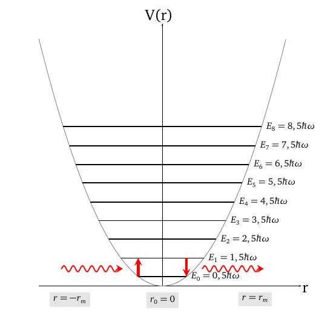

layout: true
background-size: contain

<div class="my-footer"><span>Flaviano Williams Fernandes</span></div>

```{r, include=FALSE, eval=FALSE, echo=FALSE}
  xaringan::inf_mr()
```

```{r setup, include=FALSE}
  options(htmltools.dir.version = FALSE)
  library("ggplot2")
  library("gganimate")
  library("latex2exp")
  library("tidyverse")
  library("plotly")
#  knitr::opts_chunk$set(fig.path = 'img')
```

```{r, load_refs, echo=FALSE, message=FALSE}
  library(RefManageR)
  BibOptions(check.entries = FALSE, bib.style = "authoryear", style = "markdown",
           dashed = TRUE)
  bib <- ReadBib("references.bib", check = FALSE)
```

---
class: middle

<div class="my-header"><span>Sumário</span></div>

1. Uma revisão sobre o oscilador harmômico clássico

2. Oscilador quântico

3. Função de onda do oscilador quântico

4. Níveis de energia do oscilador quântico

5. Oscilador anarmônico

6. Aplicações

<div class="footnote">
  <ul>
  <hr>
  <li> Esta apresentação está disponível para download em <a href="https://flavianowilliams.github.io/education">flavianowilliams.github.io/education</a>;
  <li> Este material está sujeito a modificações. Recomenda-se acompanhamento permanente.
  </ul>
</div>

---
class: middle

<div class="my-header"><span>Oscilador harmônico clássico - sistema de uma partícula</span></div>

.pull-left[

Supondo um oscilador harmônico constituído por um objeto de massa m conectado a uma mola de constante elástica k, definimos a sua energia potencial como $U(x)=\frac{1}{2}kx^2$ `r Citep(bib, c("tipler","mcquarrie","braga"))`. Considerando que a frequência angular é dada por $\omega = \sqrt{k}{m}$, podemos dizer que $k=m\omega^2$, ou seja, de maneira equivale à

\begin{aligned}
U(x) = \frac{1}{2}kx^2 = \frac{1}{2}m\omega^2x^2.
\end{aligned}

Na mecânica clássica, uma partícula submetida a esse potencial encontra-se em equilíbrio na posição x = 0, e fora desse ela é submetida a uma força $\vec{F}=-k\vec{x}$. A energia de uma partícula sob esse potencial seria equivalente à $E=\frac{1}{2}kx_m^2$, e nesse caso, a sua energia poderia assumir qualque valor, sem restrição, dependendo somente da amplitude de oscilação $x_m$ e da constante elástica $k$.

]
.pull-right[

A figura abaixo mostra a energia potencial do oscilador harmônico simples. Neste caso, a partícula somente pode se mover na região $-x_m<x<x_m$, que na figura está sendo mostrado pela linha vermelha.

```{r, echo=FALSE, fig.align='center',fig.cap='Gráfico da energia do oscilador harmônico clássico.',out.width="60%",fig.asp=1}
  knitr::include_graphics("img/mhs-classico.jpeg")
```

]

---
class: middle

<div class="my-header"><span>Oscilador harmônico clássico - sistema de duas partículas</span></div>

.pull-left[

Considerando o referencial na origem (x=0), podemos dizer que pela lei de Hooke

\begin{aligned}
  m_1\frac{d^2x_1}{dt^2} & = -F = k(x_2-x_1-\ell_0),\\
  m_2\frac{d^2x_2}{dt^2} & = F = -k(x_2-x_1-\ell_0).
\end{aligned}

$\ell_0$ seria neste caso a distância relativa de equilíbrio entre as partículas, onde a energia potencial é nula. Dividindo a primeira equação por $m_1$ e a segunda por $m_2$, encontraremos

\begin{aligned}
  \frac{d^2x_2}{dt^2} - \frac{d^2x_1}{dt^2} & =-k\left[\frac{(x_2-x_1-\ell_0)}{m_2}+\frac{(x_2-x_1-\ell_0)}{m_1}\right].
\end{aligned}

Aplicando as propriedades de derivação teremos

\begin{aligned}
  \frac{d^2}{dt^2}(x_2-x_1) & = -k\left[\frac{(x_2-x_1-\ell_0)}{m_2}+\frac{(x_2-x_1-\ell_0)}{m_1}\right],
\end{aligned}

]

.pull-right[

\begin{aligned}
  \frac{d^2}{dt^2}(x_2-x_1) & =-k\left(\frac{1}{m_1}+\frac{1}{m_2}\right)(x_2-x_1-\ell_0),\\
  \frac{d^2}{dt^2}(x_2-x_1) & =-k\left(\frac{1}{m_1}+\frac{1}{m_2}\right)(x_2-x_1-\ell_0).
\end{aligned}

Adotando $\mu = \frac{m_1m_2}{m_1+m_2}$, onde $\mu$ é a massa reduzida, teremos a equação do oscilador harmônico no sistema de coordenadas do centro de massa, e x é a coordenada relativa entre as partículas,

\begin{aligned}
  \mu\frac{d^2x}{dt^2} +kx = 0.
\end{aligned}

```{r, echo=FALSE, fig.align='center',fig.cap='Duas partículas conectadas por uma mola de constante elástica k.',out.width="100%",fig.asp=1}
  knitr::include_graphics("img/mhs-2particulas.jpeg")
```

]

---
class: middle

<div class="my-header"><span>Oscilador quântico - A função de onda do oscilador quântico</span></div>

.pull-left[

Considere duas particulas sujeitas a uma interação similar a um MHS, como por exemplo dois átomos de uma molecula de hidrogênio. A solução desse sistema deve satisfazer as condições da mecânica quântica, onde a equação de Schrödinger fica na forma

\begin{aligned}
  -\frac{\hbar^2}{2\mu}\frac{d^2\psi}{dx^2}+\frac{1}{2}kx^2\psi = E\psi.
\end{aligned}

Assim resolvendo essa equação encontraremos a sua função de onda $\psi$. Primeiramente deveremos deixá-la no formato que seja possível econtrar a sua solução do ponto de vista da matemática. Portanto segue os seguintes passos à seguir.

Primeiro multiplicamos por $-2\mu/\hbar^2$,

\begin{aligned}
  \frac{d^2\psi}{dx^2}-\frac{\mu k}{\hbar^2}x^2\psi+\frac{2\mu E}{\hbar^2}\psi = 0.
\end{aligned}

]

.pull-right[

Substituindo $\lambda = 2\mu E/\hbar^2$ e $\alpha^2 = \mu k/\hbar^2$ teremos

\begin{aligned}
  \frac{d^2\psi}{dx^2}+\left(\lambda-\alpha^2x^2\right)\psi = 0.
\end{aligned}

Para que essa equação seja resolvida, devemos em uma forma mais conveniente. Primeiramente fazemos a substituição

\begin{aligned}
  \psi(x) = e^{-\frac{1}{2}\alpha x^2}y(x)
\end{aligned}

Com essa substituição, a equação acima torna-se

\begin{aligned}
  \frac{d^2 y}{dx^2}-2\alpha x\frac{dy}{dx}+\left(\lambda-\alpha\right)y = 0.
\end{aligned}

Para alcançar a equação na forma desejada, ainda fazemos outra substituição, $\epsilon=\sqrt{\alpha x}$,

\begin{aligned}
  \frac{d^2 y}{d\epsilon^2}-2\epsilon\frac{dy}{d\epsilon}+\left(\lambda/\alpha-1\right)y = 0.
\end{aligned}

]

---
class: middle

<div class="my-header"><span>Oscilador quântico - A função de onda do oscilador quântico</span></div>

.pull-left[

A equação mostrada anteriormente somente tem solução se

\begin{aligned}
  \left(\frac{\lambda}{\alpha}-1\right) = 2n,
\end{aligned}

e a solução são conhecidas como polinômios de Hermite $H_n(x)$. Portanto, a função de onda do oscilador quântico possuem a forma mostrada abaixo,

\begin{aligned}
  \psi_n(x) = \left[\left(\frac{\alpha}{\pi}\right)^{1/2}\frac{1}{2^nn!}\right]e^{-\frac{\alpha^2x^2}{2}}H_n(x).
\end{aligned}

A densidade de probabilidade é obtida aplicando a famosa operação $|\psi(x)|^2$,

\begin{aligned}
  |\psi_n(x)|^2 = \frac{\alpha}{\pi}\left(\frac{1}{2^nn!}\right)^2e^{-\alpha^2x^2}|H_n(x)|^2.
\end{aligned}

]

.pull-right[

```{r, message=FALSE, echo=FALSE, fig.align='center',fig.cap='...',out.width="100%"}

myfunc1 <- function(k,x0,x){
  0.5*k*(x-x0)**2
}

myfunc2 <- function(x){
  sqrt(5/pi)*exp(-5*x**2)
}
#
myfunc3 <- function(x){
  sqrt(4*5**3/pi)*x**2*exp(-5*x**2)
}
#
myfunc4 <- function(x){
  sqrt(5/(4*pi))*(2*5*x**2-1)**2*exp(-5*x**2)
}
#
myfunc5 <- function(x){
  sqrt(5**3/(9*pi))*(2*5*x**3-3*x)**2*exp(-5*x**2)
}
#
smpl=100
xm = 1.5
nt=9
#
k = sqrt(5)
x=seq(-xm,xm,2*xm/(smpl-1))
#
potencial = data.frame(x=x, n=0, y = myfunc1(k,0,x), y2 = myfunc2(x))
potencial = rbind(potencial, data.frame(x= x, n =1 , y = myfunc1(k,0,x), y2 = myfunc3(x)))
potencial = rbind(potencial, data.frame(x= x, n =2 , y = myfunc1(k,0,x), y2 = myfunc4(x)))
potencial = rbind(potencial, data.frame(x= x, n =3 , y = myfunc1(k,0,x), y2 = myfunc5(x)))
#
fig = plot_ly(
  data = filter(potencial, n == 1), type = 'scatter', mode = 'lines', line = list(size = 5, color = 'gray'),  x = ~x, y = ~y, width = 500, height = 500, showlegend = FALSE
  ) %>%
  add_lines(
  data = potencial, type = 'scatter', mode = 'lines', line = list(size = 5, color = 'red'),  x = ~x, y = ~y2, frame = ~n)
#
fig = fig %>%
  layout(
    xaxis = list(title = 'x'),
    yaxis = list(title = 'y')
  )

fig

```

]

---
class: middle

<div class="my-header"><span>Oscilador quântico - Os níveis de energia do oscilador quântico</span></div>

.pull-left[

Substituindo $\alpha$ e $\lambda$ na equação $\left(\frac{\lambda}{\alpha}-1\right) = 2n$ teremos

\begin{aligned}
  \frac{\lambda}{\alpha} = \frac{\frac{2\mu E}{\hbar^2}}{\frac{(\mu k)^1/2}{\hbar}} & = 2n+1,\\
  \frac{2\mu E}{(\mu k)^1/2} & = 2n+1,\\
  E & = \left(n+\frac{1}{2}\right)\left(\frac{k}{m}\right)^{1/2}\hbar.
\end{aligned}

Mas pelo sistema massa-mola temos que $\omega^2=k/\mu $. Substituindo teremos

\begin{aligned}
  E_n = \left(n+\frac{1}{2}\right)\hbar\omega.
\end{aligned}

**Assim, podemos perceber que a energia do oscilador quântico é quantizada**.

]

.pull-right[

```{r, echo=FALSE, fig.align='center',fig.cap='Níveis de energia do oscilador quântico.',out.width="100%",fig.asp=1}
  knitr::include_graphics("img/energia-mhs-quantico.jpeg")
```

]

---
class: middle

<div class="my-header"><span>Oscilador quântico - regra de seleção</span></div>

.pull-left[
Vimos no slide anterior que os níveis de energia do oscilador quântico, são quantizados na forma $E_n=\hbar\omega(n+1/2)$. Fisicamente a transição eletrônica do nível n para outro n' somente ocorre se a molécula interagir com a radiação eletromagnética (através do processo de absorção da radiação). Essa interação ocorre pelo acoplamento do momento dipolo elétrico da molécula com o campo elétrico da radiação eletromagnética,
\begin{aligned}
  H = \vec{\mu}\cdot \vec{E}
\end{aligned}
Assim é de se esperar que antes e após a absorção da radiação, deve ocorrer uma mudança no momento de dipolo elétrico da molécula. Na mecânica quântica, a mudança no momento de dipolo elétrico somente não irá se anular se o fóton absorvido tiver uma energia equivalente a diferença dos níveis de energia referente à transição $\Delta n=\pm 1$ do oscilador quântico.

]

.pull-right[

```{r, echo=FALSE, fig.align='center',fig.cap='Níveis de energia do oscilador quântico.',out.width="100%",fig.asp=1}
  
```

]

---
class: middle

<div class="my-header"><span>Aplicação - Análise vibracional de moléculas diatômicas</span></div>

.pull-left[
Considerando que a interação intramolecular de uma molécula diatômica como um oscilador harmônico, os níveis de energia são dados por
\begin{aligned}
  E_n = \hbar\omega\left(n+1/2\right),\quad n=0,1,2,\cdots
\end{aligned}


]

.pull-right[
]

---
class: middle

<div class="my-header"><span>Oscilador quântico - regra de seleção</span></div>

.pull-left[
Na mecânica quântica a mudança no momento de dipolo elétrico da molécula pode ser representada pela equação abaixo,
\begin{aligned}
  \mu_{nn'} = \int\psi_n(x)\mu(x)\psi_{n'}(x)
\end{aligned}
Expandindo $\mu$ em série de potências em torno da distância de equilíbrio $r_0$, ou seja,
\begin{aligned}
  \mu(r) = \mu(r_0)+\left(\frac{d\mu}{dr}\right)_{r_0}+\cdots
\end{aligned}
teremos
\begin{aligned}
  \mu_{nn'} = \int\psi_n(x)\psi_{n'}(x)+\left(\frac{d\mu}{dr}\right)_{r_0}\int\psi_n(x)x\psi_{n'}(x)+\cdots
\end{aligned}
A primeira equação se anula devido as condições de ortogonalidade da função de onda. Agora, em relação a segunda equação fazemos a substituição $\alpha^{1/2}x=\epsilon$

]

.pull-right[

para aplicar a propriedade dos polinômios de Hermite
\begin{aligned}
  \epsilon H_n(\epsilon) = nH_{n-1}(\epsilon)+\frac{1}{2}H_{n+1}(\epsilon).
\end{aligned}
Assim teremos após a substituição $\psi(\epsilon)=H_n(\epsilon)e^{-\epsilon^2}$
\begin{aligned}
  \mu_{nn'} & = \frac{N_nN_{n'}}{\alpha}\left(\frac{d\mu}{dr}\right)_{r_0}\times\\
  &\times\int H_{n'}(x)\left[H_{n-1}(\epsilon)+\frac{1}{2}H_{n+1}(\epsilon)\right]e^{-\epsilon^2}d\epsilon+\cdots
\end{aligned}
Podemos ver que pela propriedade da ortogonalidade das funções de onda, a integral somente não irá se anular, e consequentemente $\mu{nn'}$ se $n'=\pm n$.

]

---
class: middle

<div class="my-header"><span>Bibliografia</span></div>

```{r, results='asis', echo=FALSE, message=FALSE}
PrintBibliography(bib)
```

