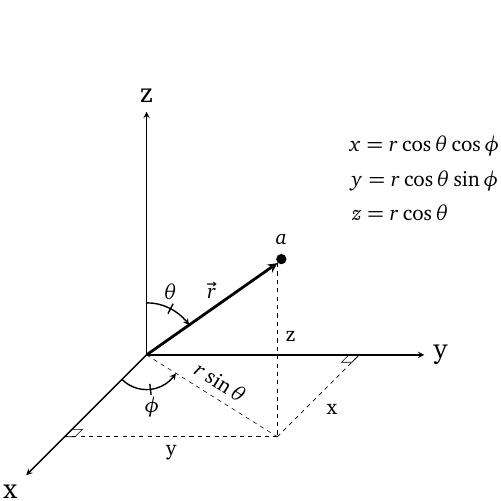
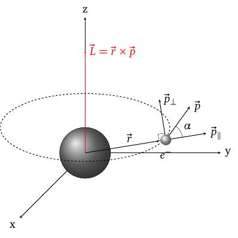
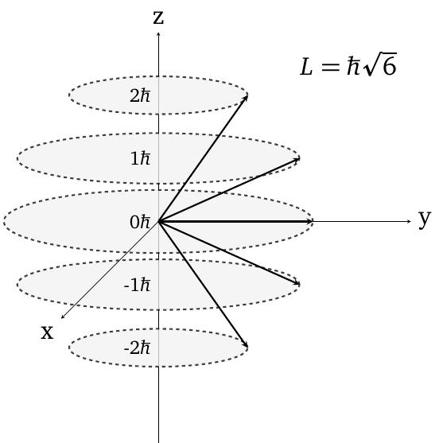

layout: true
background-size: contain

<div class="my-footer"><span>Flaviano Williams Fernandes</span></div>

```{r, include=FALSE, eval=FALSE, echo=FALSE}
  xaringan::inf_mr()
```

```{r setup, include=FALSE}
  options(htmltools.dir.version = FALSE)
  library("ggplot2")
  library("gganimate")
  library("latex2exp")
  library("RefManageR")
```

```{r, load_refs, echo=FALSE, message=FALSE}
  bib <- ReadBib("references.bib", check = FALSE)
  BibOptions(check.entries = FALSE, bib.style = "authoryear", style = "markdown",
           dashed = TRUE)
```

---
class: middle

<div class="my-header"><span>Sumário</span></div>

1. A equação de Schrodinger em coordenadas esféricas

2. Solução da parte radial e número quântico principal

2. Momento angular

3. Solução da parte angular e número quântico orbital

4. Solução da parte azimutal e número quântico magnético

5. Quantização da energia

5. Funções hidrogenóides

6. Bibliografia

<div class="footnote">
  <ul>
  <hr>
  <li> Esta apresentação está disponível para download em <a href="https://flavianowilliams.github.io/education">flavianowilliams.github.io/education</a>;
  <li> Este material está sujeito a modificações. Recomenda-se acompanhamento permanente.
  </ul>
</div>

---
class: middle

<div class="my-header"><span>A equação de Schrödinger em três dimensões - equação de Schrödinger independente do tempo</span></div>

.pull-left[

Até o momento consideramos movimentos em apenas uma dimensão (no caso ao longo do eixo x). Mas a maioria dos casos reais, o movimento acontece nas três dimensões. Um exemplo é o movimento do elétron no átomo de hidrogênio `r Cite(bib, c("tipler"))`.

Em coordenadas retangulares, a equação de Schrödinger pode ser escrito na forma
\begin{aligned}
  -\frac{\hbar^2}{2m}\left(\frac{\partial^2\Psi}{\partial x^2}+\frac{\partial^2\Psi}{\partial y^2}+\frac{\partial^2\Psi}{\partial z^2}\right)+V\Psi=i\hbar\frac{\partial\Psi}{\partial t},
\end{aligned}
onde $\Psi\equiv\Psi(x,y,z,t)$. Usando o método de separação de variáveis, onde consideramos
\begin{aligned}
  \Psi(x,y,z,t)=\psi(x,y,z)\phi(t)
\end{aligned}
podemos chegar de maneira equivalente ao método usado na equação de Schrödinger em uma dimensão para a equação de Schrödinger independente do tempo.

]
.pull-right[

A primeira equação abaixo depende das variáveis x, y e z, enquanto que a segunda depende da variável t.
\begin{aligned}
  -\frac{\hbar^2}{2m}\left(\frac{\partial^2\psi}{\partial x^2}+\frac{\partial^2\psi}{\partial y^2}+\frac{\partial^2\psi}{\partial z^2}\right)+V\psi & = E\psi,\\
  i\hbar\frac{\partial\phi}{\partial t} & = E\phi.
\end{aligned}
Podemos ver assim que a equação de Schrödinger independente do tempo em coordenadas retangulares é dada por
\begin{aligned}
  -\frac{\hbar^2}{2m}\left(\frac{\partial^2\psi}{\partial x^2}+\frac{\partial^2\psi}{\partial y^2}+\frac{\partial^2\psi}{\partial z^2}\right)+V\psi & = E\psi.
\end{aligned}
Ou de maneira equivalente
\begin{aligned}
  -\frac{\hbar^2}{2m}\nabla^2\psi+V\psi & = E\psi.
\end{aligned}
Chamamos $\nabla^2=\frac{\partial^2}{\partial x^2}+\frac{\partial^2}{\partial y^2}+\frac{\partial^2}{\partial z^2}$ de Laplaciano.

]

---
class: middle

<div class="my-header"><span>A equação de Schrödinger em coordenadas esféricas - A equação em três dimensões</span></div>

.pull-left[

No caso do átomo de hidrogênio, ocorre a interação entre o elétron e o núcleo governada pelas leis da eletrostática, onde a energia potencial é dada por
\begin{aligned}
  V(r) = -\frac{Ze^2}{r}.
\end{aligned}
Podemos ver a distância relativa entre o núcleo e o elétron é dado por $r=\sqrt{x^2+y^2+z^2}$. Substituindo na equação de Schrödinger, torna-se praticamente impossível separar as variáveis x, y e z em três equações distintas. Isso inviabiliza obter uma solução usando coordenadas retangulares. Outra maneira seria empregar outro sistema de coordenadas. Devido a simetria do potencial, vemos que o problema fica mais fácil de resolver em coordenadas esféricas $r$, $\theta$ e $\phi$, onde
\begin{aligned}
  x & = r\sin\theta\cos\phi,\\
  y & = r\sin\theta\sin\phi,\\
  z & = r\cos\theta.
\end{aligned}

]
.pull-right[

Após a transformação para o sistema de coordenadas esféricas, ela se torna (veja o Apêndice A)
\begin{aligned}
  -\frac{\hbar^2}{2mr^2}\frac{\partial }{\partial r^2}\left(r^2\frac{\partial\psi}{\partial r}\right) & -\frac{\hbar^2}{2mr^2}\frac{1}{\sin\theta}\frac{\partial}{\partial\theta}\left(\sin\theta\frac{\partial\psi}{\partial\theta}\right) - \\
  -\frac{\hbar^2}{2mr^2}\frac{1}{\sin^2\theta}\frac{\partial^2\psi}{\partial\phi^2} & + V(r)\psi = E\psi.
\end{aligned}

```{r, echo=FALSE, fig.align='center',fig.cap='Vetor posição em coordenadas esféricas.',out.width="60%",fig.asp=1}
  
```

]

---
class: middle

<div class="my-header"><span>A equação de Schrödinger em coordenadas esféricas - O método de separação de variáveis</span></div>

Para resolver a equação anterior, a melhor opção seria utilizar o método de separação de variáveis, onde
\begin{aligned}
  \psi(r,\theta,\phi) = R(r)\Theta(\theta)\Phi(\phi).
\end{aligned}
Substituindo a equação teremos

\begin{aligned}
  -\frac{\hbar^2}{2mr^2}\frac{\partial}{\partial r}\left[r^2\frac{\partial }{\partial r}R(r)\Theta(\theta)\Phi(\phi)\right]-\frac{\hbar^2}{2mr^2\sin\theta}\frac{\partial}{\partial\theta}\left[\sin\theta\frac{\partial}{\partial\theta}R(r)\Theta(\theta)\Phi(\phi)\right] & -\\
  -\frac{\hbar^2}{2mr^2\sin^2\theta}\frac{\partial^2}{\partial\phi^2}R(r)\Theta(\theta)\Phi(\phi)+V(r)R(r)\Theta(\theta)\Phi(\phi) & =ER(r)\Theta(\theta)\Phi(\phi),\\
  -\frac{\hbar^2\Theta(\theta)\Phi(\phi)}{2mr^2}\frac{\partial}{\partial r}\left[r^2\frac{\partial }{\partial r}R(r)\right]-\frac{\hbar^2R(r)\Phi(\phi)}{2mr^2\sin\theta}\frac{\partial}{\partial\theta}\left[\sin\theta\frac{\partial}{\partial\theta}\Theta(\theta)\right] & -\\
  -\frac{\hbar^2R(r)\Theta(\theta)}{2mr^2\sin^2\theta}\frac{\partial^2}{\partial\phi^2}\Phi(\phi)+V(r)R(r)\Theta(\theta)\Phi(\phi) & =ER(r)\Theta(\theta)\Phi(\phi).
\end{aligned}
Dividindo por $R\Theta\Phi$ teremos
\begin{aligned}
  -\frac{\hbar^2}{2mr^2R(r)}\frac{\partial}{\partial r}\left[r^2\frac{\partial }{\partial r}R(r)\right]-\frac{\hbar^2}{2mr^2\sin\theta\Theta(\theta)}\frac{\partial}{\partial\theta}\left[\sin\theta\frac{\partial}{\partial\theta}\Theta(\theta)\right]-\frac{\hbar^2}{2mr^2\sin^2\theta\Phi(\phi)}\frac{\partial^2}{\partial\phi^2}\Phi(\phi)+V(r) =E.
\end{aligned}

---
class: middle

<div class="my-header"><span>A equação de Schrödinger em coordenadas esféricas - Solução da parte radial</span></div>

Organizando os termos da equação anterior teremos
\begin{aligned}
  \frac{\hbar^2}{2mr^2R(r)}\frac{\partial}{\partial r}\left[r^2\frac{\partial }{\partial r}R(r)\right]+\frac{\hbar^2}{2mr^2\sin\theta\Theta(\theta)}\frac{\partial}{\partial\theta}\left[\sin\theta\frac{\partial}{\partial\theta}\Theta(\theta)\right]+\frac{\hbar^2}{2mr^2\sin^2\theta\Phi(\phi)}\frac{\partial^2}{\partial\phi^2}\Phi(\phi)+E-V(r) =0.
\end{aligned}

Podemos simplificar ainda mais a expressão anterior dividindo os termos por $\frac{\hbar^2}{2mr^2}$,
\begin{aligned}
  \frac{1}{R(r)}\frac{\partial}{\partial r}\left[r^2\frac{\partial }{\partial r}R(r)\right]+\frac{1}{\sin\theta\Theta(\theta)}\frac{\partial}{\partial\theta}\left[\sin\theta\frac{\partial}{\partial\theta}\Theta(\theta)\right]+\frac{1}{\sin^2\theta\Phi(\phi)}\frac{\partial^2}{\partial\phi^2}\Phi(\phi)+\frac{2mr^2}{\hbar}\left[E-V(r)\right]=0.
\end{aligned}
Após essa operação, podemos perceber que existem termos que dependem somente de R e termos que dependem somente de $\theta$ e $\phi$. Isolando esses termos em lados opostos teremos
\begin{aligned}
  \frac{1}{R(r)}\frac{\partial}{\partial r}\left[r^2\frac{\partial }{\partial r}R(r)\right]+\frac{2mr^2}{\hbar}\left[E-V(r)\right]=-\frac{1}{\sin\theta\Theta(\theta)}\frac{\partial}{\partial\theta}\left[\sin\theta\frac{\partial}{\partial\theta}\Theta(\theta)\right]-\frac{1}{\sin^2\theta\Phi(\phi)}\frac{\partial^2}{\partial\phi^2}\Phi(\phi).
\end{aligned}
Como o lado direito da equação não possui dependência na variável r, o lado esquerdo enxerga o lado direito como uma constante. A mesma afirmação pode ser feito no sentido oposto, o lado direito enxerga o lado esquerdo como uma constante devido a ausência das variáveis $\theta$ e $\phi$. No próximo slide será discutido sobre a solução da parte radial $R(r)$ da função de onda $\psi(r,\theta,\phi)$, após a reestruturação da equação acima.

---
class: middle

<div class="my-header"><span>A equação de Schrödinger em coordenadas esféricas - Solução da parte radial</span></div>

.pull-left[

Portanto para a equação referente a R(r) pode ser escrito como
\begin{aligned}
  \frac{1}{R(r)}\frac{\partial}{\partial r}\left[r^2\frac{\partial }{\partial r}R(r)\right]+\frac{2mr^2}{\hbar}\left[E-V(r)\right]=C.
\end{aligned}
Chamando $C=\ell(\ell+1)$, sendo $\ell$ um número inteiro positivo, teremos
\begin{aligned}
  \frac{\partial}{\partial r}\left[r^2\frac{\partial }{\partial r}R(r)\right]+\frac{2mr^2\left[E-V(r)\right]}{\hbar}R(r)=\ell(\ell+1)R(r)
\end{aligned}
Usando técnicas matemáticas, como o método de solução por série de potências, poderemos encontrar a solução para a equação acima, como
\begin{aligned}
  R_{n\ell}(r) = A_{n\ell}e^{-r/a_0n}r^\ell L_{n\ell}.
\end{aligned}
$L_{n\ell}$ são chamados polinômios de Laguerre e depende dos valores inteiros n e $\ell$. $R_{n\ell}$ depende de n que assume valores inteiros positivos e não-nulos.

]
.pull-right[

Pelos polinômios de Laguerre, os valores de $\ell$ estão amarrados com os valores de n, ou seja,
\begin{aligned}
  n & = 1,2,3,\cdots,\\
  \ell & = 0,1,2,\cdots,(n-1).
\end{aligned}
n é chamada de número quântico principal e $\ell$, como veremos à seguir, é chamado número quântico angular. Abaixo mostramos algumas funções de Laguerre, para $n=1$ e $n=2$.
\begin{eqnarray}
  (n = 1, \ell=0)&\Rightarrow& R_{10} = \frac{2}{\sqrt{a^3_0}}e^{-r/a_0},\\
  (n = 2, \ell=0)&\Rightarrow& R_{20} = \frac{1}{2a^3_0}\left(1-\frac{r}{2a_0}\right)e^{-r/2a_0},\\
  (n = 2, \ell=1)&\Rightarrow& R_{21}  =  \frac{1}{\sqrt{6a^3_0}}\frac{r}{a_0}e^{-r/2a_0},\\
   & \vdots &
\end{eqnarray}

]

---
class: middle

<div class="my-header"><span>A equação de Schrödinger em coordenadas esféricas - Momento angular e potencial efetivo</span></div>

Agora, retornando a equação anterior,
\begin{aligned}
  \frac{1}{R(r)}\frac{\partial}{\partial r}\left[r^2\frac{\partial }{\partial r}R(r)\right]+\frac{2mr^2}{\hbar}\left[E-V(r)\right]=-\frac{1}{\sin\theta\Theta(\theta)}\frac{\partial}{\partial\theta}\left[\sin\theta\frac{\partial}{\partial\theta}\Theta(\theta)\right]-\frac{1}{\sin^2\theta\Phi(\phi)}\frac{\partial^2}{\partial\phi^2}\Phi(\phi).
\end{aligned}
Podemos escrever o lado direito como
\begin{aligned}
  -\frac{1}{\sin\theta\Theta(\theta)}\frac{\partial}{\partial\theta}\left[\sin\theta\frac{\partial}{\partial\theta}\Theta(\theta)\right]-\frac{1}{\sin^2\theta\Phi(\phi)}\frac{\partial^2}{\partial\phi^2}\Phi(\phi)=\ell(\ell+1).
\end{aligned}
Multiplicando ambos lados da equação por $-\sin^2\theta$, poderemos separar os termos em função das variáveis $\theta$ e $\phi$,
\begin{aligned}
  \frac{1}{\Phi(\phi)}\frac{\partial^2}{\partial\phi^2}\Phi(\phi)=-\ell(\ell+1)\sin^2\theta-\frac{\sin\theta}{\Theta(\theta)}\frac{\partial}{\partial\theta}\left[\sin\theta\frac{\partial}{\partial\theta}\Theta(\theta)\right].
\end{aligned}
Assim como foi feito para $R(r)$ temos que o lado esquerdo é independente do lado direito e vice-versa. Igualando ambos os lados por uma constante, que chamaremos convenientemente de $-m^2$, teremos para o lado esquerdo
\begin{aligned}
  \frac{1}{\Phi(\phi)}\frac{\partial^2}{\partial\phi^2}\Phi(\phi)=-m^2\Rightarrow\frac{1}{\Phi(\phi)}\frac{\partial^2}{\partial\phi^2}\Phi(\phi)+m^2\Phi(\phi)=0.
\end{aligned}

---
class: middle

<div class="my-header"><span>A equação de Schrödinger em coordenadas esféricas - solução da parte angular</span></div>

.pull-left[
Como foi mostrado em aulas anteriores, a solução da equação acima seria
\begin{aligned}
  \Phi(\phi)\Rightarrow e^{im\phi}+e^{-im\phi}
\end{aligned}
Para o lado direito da equação, teremos
\begin{aligned}
  -\ell(\ell+1)\sin^2\theta-\frac{\sin\theta}{\Theta(\theta)}\frac{\partial}{\partial\theta}\left[\sin\theta\frac{\partial}{\partial\theta}\Theta(\theta)\right] & =-m^2,\\
    -\ell(\ell+1)\sin^2\theta-\frac{\sin\theta}{\Theta(\theta)}\frac{\partial}{\partial\theta}\left[\sin\theta\frac{\partial}{\partial\theta}\Theta(\theta)\right] + m^2 & = 0.
\end{aligned}
Para que a equação acima tenha solução para qualquer valor de $\theta$, obrigatoriamente deveremos impor a condição
\begin{aligned}
  |m| & \le \ell,\\
  |m| & = 0,\pm 1,\pm 2,\cdots,\pm\ell.
\end{aligned}
Sabendo que $\ell$ assume valores inteiros positivos, isso faz com que m também seja um número inteiro.

]
.pull-right[

Em outras palavras, poderemos afirmar que para qualquer valor de $\ell$, teremos
\begin{aligned}
  m = -\ell+1,-\ell+2,\cdots,0,\cdots,\ell-2,\ell-1,
\end{aligned}
ou seja, para cada valor de $\ell$ teremos $2\ell+1$ valores possíveis para m. Além do mais, sabendo que $|m|\le \pm \ell$, poderemos resumir a solução para $\Phi(\phi)$ na forma
\begin{aligned}
  \Phi(\phi)\Rightarrow e^{im\phi},
\end{aligned}
pois seria redundante se $e^{-im\phi}$ fosse considerado.

Para $\Theta(\theta)$ temos como solução da equação anterior os polinômios de Legendre, escrito na forma abaixo,
\begin{aligned}
  \Theta_{lm}(\theta) = \frac{\sin^{|m|}\theta}{2^\ell\ell!}\left[\frac{d}{d\cos\theta}\right]^{\ell+|m|}\left(\cos^2\theta-1\right)^\ell.
\end{aligned}

]

---
class: middle

<div class="my-header"><span>A equação de Schrödinger em coordenadas esféricas - Harmônicos esféricos</span></div>

.pull-left[

Portanto, sabendo as funções $R(r)$, $\Theta(\theta)$ e $\Phi(\phi)$, poderemos obter a função de onda $\phi(r,\theta,\phi)=R(r)\Theta(\theta)\Phi(\phi)$. Ou poderemos reescrever $\psi$ em termos da solução da parte radial e da parte angular,
\begin{aligned}
  \psi_{n\ell m}(r,\theta,\phi) = R_{n\ell}(r)Y_{\ell m}(\theta,\phi).
\end{aligned}
$Y_{\ell m}$ recebe o nome de **harmônicos esféricos**. Ao lado temos os harmônicos esféricos para os números quânticos $\ell=0,1,2$. Após a solução da função de onda, podemos ver que ela depende de três números quânticos: $n$ chamado de número quântico principal, $\ell$ de número angular e $m$ de número magnético (seu significado será discutido a seguir). Abaixo mostra um resumo de valores para n, $\ell$ e m,
\begin{aligned}
  n & = 1, 2, 3, \cdots,\\
  \ell & = 0, 1, 2, \cdots, (n-1),\\
  m & = -\ell, -\ell+1, -2,-1,\cdots,0,1,2,\ell-1,\ell.
\end{aligned}

]
.pull-right[

\begin{eqnarray}
  (\ell = 0, m=0)&\Rightarrow& Y_{10} = \sqrt{\frac{1}{4\pi}},\\
  (\ell = 1, m=1)&\Rightarrow& Y_{11} = - \sqrt{\frac{3}{8\pi}}\sin\theta e^{i\phi},\\
  (\ell = 1, m=0)&\Rightarrow& Y_{10}  = \sqrt{\frac{3}{4\pi}}\cos\theta,\\
  (\ell = 1, m=-1)&\Rightarrow& Y_{1-1}  = \sqrt{\frac{3}{8\pi}}\sin\theta e^{-i\phi},\\
  (\ell = 2, m=2)&\Rightarrow& Y_{22} = \sqrt{\frac{15}{32\pi}}\sin^2\theta e^{2i\phi},\\
  (\ell = 2, m=1)&\Rightarrow& Y_{21} = - \sqrt{\frac{15}{8\pi}}\sin\theta\cos\theta e^{i\phi},\\
  (\ell = 2, m=0)&\Rightarrow& Y_{20} = - \sqrt{\frac{5}{16\pi}}(3\cos^2\theta-1),\\
  (\ell = 2, m=-1)&\Rightarrow& Y_{2-1}  = \sqrt{\frac{15}{8\pi}}\sin\theta\cos\theta e^{-i\phi},\\
  (\ell = 2, m=-2)&\Rightarrow& Y_{2-2}  = \sqrt{\frac{15}{8\pi}}\sin^2\theta e^{-2i\phi}.
\end{eqnarray}

]

---
class: middle

<div class="my-header"><span> Momento angular - Potencial efetivo</span></div>

.pull-left[
Sabemos que a equação de Schrodinger deve satisfazer a equação da energia, ou seja,
$\frac{p^2}{2m}+V(r)=E$. Porém, vamos supor que o elétron esteja se movendo em órbitas elípticas como mostra a figura ao lado. O momento angular deste elétron é dado por
\begin{aligned}
  \vec{L} & = \vec{r}\times\vec{p},\\
  L & = rp_\perp.
\end{aligned}
Considerando que $p^2=p^2_\perp+p^2_\|$ teremos
\begin{aligned}
  \frac{p^2}{2m} & = \frac{p^2_\perp+p^2_\|}{2m},\\
                 & = \frac{p^2_\perp}{2m}+\frac{p^2_\|}{2m}.
\end{aligned}
Substituindo na equação da energia teremos
\begin{aligned}
  \frac{p^2_r}{2m}+\frac{L^2}{2mr^2}+V(r) = E.
\end{aligned}

]
.pull-right[

O termo $L^2/2mr^2$ surge devido a contribuição da força centrípeta para a energia potencial.

```{r, echo=FALSE, fig.align='center',fig.cap='Momento angular do elétron ao redor do núcleo.',out.width="90%",fig.asp=1}
  
```

]

---
class: middle

<div class="my-header"><span> Momento angular - Valores</span></div>

.pull-left[

]
.pull-right[

```{r, echo=FALSE, fig.align='center',fig.cap='Modelo vetorial do momento angular.',out.width="90%",fig.asp=1}
  
```

]

---
class: middle

<div class="my-header"><span>Bibliografia</span></div>

```{r, results='asis', echo=FALSE, message=FALSE}
PrintBibliography(bib)
```
