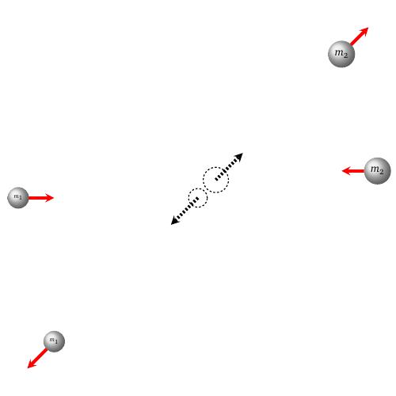
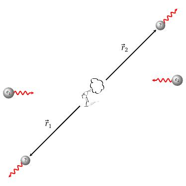
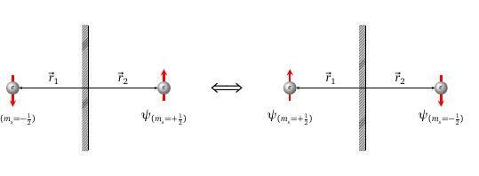

layout: true
background-size: contain

<div class="my-footer"><span>Flaviano Williams Fernandes</span></div>

```{r, include=FALSE, eval=FALSE, echo=FALSE}
  xaringan::inf_mr()
```

```{r setup, include=FALSE}
  options(htmltools.dir.version = FALSE)
  library("ggplot2")
  library("gganimate")
  library("latex2exp")
  library("tidyverse")
  library("plotly")
#  knitr::opts_chunk$set(fig.path = 'img')
```

```{r dataframes, include=FALSE}

elementos_df = data.frame(Z = seq(1,20,1), raio_atomico = c(0.53, 0.31, 1.67, 1.12, 0.87, 0.67, 0.56, 0.48, 0.42, 0.38, 1.90, 1.45, 1.18, 1.11, 0.98, 0.88, 0.79, 0.71, 2.43, 1.94))

elementos_df = elementos_df %>%
  mutate(carga_nuclear = c(1.00, 1.65, 1.30, 1.98, 2.6, 3.25, 3.9, 4.55, 4.1, 5.05, 2.2, 2.85, 3.5, 4.15, 4.8, 5.45, 6.1, 6.75, 2.20, 2.85)) %>%
  mutate(energia_ionizacao = c(13.5984, 24.5874, 5.3917, 9.3227, 8.2980, 11.2603, 14.5341, 13.6181, 17.4228, 21.5645, 5.1391, 7.6462, 5.9858, 8.1517, 10.4867, 10.3600, 12.9676, 15.7596, 4.3407, 6.1132)) %>%
  mutate(afinidade_eletronica = c(-0.75676, 0.21769, -0.62199, 0.19697, -0.27989, -1.2647, 0.072566, -1.4616, -3.4002, 0.30063, -0.54942, 0.19696, -0.44576, -1.3891, -0.74639, -2.0733, -2.4776, 0.36283, -0.49759, 0.103665))

```

```{r, load_refs, echo=FALSE, message=FALSE}
  library(RefManageR)
  BibOptions(check.entries = FALSE, bib.style = "authoryear", style = "markdown",
           dashed = TRUE)
  bib <- ReadBib("references.bib", check = FALSE)
```

---
class: middle

<div class="my-header"><span>Sumário</span></div>

1. Sistema de partículas idênticas

2. A tabela periódica

<div class="footnote">
  <ul>
  <hr>
  <li> Esta apresentação está disponível para download em <a href="https://flavianowilliams.github.io/education">flavianowilliams.github.io/education</a>;
  <li> Este material está sujeito a modificações. Recomenda-se acompanhamento permanente.
  </ul>
</div>

---
class: middle

<div class="my-header"><span>Sistema de partículas idênticas. Comparação entre colisões clássicas e quânticas</span></div>

.pull-left[

No modelo clássico, ao colidirmos duas partículas, mesmo que sejam idênticas, é possível sem alguma dificuldade identificar cada partícula após a colisão.

```{r, echo=FALSE, fig.align='center',fig.cap='Modelo clássico de colisão.',out.width="75%",fig.asp=1}
  
```

]

.pull-right[

Devido ao princípio da incerteza de Heisenberg, é praticamente impossível conhecer com total exatidão a localização de uma partícula. Assim, dois elétrons (partículas idênticas), no ato do encontro (colisão) não poderemos saber qual é qual durante a colisão. Isso torna impossível identificar cada uma das partículas.

```{r, echo=FALSE, fig.align='center',fig.cap='Colisão entre elétrons.',out.width="60%",fig.asp=1}
  
```

]

---
class: middle

<div class="my-header"><span>Sistema de partículas idênticas. Função de onda do sistema de duas partículas</span></div>


.pull-left[

Como exemplo, imaginemos uma colisão como mostra a figura ao lado. Apoś a colisão, o elétron que sai à esquerda para baixo poderá ser tanto o elétron 1 quanto 2. O mesmo pode ser dito a respeito do elétron que sai à direita para cima. Similarmente nada pode ser dito a respeito do encontro no ato da colisão. Portanto, em um sistema contendo dois elétrons, onde definimos $\psi_1$ e $\psi_2$ referente a cada elétron, a função de onda deve ser uma função que engloba a possibilidade de troca das partículas. Supondo segundo as resgras da estatística, em um sistema com duas partículas, a função que representa a probabilidade do conjunto deve ser o produto das funções individuais, ou seja,
\begin{align*}
  \psi_{mn}(r_1,r_2) = \psi_m(r_1)\psi_n(r_2)
\end{align*}
m e n referem-se aos estados ocupados por cada partícula. Sabendo que $\psi$ deve considerar a probabilidade de troca das partículas, uma representação mais correta seria `r Citep(bib, c("tipler"))`

]

.pull-right[

\begin{align*}
  \psi_{mn}(r_1,r_2) = \psi_m(r_1)\psi_n(r_2)+\psi_m(r_2)\psi_n(r_1)
\end{align*}
Assim podemos ver que ao fazer a troca da posição das partículas 1 e 1, o mesmo resultado obtemos para $\psi_{mn}$,
\begin{align*}
  \psi_{mn}(r_2,r_1) & = \psi_m(r_2)\psi_n(r_1)+\psi_m(r_1)\psi_n(r_2),\\
  \psi_{mn}(r_2,r_1) & = \psi_{mn}(r_1,r_2).
\end{align*}

```{r, echo=FALSE, fig.align='center',fig.cap='Colisão entre elétrons.',out.width="60%",fig.asp=1}
  
```

]

---
class: middle

<div class="my-header"><span>Sistema de partículas idênticas. Paridade da função de onda</span></div>


.pull-left[

Entretanto, além do fato da indistinguibilidade das partículas (que também chamamos efeito de troca), existe o comportamento chamado paridade da partícula. A paridade ou simetria da partícula refere-se ao fato da função de onda mudar o seu sinal ao trocar a posição do elétron de r para -r, ou seja, como a função de onda altera o seu valor em relação ao elétron e sua imagem vista em um espelho (veja a figura ao lado). O efeito de paridade torna-se perceptível quando levamos em consideração o estado de spin da partícula.

```{r, echo=FALSE, fig.align='center',fig.cap='Exemplo de paridade antissimétrica entre dois elétrons.',out.width="100%",fig.asp=1}
  
```

]

.pull-right[

Ao trocarmos os elétrons 1 e 2 nos estados m e n, ou seja, $(r_1, r_2)\Leftrightarrow (r_2, r_1)$, teremos a inversão na função $\psi_{mn}$, equivalente a uma função ímpar, onde f(-r)=-f(r). **Portanto, partículas com função de onda simétrica possuem spin inteiro, enquanto que antissimétricas possuem spin semi-inteiro.** Segue abaixo o esquema de paridade da função de onda.
\begin{align*}
  \psi_{mn}(r_1, r_2) & = +\psi_{mn}(r_2, r_1),\quad\text{(simétrica)},\\
  \psi_{mn}(r_1, r_2) & = -\psi_{mn}(r_2, r_1),\quad\text{(antissimétrica)}.
\end{align*}
Para que a função de onda $\psi_{mn}$ seja antissimétrica devemos impor a seguinte regra
\begin{align*}
  \psi_{mn}(r_1,r_2) & = \psi_m(r_1)\psi_n(r_2)-\psi_m(r_2)\psi_n(r_1).
\end{align*}
Temos portanto que
\begin{align*}
  \psi_{mn}^{(S)}(r_1,r_2) & = \psi_m(r_1)\psi_n(r_2)+\psi_m(r_2)\psi_n(r_1),\\
  \psi_{mn}^{(A)}(r_1,r_2) & = \psi_m(r_1)\psi_n(r_2)-\psi_m(r_2)\psi_n(r_1).
\end{align*}

]

---
class: middle

<div class="my-header"><span>Sistema de partículas idênticas. Princípio de exclusão de Linus Pauli</span></div>

.pull-left[

Uma das grandes consequências do efeito de paridade das funções acontece quando as funções de onda de partículas idênticas assumem o mesmo estado quântico. Considere o caso m=n, teremos para a função de onda simétrica
\begin{align*}
  \psi_{mm}(r_1, r_2) & = \psi_m(r_1)\psi_m(r_2)+\psi_m(r_2)\psi_m(r_1),\\
  \psi_{mm}(r_1, r_2) & = 2\psi_m(r_1)\psi_m(r_2),
\end{align*}
enquanto que para funções antissimétrica resulta em
\begin{align*}
  \psi_{mm}(r_1, r_2) & = \psi_m(r_1)\psi_m(r_2)-\psi_m(r_2)\psi_m(r_1),\\
  \psi_{mm}(r_1, r_2) & = 0.
\end{align*}
Ou seja, **não existe alguma probabilidade de dois elétrons estarem no mesmo estado quântico. Essa regra é chamada de princípio de exclusão de Linus Pauling.**

]

.pull-right[

Agora, observando a equação anterior, é possível perceber que o lado direito da equação pode ser representando como o determinante da matriz
\begin{align*}
  \psi_{mm}(r_1, r_2) & \Rightarrow \text{Det}
  \left[
  \begin{array}{cc}
  \psi_m(r_1) & \psi_m(r_2)\\
  \psi_n(r_1) & \psi_n(r_2)
  \end{array}
  \right].
\end{align*}
Para um sistema com N elétrons ocupando M estados distintos, temos para a função de onda
\begin{align*}
  & \psi(r_1, r_2,\dots , r_N) \Rightarrow\\
  & \Rightarrow\text{Det}\left[
  \begin{array}{cccc}
  \psi_m(r_1) & \psi_m(r_2) &\cdots & \psi_m(r_N)\\
  \psi_n(r_1) & \psi_n(r_2) &\cdots & \psi_n(r_N)\\
  \vdots & \vdots & \ddots & \vdots\\
  \psi_M(r_1) & \psi_M(r_2) &\cdots & \psi_M(r_N)
  \end{array}
  \right].
\end{align*}
**O determinante acima é chamado determinante de Slater `r Citep(bib, c("mcquarrie","braga"))`.**

]

---
class: middle

<div class="my-header"><span>A tabela periódica. Sistema de unidades atômicas</span></div>

.pull-left[

Como vimos no modelo de Bohr, o raio atômico e a energia do átomo de hidrogênio são definidos por
\begin{align*}
  r_n & = \left(\frac{\hbar^2}{mKe^2}\right)\frac{n^2}{Z},\\
  E_n & = -\left(\frac{mK^2e^4}{2\hbar^2}\right)\frac{n^2}{Z^2}.
\end{align*}
Adotaremos aqui um sistema de unidades chamado *unidades atômicas* (a.u.). Nesse sistema de unidades a carga do elétron, a massa e a constante reduzida de Planck assumem valores unitários. A intenção desse sistema é simplificar as expressões, deixando de carregar constantes como aquelas mencionadas anteriormente. A tabela abaixo mostra as principais unidades de medida em a.u.

Em unidades a.u., as expressões para o raio e a energia tornam-se

]

.pull-right[

\begin{align*}
  r_n & = \frac{n^2}{Z},\\
  E_n & = -\frac{n^2}{2Z^2}.
\end{align*}
Entretanto, Bohr pensou no modelo do átomo de hidrogênio constuído apenas para o sistema de uma particula sujeita a um potencial coulombiano, *desprezando a interação elétron-elétron*. No caso de sistema formados por mais de um elétron, que no caso seria quase todos os elementos da tabela periódica, exceto hidrogênio, vimos que o princípio da indistinguibilidade impede a descrição completa da interação existente entre elétrons. Isso inviabiliza qualquer modelo teórico exato que possui solução analítica, como por exemplo o modelo de Bohr. Contudo, veremos que com algumas correções o modelo de Bohr pode de certa maneira explicar alguns comportamentos de átomos, como He, Li, etc...

]

---
class: middle

<div class="my-header"><span>A tabela periódica. Raio atômico</span></div>

.pull-left[

Para calcular o raio atômico segundo o modelo de Bohr, devemos considerar o valor de n referente ao número quântico principal do elétron da camada mais externa do átomo. Como exemplo, podemos supor que para o Lítio temos n=2, pois a sua configuração eletrônica é $[Li]: 1s^22s^2$. O mesmo para o Sódio, $[Na]: [Ne]3s^1$, onde n = 3, e assim para os demais. A figura ao lado mostra o raio atômico obtido através do modelo de Bohr e o valor experimental. `r Citep(bib, c("braga"))`. Podemos ver uma discrepância do ponto de vista quantitativo à medida que o número atômico aumenta, Porém qualitativamente os resultados concordam em alguns aspectos, onde de acordo com a tabela periódica

* *o raio atômico diminui gradualmente da esquerda para a direita entre átomos no mesmo período;*
* *o raio atômico aumenta substancialmente para os metais alcalinos (família IA).*

]

.pull-right[

```{r, echo=FALSE, fig.align='center',fig.cap='Raio atômico do átomo de acordo com o seu número atômico.',out.width="100%",fig.asp=1}

rn = function(n,Z){
  valor = n**2/Z
  valor = valor*0.529177249
  return(valor)
}

for (Z in 1:2){
  raio_atomico_df = data.frame(Z=Z, Teórico = rn(1, Z))
}
for (Z in 3:10){
  raio_atomico_df = rbind(
    raio_atomico_df,
    data.frame(Z=Z, Teórico = rn(2, Z))
    )
}
for (Z in 11:18){
  raio_atomico_df = rbind(
    raio_atomico_df,
    data.frame(Z=Z, Teórico = rn(3, Z))
    )
}
for (Z in 19:20){
  raio_atomico_df = rbind(
    raio_atomico_df,
    data.frame(Z=Z, Teórico = rn(4, Z))
    )
}

raio_atomico_df = raio_atomico_df %>%
  inner_join(elementos_df, by = "Z") %>%
  rename(Experimental = raio_atomico) %>%
  select(Z, Teórico, Experimental)

raio_atomico_df = raio_atomico_df %>%
  gather("Teórico", "Experimental", key="Modelo", value= "Raio")

fig = ggplot(raio_atomico_df, aes(x = Z, y = Raio, color = Modelo))+
  geom_line()+
  geom_point()+
  annotate("text", x = 3, y = elementos_df$raio_atomico[3]+0.1, label = "IA")+
  annotate("text", x = 11, y = elementos_df$raio_atomico[11]+0.1, label = "IA")+
  annotate("text", x = 19, y = elementos_df$raio_atomico[19]+0.1, label = "IA")+
  annotate("segment", x = 3, xend = 11, y = elementos_df$raio_atomico[19]+0.2, yend = elementos_df$raio_atomico[19]+0.2, arrow = arrow(ends = "both", angle = 90, length = unit(.2,"cm")))+
  annotate("text", x = 7, y = elementos_df$raio_atomico[19]+0.4, label = "Período 2")+
  annotate("segment", x = 11, xend = 19, y = elementos_df$raio_atomico[19]+0.2, yend = elementos_df$raio_atomico[19]+0.2, arrow = arrow(ends = "both", angle = 90, length = unit(.2,"cm")))+
  annotate("text", x = 15, y = elementos_df$raio_atomico[19]+0.4, label = "Período 3")

fig
```

]

---
class: middle

<div class="my-header"><span>A tabela periódica. Carga efetiva</span></div>

.pull-left[

Vimos que o modelo de Bohr falha miseravelmente quantitativamente comparado ao resultado experimental. Contudo, algumas modificações pode ser feitas afim de obter um melhor resultado comparativo. Podemos imaginar que elétrons de camadas mais internas podem blindar eletronicamente a carga do núcleo. Assim, ao invés de considerar o número Z substituímos por valor menor $Z_{ef}$. Determinar a carga efetiva não é uma tarefa fácil, e esforços vem sendo feitos neste sentido, entre eles a regra de Slater, onde consideramos $Z_{ef} = Z-B$, e B é chamada constante de blindagem. A figura ao lado mostra novamente o raio atômico teórico e experimental. No caso teórico a carga nuclear foi substituída por $Z_{ef}$, percebido pelo átomo da camada mais externa. Apesar da diferença permanecer, podemos ver uma melhora dos resultados teóricos perante o experimental.

]

.pull-right[

```{r, echo=FALSE, fig.align='center',fig.cap='Raio atômico do átomo de acordo com o seu número atômico.',out.width="100%",fig.asp=1}

rn = function(n,Z){
  valor = n**2/Z
  return(valor)
}

for (Z in 1:2){
  raio_atomico_df = data.frame(Z=Z, Teórico = rn(1, elementos_df$carga_nuclear[Z]))
}
for (Z in 3:10){
  raio_atomico_df = rbind(
    raio_atomico_df,
    data.frame(Z=Z, Teórico = rn(2, elementos_df$carga_nuclear[Z]))
    )
}
for (Z in 11:18){
  raio_atomico_df = rbind(
    raio_atomico_df,
    data.frame(Z=Z, Teórico = rn(3, elementos_df$carga_nuclear[Z]))
    )
}
for (Z in 19:20){
  raio_atomico_df = rbind(
    raio_atomico_df,
    data.frame(Z=Z, Teórico = rn(4, elementos_df$carga_nuclear[Z]))
    )
}

raio_atomico_df = raio_atomico_df %>%
  inner_join(elementos_df, by = "Z") %>%
  rename(Experimental = raio_atomico)

raio_atomico_df = raio_atomico_df %>%
  gather("Teórico", "Experimental", key="Modelo", value= "Raio")

fig = ggplot(raio_atomico_df, aes(x = Z, y = Raio, color = Modelo))+
  geom_line()+
  geom_point()

fig
```

]

---
class: middle

<div class="my-header"><span>A tabela periódica. Energia de ionização</span></div>

.pull-left[

Definimos energia de ionização como a energia necessária para remover um elétron de um átomo X qualquer, ou seja,
\begin{align*}
  I = E^{(+)}-E
\end{align*}
No caso do lítio por exemplo temos
\begin{align*}
  E & = 2E_{1s}+E_{2s} \approx -49,73\;\text{eV} \\
  E^{(+)} & = 2E_{1s} \approx -44,2\;\text{eV} 
\end{align*}
ou seja, a energia de ionização do lítio é I = 5,6 eV.

No modelo de Bohr a energia de ionização diverge absurdamente do experimental do ponto de vista quantitativo. Entretanto, o seu valor assume valor positivo e os picos de máximo valor local ocorrem na mesma posição. A figura ao lado mostra a comparação entre os modelos teórico segundo Bohr e experimental `r Citep(bib, c("braga"))`.

]

.pull-right[

```{r, echo=FALSE, fig.align='center',fig.cap='Raio atômico do átomo de acordo com o seu número atômico.',out.width="100%",fig.asp=1}

rn = function(n,Z){
  valor = 0.5*(Z/n)**2
  valor = valor*27.211407953
  return(valor)
}

ein = function(ni, Z) {
  valor = 0.0
  for (i in 1:ni) {
    if (i <= 2) {
      n = 1
    } else if (i <= 8) {
      n = 2
    } else if (i <= 18) {
      n = 3
    }
    valor = valor-0.5*(Z/n)**2
    valor = valor*27.211407953
  }
  return(valor)
}

for (Z in 1:2){
  energia_ionizacao_df = data.frame(Z=Z, Teórico = rn(1, elementos_df$carga_nuclear[Z]))
}
for (Z in 3:10){
  energia_ionizacao_df = rbind(
    energia_ionizacao_df,
    data.frame(Z=Z, Teórico = rn(2, elementos_df$carga_nuclear[Z]))
    )
}
for (Z in 11:18){
  energia_ionizacao_df = rbind(
    energia_ionizacao_df,
    data.frame(Z=Z, Teórico = rn(3, elementos_df$carga_nuclear[Z]))
    )
}
for (Z in 19:20){
  energia_ionizacao_df = rbind(
    energia_ionizacao_df,
    data.frame(Z=Z, Teórico = rn(2, elementos_df$carga_nuclear[Z]))
    )
}

energia_ionizacao_df = energia_ionizacao_df %>%
  inner_join(elementos_df, by = "Z") %>%
  rename(Experimental = energia_ionizacao) %>%
  select(Z, Teórico, Experimental)

energia_ionizacao_df = energia_ionizacao_df %>%
  gather("Teórico", "Experimental", key="Modelo", value= "Energia")

fig = ggplot(energia_ionizacao_df, aes(x = Z, y = Energia, color = Modelo))+
  geom_line()+
  geom_point()
fig
```

]

---
class: middle

<div class="my-header"><span>A tabela periódica. Afinidade eletrônica</span></div>

.pull-left[

Definimos afinidade eletrônica como a diferença de energia do ânion e o átomo neutro qualquer,
\begin{align*}
  A = E_{(-)}-E
\end{align*}
A afinidade eletrônica, assim como no caso da energia de ionização falha do ponto de vista quantitativo, porém os picos de máximo ocorrem na mesma posição comparado com experimental. A figura ao lado mostra a comparação entre os modelos teórico e experimental para a afinidade eletrônica dos vinte primeiros átomos da tabela periódica `r Citep(bib, c("braga"))`.

]

.pull-right[

```{r, echo=FALSE, fig.align='center',fig.cap='Raio atômico do átomo de acordo com o seu número atômico.',out.width="100%",fig.asp=1}

rn = function(n,Z){
  valor = n**2/Z
  return(valor)
}

for (Z in 1:2){
  afinidade_eletronica_df = data.frame(Z=Z, Teórico = rn(1, elementos_df$carga_nuclear[Z]))
}
for (Z in 3:10){
  afinidade_eletronica_df = rbind(
    afinidade_eletronica_df,
    data.frame(Z=Z, Teórico = rn(2, elementos_df$carga_nuclear[Z]))
    )
}
for (Z in 11:18){
  afinidade_eletronica_df = rbind(
    afinidade_eletronica_df,
    data.frame(Z=Z, Teórico = rn(3, elementos_df$carga_nuclear[Z]))
    )
}
for (Z in 19:20){
  afinidade_eletronica_df = rbind(
    afinidade_eletronica_df,
    data.frame(Z=Z, Teórico = rn(4, elementos_df$carga_nuclear[Z]))
    )
}

afinidade_eletronica_df = afinidade_eletronica_df %>%
  inner_join(elementos_df, by = "Z") %>%
  rename(Energia = afinidade_eletronica)

#afinidade_eletronica_df = afinidade_eletronica_df %>%
#  gather("Teórico", "Experimental", key="Modelo", value= "Energia")

fig = ggplot(afinidade_eletronica_df, aes(x = Z, y = Energia))+
  geom_line()+
  geom_point()
fig
```

]

---
class: middle

<div class="my-header"><span>Bibliografia</span></div>

```{r, results='asis', echo=FALSE, message=FALSE}
PrintBibliography(bib)
```

