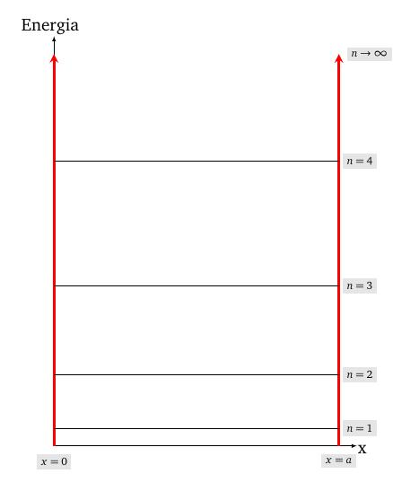

layout: true
background-size: contain

<div class="my-footer"><span>Flaviano Williams Fernandes</span></div>

```{r, include=FALSE, eval=FALSE, echo=FALSE}
  xaringan::inf_mr()
```

```{r setup, include=FALSE}
  options(htmltools.dir.version = FALSE)
  library("ggplot2")
  library("gganimate")
  library("latex2exp")
#  knitr::opts_chunk$set(fig.path = 'img')
```

```{r, load_refs, echo=FALSE, message=FALSE}
  library(RefManageR)
  BibOptions(check.entries = FALSE, bib.style = "authoryear", style = "markdown",
           dashed = TRUE)
  bib <- ReadBib("references.bib", check = FALSE)
```

---
class: middle

<div class="my-header"><span>Sumário</span></div>

1. O poço quadrado infinito

6. Bibliografia

<div class="footnote">
  <ul>
  <hr>
  <li> Esta apresentação está disponível para download em <a href="https://flavianowilliams.github.io/education">flavianowilliams.github.io/education</a>;
  <li> Este material está sujeito a modificações. Recomenda-se acompanhamento permanente.
  </ul>
</div>

---
class: middle

<div class="my-header"><span>O poço quadrado infinito - exemplo real</span></div>

.pull-left[

A figura abaixo mostra um elétron aprisionado em uma cúpula à vácuo, onde as extremidades dessa cúpula está submetida a uma d.d.p. V, `r Cite(bib, c("tipler"))`. Podemos considerar que o elétron pode se mover livremente dentro da cúpula, mas ao se aproximar das extremidades, ele sofre uma forte repulsão, impedindo-o de estar além das extremidades desta cúpula.

```{r, echo=FALSE, fig.align='center',fig.cap='Dois eletrodos sujeitos a uma d.d.p. $V_0$.',out.width="75%",fig.asp=1}
  
```

]
.pull-right[

De acordo com o dispositivo ao lado, supondo que a barreira de potencial assume valores extremamente elevados nas extremidades da cúpula, podemos dizer que o potencial $V(x)$ assume valores como mostra abaixo,
\begin{aligned}
V(x)=
  \begin{cases}
    \infty,\quad & (x\le 0),\\
    0,\quad & (0< x< a),\\
    \infty,\quad & (x\ge a).
  \end{cases}
\end{aligned}

Para $x<0$ e $x>a$ temos que a partícula não poderá aparecer devido a barreira de potencial, assim a função de onda deve ser zero nessa região. E para $0\le x \le a$ temos a solução da partícula. Reunindo essas informações temos a solução geral do elétron,

\begin{aligned}
\psi(x)=
  \begin{cases}
    0,\quad & (x\le 0),\\
    c_1e^{ik_1x}+c_2e^{-ik_1x},\quad & (0< x< a),\\
    0,\quad & (x\ge a).
  \end{cases}
\end{aligned}

]

---
class: middle

<div class="my-header"><span>O poço quadrado infinito - solução geral</span></div>

.pull-left[

Para obter as constantes $c_1$ e $c_2$ usamos as condições de analiticidade da função de onda em $x=0$ e $x=a$. Pela expressão da função de onda deveremos ter
\begin{aligned}
  \psi(x=0) =\psi(x=a) = 0.
\end{aligned}
Contudo, primeiramente faremos a substituição $e^{i\theta}=\cos\theta+i\sin\theta$, onde
\begin{aligned}
  \psi(x) & = c_1(\cos(kx)+i\sin(kx))+\\
  & + c_2(\cos(-kx)+i\sin(-kx)).
\end{aligned}
Sabendo que $\cos(-\theta)=\cos(\theta)$ e $\sin(-\theta)=-\sin(\theta)$ teremos
\begin{aligned}
  \psi(x) & = c_1\cos(kx)+ic_1\sin(kx)+\\
  & + c_2\cos(kx)-ic_2\sin(kx),\\
  & = (c_1+c_2)\cos(kx)+i(c_1-c_2)\sin(kx).
\end{aligned}
Podemos ver que $\psi(x)=0$ em $x=0$ somente se o termo contendo $\cos(kx)$ for nulo, ou seja, $c_2=-c_1$.

]
.pull-right[

Assim teremos como solução
\begin{aligned}
\psi(x)=
  \begin{cases}
    0,\quad & (x\le 0),\\
    2ic_1\sin(kx),\quad & (0< x< a),\\
    0,\quad & (x\ge a).
  \end{cases}
\end{aligned}
Para obter $c_1$ usamos a condição de encontrar o elétron em toda a região é 100%, ou seja, igua a 1,
\begin{aligned}
  \int^{\infty}_{-\infty}|\psi(x)|^2dx & = 1,\\
  \int^{a}_{0}(2ic_1\sin(kx))^*(-2ic_1\sin(kx)) & = 1,\\
  4|c_1|^2\int^{a}_{0}\sin^2(kx)dx & = 1.
\end{aligned}
Aplicando a identidade $\sin^2\theta=\frac{1}{2}(1-\cos2\theta)$
\begin{aligned}
  \frac{4|c_1|^2}{2}\int^{a}_{0}(1-\cos2kx)dx & = 1.
\end{aligned}

]

---
class: middle

<div class="my-header"><span>O poço quadrado infinito - Níveis de energia</span></div>

.pull-left[

\begin{aligned}
  2|c_1|^2\int^{a}_{0}(1-\cos2kx)dx & = 1,\\
  2|c_1|^2\left[\int^{a}_{0}dx-\int^{a}_{0}\cos2kx\right] & = 1,\\
  2|c_1|^2\left(a-\frac{\sin2ka}{2k}\right) & = 1.
\end{aligned}
Aplicando a condição $\psi(x=a)=0$ teremos
\begin{aligned}
  2c_1\sin ka = 0.
\end{aligned}
Isso será verdade se $\sin ka=0$. Assim, poderemos dizer que $\sin2ka$ também será zero,
\begin{aligned}
  2|c_1|^2a & = 1,\\
  c_1 & = \frac{1}{\sqrt{2a}}.
\end{aligned}
Retomando a equação $\sin ka=0$. Pela propriedade da função seno, temos que ela somente será zero se

]
.pull-right[

\begin{aligned}
  ka & = n\pi,\\
  k & = \frac{n\pi}{a},\quad (n=1, 2,\cdots)
\end{aligned}
Porém, a partir da solução da partícula livre, sabemos que $k=\frac{\sqrt{2mE}}{\hbar}$, portanto
\begin{aligned}
   \frac{\sqrt{2mE}}{\hbar} & = \frac{n\pi}{a},\\
   E & = \frac{n^2\pi^2\hbar^2}{2ma^2},\quad (n= 1, 2,\cdots).
\end{aligned}
**Podemos perceber que a energia do elétron assume valores discretos que dependem de $n^2$**. Além do mais, temos que os demais valores são constantes, assim
\begin{aligned}
   E_n & = \left(\frac{\pi^2\hbar^2}{2ma^2}\right)n^2= E_1n^2.
\end{aligned}
$E_1$ é chamado energia do estado fundamental.

]

---
class: middle

<div class="my-header"><span>O poço quadrado infinito - Representação gráfica dos níveis de energia</span></div>

.pull-left[

```{r, echo=FALSE, fig.align='center',fig.cap='Representação gráfica dos níveis de energia para n=1,2,3 e 4.',out.width="75%",fig.asp=1}
  
```

]
.pu---right[

]

---
class: middle

<div class="my-header"><span>O poço quadrado infinito - Densidade de probabilidade</span></div>

.pull-left[

Através de $c_1$ reescrevemos a expressão final da função de onda,
\begin{aligned}
\psi(x)=
  \begin{cases}
    0,\quad & (x\le 0),\\
    i\sqrt{\frac{2}{a}}\sin\left(\frac{n\pi}{a}x\right),\quad & (0< x< a),\\
    0,\quad & (x\ge 0).
  \end{cases}
\end{aligned}
Podemos obter a densidade de probabilidade multiplicando $\psi$ pelo complexo conjugado, ou seja,
\begin{aligned}
|\psi(x)|^2=
  \begin{cases}
    0,\quad & (x\le 0),\\
    \frac{2}{a}\sin^2\left(\frac{n\pi}{a}x\right),\quad & (0< x< a),\\
    0,\quad & (x\ge 0).
  \end{cases}
\end{aligned}
Podemos ver que $|\psi(x)|^2$ é uma função senoidal, onde seu valor é zero nas extremidades, como era esperado.

A figura ao lado mostra a densidade de probabilidade para $n=1,2,3,4$.

]
.pull-right[

```{r, echo=FALSE, fig.align='center',fig.cap='Representação gráfica da densidade de probabilidade para n=1,2,3 e 4.',out.width="75%",fig.asp=1}
  
```

]

---
class: middle

<div class="my-header"><span>Potencial barreira - Aplicações </span></div>

### Ressonância eletrônica na molécula de butadieno

.pull-left[

A molécula de butadieno tem a estrutura $C=C-C=C$. Nela um elétron viaja repetidamente de uma extremidade a outra como se estivesse em um poço de potencial. Do ponto de vista mecânica quântica, este problema pode ser traduzido como o elétron na caixa.

```{r, echo=FALSE, fig.align='center',fig.cap='Molécula de butadieno.',out.width="75%",fig.asp=1}
  
```

]
.pull-right[

Do poblema do poço de potencial infinito, temos que os níveis de energia são dados por
\begin{aligned}
 E_n & = \frac{n^2\pi^2\hbar^2}{2ma^2} = \frac{n^2h^2}{8ma^2},
\end{aligned}
sabendo que $\hbar=h/2\pi$. Se o elétron saltar de um nível mais energético n+1 para o nível menos energético n, neste salto ele emite um fóton de energia $\Delta E$, onde
\begin{aligned}
  \Delta E & = E_{n+1}-E_n,\\
  & = \frac{(n+1)^2h^2}{8ma^2}-\frac{n^2h^2}{8ma^2},\\
  & = \frac{(2n+1)h^2}{8ma^2}.
\end{aligned}
No caso do fóton emitido, temos que a sua energia é $\Delta E = h\nu$, ou de maneira equivalente $\lambda = \frac{hc}{\Delta E}$.

]

---
class: middle

<div class="my-header"><span>Potencial barreira - Aplicações </span></div>

### Ressonância eletrônica na molécula de butadieno

.pull-left[

No butadieno, o níveis n=1 e 2 encontram-se ocupados por dois elétrons cada (considerando a multiplicidade de spin). Portanto, o primeiro estado excitado seria o nível n=3, devido a transição de um dos elétrons no nível n = 2 para n = 3. Assim teríamos
\begin{aligned}
  \lambda & = \frac{hc}{\Delta E},\\
  & = \frac{8mc}{h(2n+1)}a^2.
\end{aligned}
Para o elétron, teríamos
\begin{aligned}
  \lambda = \frac{32,97}{2n+1}a^2.
\end{aligned}
Considerando o comprimento do butadieno de 5,6 A teremos $\lambda=207\;nm$. onde o valor experimental é de $210\;nm$ com erro percentual de 1,4 %.

]
.pull-right[

```{r, echo=FALSE, fig.align='center',fig.cap='Emissão de um fóton devido a transição do primeiro estado n=3 para o estado fundamental (n=2).',out.width="75%",fig.asp=1}
  
```

]

---
class: middle

<div class="my-header"><span>Bibliografia</span></div>

```{r, results='asis', echo=FALSE, message=FALSE}
PrintBibliography(bib)
```

