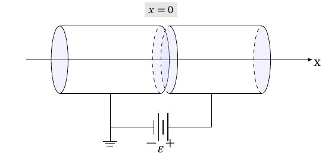
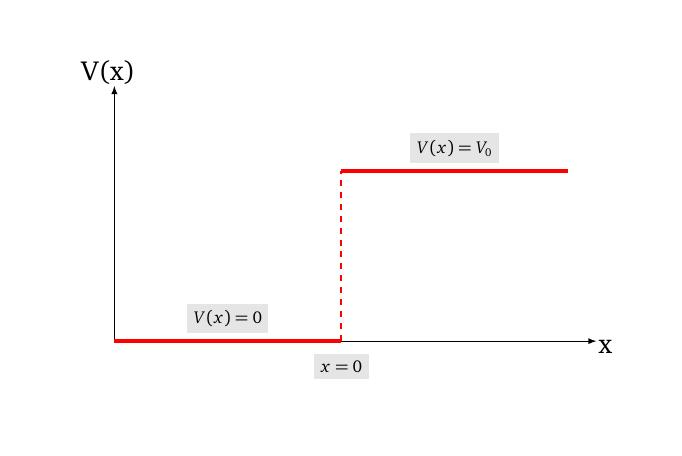

layout: true
background-size: contain

<div class="my-footer"><span>Flaviano Williams Fernandes</span></div>

```{r, include=FALSE, eval=FALSE, echo=FALSE}
  xaringan::inf_mr()
```

```{r setup, include=FALSE}
  options(htmltools.dir.version = FALSE)
  library("ggplot2")
  library("gganimate")
  library("latex2exp")
#  knitr::opts_chunk$set(fig.path = 'img')
```

```{r, load_refs, echo=FALSE, message=FALSE}
  library(RefManageR)
  BibOptions(check.entries = FALSE, bib.style = "authoryear", style = "markdown",
           dashed = TRUE)
  bib <- ReadBib("references.bib", check = FALSE)
```

---
class: middle

<div class="my-header"><span>Sumário</span></div>

1. A equação de Schrödinger

2. A equação de Scrhrödinger independente do tempo

3. O problema do elétron na caixa

2. Apêndice A

6. Bibliografia

<div class="footnote">
  <ul>
  <hr>
  <li> Esta apresentação está disponível para download em <a href="https://flavianowilliams.github.io/education">flavianowilliams.github.io/education</a>;
  <li> Este material está sujeito a modificações. Recomenda-se acompanhamento permanente.
  </ul>
</div>

---

<div class="my-header"><span>A equação de Scrödinger - Considerações iniciais</span></div>

.pull-left[
Em física, para analisar qualquer sistema físico precisamos obter uma expressão matemática que representa esse sistema. Matematicamente, o primeiro passo seria encontrar uma equação matemática, cuja solução nos fornece a variável que precisamos. Essa equação geralmente é uma equação diferencial, ou seja, uma equação contendo derivadas de diversas ordens. [`r Cite(bib, c("nussenzveig","tipler","mcquarrie","braga","eisberg"))`]
Portanto, para estudar o sistema físico, o primeiro passo seria construir essa equação diferencial. Agora, qual seria a variável de interesse, que pode ser obtida a partir dessa equação diferencial? Bem... um elétron pode ser estudado do ponto de vista quântico a partir da função de onda que descreve o seu movimento. Portanto, a solução desejada após resolver essas equação diferencial deverá ser a função de onda do sistema físico.
]
.pull-right[
Agora, como obter uma equação diferencial cuja solução poderá fornecer informações físicas a respeito do sistema a nível quântico? Para isso, essa equação deverá satisfazer certos critérios, e alguns deles foram mencionados anteriormente;
1. Ela deve ser consistente com o princípio da dualidade onda-partícula, onde
\begin{aligned}
  k = \frac{p}{\hbar},\quad \omega=\frac{E}{\hbar};
\end{aligned}
2. Ela deve ser consistente com a equação da energia (a nível não-relativístico);
\begin{aligned}
  E = \frac{p^2}{2m}+V;
\end{aligned}
3. Ela deve ser linearmente independente, onde os seus termos são funções do tipo $\psi(x,t)$;
4. Ela deve satisfazer o princípio da incerteza.
]

---
class: middle

<div class="my-header"><span>A equação de Scrödinger - Representação matemática</span></div>

.pull-left[
Observando a função de onda podemos ver que a segunda derivada em relação a posição fornece $k^2$, enquanto que a primeira derivada em relação ao tempo fornece $\omega$. Assim, um bom chute seria
\begin{aligned}
\alpha\frac{\partial^2}{\partial x^2}\Psi(x,t)+V(x,t)\Psi(x,t)=\beta\frac{\partial}{\partial t}\Psi(x,t).
\end{aligned}
O próximo passo seria obter as expressões para $\alpha$ e $\beta$. Para isso, tomamos como exemplo o pacote de onda
\begin{aligned}
  \Psi(x,t)=\cos(kx-\omega t)+i\sin(kx-\omega t).
\end{aligned}
Usando a fórmula de Euler $e^{i\theta}=\cos\theta + i\sin\theta$, teremos $\psi (x,t)=e^{i(kx-\omega t)}$ (*esta expressão corresponde justamente a função de onda do elétron livre, que será discutido a seguir*). Substituindo na equação acima teremos
\begin{aligned}
  \alpha\frac{\partial^2}{\partial x^2}e^{i(kx-\omega t)}+V(x,t)e^{i(kx-\omega t)} & = \beta\frac{\partial}{\partial t}e^{i(kx-\omega t)},
\end{aligned}
]
.pull-right[
\begin{aligned}
  \alpha(ik)^2e^{i(kx-\omega t)}+V(x,t)e^{i(kx-\omega t)} & = -i\beta\omega e^{i(kx-\omega t)},\\
  \left[-\alpha k^2+V(x,t)\right]e^{i(kx-\omega t)} & = -i\beta\omega e^{i(kx-\omega t)},\\
  \left[-\alpha k^2+V(x,t)\right] & = -i\beta\omega.
\end{aligned}

Agora, de acordo com a condição 2 do slide anterior, vamos focar na equação da energia representado pela mecânica clássica, onde substituímos os termos $p=\hbar k$ e $E=\hbar\omega$, seguindo o condição 1,
\begin{aligned}
  E & = \frac{p^2}{2m}+V,\\
    \hbar\omega & = \frac{\hbar^2k^2}{2m}+V.
\end{aligned}
Podemos ver que as equações coincidem se $\alpha=-\hbar^2/2m$ e $\beta=i\hbar$. Assim chegamos na **tão desejada** equação de Scrödinger em uma dimensão,
\begin{aligned}
  \boxed{-\frac{\hbar^2}{2m}\frac{\partial^2}{\partial x^2}\Psi(x,t)+V(x,t)\psi(x,t) = i\hbar\frac{\partial}{\partial t}\Psi(x,t).}
\end{aligned}
]

---
class: middle

<div class="my-header"><span>Equação de Scrödinger independente do tempo - O método de separação de variáveis</span></div>

.pull-left[
Em problemas em que a energia potencial não muda com o tempo, ou seja, $V(x,t)\equiv V(x)$, as funções do tempo e do espaço podem ser separadas, o que permite reescrever a equação de Scrödinger em uma forma mais simples. Para isso, supomos que a função $\psi$ pode ser escrita na forma abaixo,
\begin{aligned}
  \Psi (x,t) = \psi(x)\phi(t).
\end{aligned}
Substituindo na equação de Schrödinger teremos
\begin{aligned}
\small
  -\frac{\hbar^2}{2m}\frac{\partial^2}{\partial x^2}\left(\psi(x)\phi(t)\right)+V(x)\psi(x)\phi(t) & = i\hbar\frac{\partial}{\partial t}\left(\psi(x)\phi(t)\right),\\
  -\frac{\hbar^2\phi(t)}{2m}\frac{\partial^2}{\partial x^2}\psi(x)+\phi(t)V(x)\psi(x) & = i\hbar\psi(x)\frac{\partial}{\partial t}\phi(t).
\end{aligned}
Dividindo a equação por $\psi(x)\phi(t)$ teremos
\begin{aligned}
\small
  -\frac{\hbar^2\phi(t)}{2m\psi(x)\phi(t)}\frac{\partial^2}{\partial x^2}\psi(x)+\frac{\psi(x)\phi(t)}{\psi(x)\phi(t)}V(x) & = \frac{i\hbar\psi(x)}{\psi(x)\phi(t)}\frac{\partial}{\partial t}\phi(t).
\end{aligned}
]
.pull-right[
\begin{aligned}
  -\frac{\hbar^2}{2m}\frac{1}{\psi(x)}\frac{\partial^2}{\partial x^2}\psi(x)+V(x) & = i\hbar\frac{1}{\phi(t)}\frac{\partial}{\partial t}\phi(t).
\end{aligned}
Como $V(x)$ é uma função independente do tempo, podemos dizer que o lado esquerdo independe da variável t e o lado direito independe da variável x, assim para que a equação seja satisfeita, a única maneira disso ser verdade é se ambos os lados forem iguais a um mesmo valor constante C, que não dependa nem de x ou t,
\begin{aligned}
  -\frac{\hbar^2}{2m}\frac{1}{\psi(x)}\frac{d^2\psi(x)}{dx^2}+V(x) & = C,\\
  i\hbar\frac{1}{\phi(t)}\frac{d\phi(t)}{dt} & = C.
\end{aligned}
Inicialmente o problema era obter a solução $\Psi(x,t)$ partindo de uma única equação complicada. De acordo com o esquema acima, o problema se resume em obter a solução de duas equações simples, separadamente.
]

---
class: middle

<div class="my-header"><span>Equação de Scrödinger independente do tempo - Solução da parte dependente do tempo</span></div>

.pull-left[
A equação referente a parte temporal pode ser reescrita na forma abaixo
\begin{aligned}
  i\hbar\frac{1}{\phi(t)}\frac{d\phi(t)}{dt} & = C,\\
  i\hbar\frac{d\phi(t)}{dt} & = C\phi(t),\\
  i\hbar\frac{d\phi(t)}{dt} - C\phi(t) & = 0.
\end{aligned}
Uma possível solução para a equação acima seria se $\phi(t)=e^{-iCt/\hbar}$. Para checar essa possibilidade, substituímos $\phi(t)$ na equação diferencial,
\begin{aligned}
  i\hbar\frac{d}{dt}\left(e^{-iCt/\hbar}\right) - Ce^{-iCt/\hbar} & = 0,\\
  i\hbar\left(\frac{-iC}{\hbar}e^{-iCt/\hbar}\right) - Ce^{-iCt/\hbar} & = 0,\\
  Ce^{-iCt/\hbar} - Ce^{-iCt/\hbar} & = 0.
\end{aligned}
]
.pull-right[
Podemos ver claramente que a opção $\phi(t)=e^{-iCt/\hbar}$ é a solução da parte temporal da função de onda. Agora, para completar a solução da parte de temporal basta obter a expressão de C. Podemos dizer que
\begin{aligned}
  e^{-iCt/\hbar}=\cos\left(-\frac{C}{\hbar}t\right)+i\sin\left(-\frac{C}{\hbar}t.\right)
\end{aligned}
Comparando com a função da onda progressiva, $y(x,t)=y_m\cos(kx-\omega t)$, podemos perceber que $C=\hbar\omega\Rightarrow E$, ou seja, 
\begin{aligned}
  \phi(t)=e^{-iEt/\hbar}.
\end{aligned}
Assim chegamos na solução da parte dependente do tempo de $\Psi(x,t)$. Entretanto, para obter a densidade de probabilidade basta sabermos $|\psi(x)|^2$, pois
\begin{aligned}
  \Psi^*(x,t)\Psi(x,t) & = \psi^*(x)\psi(x)e^{iEt/\hbar}e^{-iEt/\hbar},\\
  \Psi^*(x,t)\Psi(x,t) & = \psi^*(x)\psi(x)\Rightarrow|\psi(x)|^2.
\end{aligned}
]

---
class: middle

<div class="my-header"><span>Equação de Scrödinger independente do tempo - Solução da partícula livre</span></div>

.pull-left[
Substituindo C na equação dependente de x teremos
\begin{aligned}
  -\frac{\hbar^2}{2m}\frac{1}{\psi(x)}\frac{d^2\psi(x)}{dx^2}+V(x) & = E.
\end{aligned}
Multiplicando por $\psi(x)$ chegamos na **equação de Schrödinger independente do tempo**,
\begin{aligned}
  \boxed{-\frac{\hbar^2}{2m}\frac{d^2\psi(x)}{dx^2}+V(x)\psi(x) = E\psi(x).}
\end{aligned}
Podemos ver que a solução para $\psi(x)$ depende diretamente do potencial $V(x)$. A equação de Schrödinger é uma equação diferencial ordinária, cuja solução $\psi(x)$ deve satisfazer as condições de um função analítica, onde
* $\psi(x)$ e $d\psi(x)/dx$ devem ser contínuas;
* $\psi(x)$ e $d\psi(x)/dx$ devem ser finitas;
* $\psi(x)$ e $d\psi(x)/dx$ devem ser unívocas;
]
.pull-right[
Agora, supondo um elétron se propagando livremente ao longo da direção x, onde $-\infty<x<\infty$, sem a ação de qualquer potencial. Neste caso teremos $V=0$, portanto a equação de Schrödinger se torna
\begin{aligned}
  -\frac{\hbar^2}{2m}\frac{d^2\psi(x)}{dx^2} = E\psi(x),
\end{aligned}
\begin{aligned}
  \frac{\hbar^2}{2m}\frac{d^2\psi(x)}{dx^2} +E\psi(x) & = 0,\\
\end{aligned}
Podemos ver que uma possível solução para a equação seria
\begin{aligned}
  \psi_1(x) = c'_1e^{ikx},
\end{aligned}
sendo $c'_1$ uma constante arbitrária, Substituindo $\psi(x)$ teremos
\begin{aligned}
  \frac{\hbar^2}{2m}\frac{d^2}{dx^2}\left(c'_1e^{ikx}\right) +E\left(c'_1e^{ikx}\right) & = 0,
\end{aligned}
]

---
class: middle

<div class="my-header"><span>Equação de Scrödinger independente do tempo - Solução geral da partícula livre</span></div>

.pull-left[
\begin{aligned}
  \frac{\hbar^2}{2m}\frac{d^2}{dx^2}\left(c'_1e^{ikx}\right) +E\left(c'_1e^{ikx}\right) & = 0,\\
  \frac{\hbar^2}{2m}\left(-c'_1k^2e^{ikx}\right) +E\left(c'_1e^{ikx}\right) & = 0,\\
  \frac{-c'_1\hbar^2k^2}{2m}e^{ikx} +c'_1Ee^{ikx} & = 0.
\end{aligned}
Podemos ver que $\psi_1(x)$ faz parte da solução se
\begin{aligned}
  E = \frac{\hbar^2k^2}{2m}.
\end{aligned}
Porém, podemos ver que $\psi_2(x)=c'_2e^{-kx}$ também pode ser outra solução para o problema,
\begin{aligned}
  \frac{\hbar^2}{2m}\frac{d^2}{dx^2}\left(c'_2e^{-ikx}\right) +E\left(c'_2e^{-ikx}\right) & = 0,\\
  \frac{\hbar^2}{2m}\left(-c'_2k^2e^{-ikx}\right) +E\left(c'_2e^{-ikx}\right) & = 0,\\
  \frac{-c'_2\hbar^2k^2}{2m}e^{-ikx} +c'_2Ee^{-ikx} & = 0,
\end{aligned}
]
.pull-right[
Portanto, podemos perceber que a solução geral para o elétron livre seria uma função que contemplasse todas as soluções possíveis, ou seja,
\begin{aligned}
  \psi(x) & = \psi_1(x)+\psi_2(x),\\
  \psi(x) & = c'_1e^{ikx}+c'_2e^{-ikx}.
\end{aligned}
Pela igualdade $e^{i\theta}=\cos\theta+i\sin\theta$ teremos
\begin{aligned}
  \psi(x) & = c'_1\cos(kx)+c'_1i\sin(kx)\\
  & +c'_2\cos(-kx)+c'_2i\sin(-kx),\\
  \psi(x) & = (c'_1+c'_2)\cos(kx)+(c'_1-c'_2)i\sin(kx).
\end{aligned}
Sabendo que $c'_1$ e $c'_2$ são constantes, então podemos substituí-las por outras constantes, onde $c_1=c'_1+c'_2$ e $c_2=(c'_1-c'_2)i$, assim
\begin{aligned}
  \psi(x) & = c_1\cos(kx)+c_2\sin(kx).
\end{aligned}
$c_1$ e $c_2$ são chamadas constantes de normalização.
]

---
class: middle

<div class="my-header"><span>Aplicações da equação de Schrodinger - Potencial degrau</span></div>

.pull-left[
Imagine um elétron se movendo na direção do eixo x de um sistema formado por dois eletrodos ligeiramente separados, assim como mostra a figura ao lado. Esses eletrodos produzem uma diferença de potencial $V_0$ justamente na posição de separação $x=0$. Do ponto de vista de mecânica clássica, poderíamos imaginar uma partícula se movendo livremente até $x=0$. A partir daí a partícula sofreria a ação de uma força atuando no sentido contrário a x. Caso a energia da partícula fosse menor que $V_0$, ela 
seria impedida de continuar o seu movimento para $x>0$.

```{r, echo=FALSE, fig.align='center',fig.cap='Dois eletrodos sujeitos a uma d.d.p. $V_0$.',out.width="75%",fig.asp=1}
  
```

]
.pull-right[
Graficamente podemos representar o potencial no qual a partícula está submetida assim como mostra a figura abaixo,

```{r, echo=FALSE, fig.align='center',fig.cap='Representação gráfica da energia  potencial.',out.width="75%",fig.asp=1}
  
```

Temos assim duas regiões distintas no qual o elétron estaria sendo submetido. Para $x<0$ o elétrons estaria livre de qualquer interação, se comportando assim como uma partícula livre, e para $x\ge 0$ o elétron estaria sujeito a ação de um potencial constante $V_0$.

]

---
class: middle

<div class="my-header"><span>Aplicações da equação de Schrodinger - Potencial degrau</span></div>

.pull-left[
Considere uma situação onde a energia do elétron é menor que a energia potencial $V_0$. A figura abaixo mostra graficamente uma situação deste tipo,

```{r, echo=FALSE, fig.align='center',fig.cap='Representação gráfica da energia  potencial.',out.width="75%",fig.asp=1}
  
```

Do ponto de vista da mecânica clássica, o elétron estaria impedido de se mover para regiões além de $x=0$, mas será que isso também acontece na mecânica quântica? Para verificar isso, vamos determinar a função de onda do elétron para $x<0$ e para $x>0$.

]
.pull-right[
Para $x<0$, onde $V(x)=0$, a **equação de Schrodinger independente do tempo** se torna
\begin{aligned}
  -\frac{\hbar^2}{2m}\frac{d^2\psi(x)}{dx^2} = E\psi(x),
\end{aligned}
que corresponde justamente a equação da partícula livre. A solução desta equação já foi obtida anteriormente e seria
\begin{aligned}
  \psi(x) & = c_1e^{ik_1x}+c_2e^{-ik_1x}.
\end{aligned}
Para $x\ge 0$ a equação de Schrodinger se torna
\begin{aligned}
  -\frac{\hbar^2}{2m}\frac{d^2\psi(x)}{dx^2}+V_0\psi(x) & = E\psi(x),\\
  -\frac{\hbar^2}{2m}\frac{d^2\psi(x)}{dx^2}+V_0\psi(x)-E\psi(x) & =0,\\
  \frac{\hbar^2}{2m}\frac{d^2\psi(x)}{dx^2}-(V_0-E)\psi(x) & =0.
\end{aligned}

]

---
class: middle

<div class="my-header"><span>Aplicações da equação de Schrodinger - Potencial degrau</span></div>

.pull-left[
Dividindo ambos os lados da equação por $2m/\hbar^2$, onde m é a massa do elétron, teremos
\begin{aligned}
  \frac{d^2\psi(x)}{dx^2}-\frac{2m}{\hbar}(V_0-E)\psi(x) & =0,\\
  \frac{d^2\psi(x)}{dx^2}-\kappa^2\psi(x) & =0,
\end{aligned}
onde definimos $\kappa=\frac{\sqrt{2m(V_0-E)}}{\hbar}$. Fazendo essas considerações, uma possível solução desta equação seria $\psi(x)=c_3e^{-\kappa x}$. Vamos checar!!!
\begin{aligned}
  \frac{d^2}{dx^2}\left(c_3e^{-\kappa x}\right) -\kappa^2\left(c_3e^{-\kappa x}\right) & = 0,\\
  \kappa^2c_3e^{-\kappa x} -\kappa^2c_3e^{-\kappa x} & = 0,\\
  \kappa^2 - \kappa^2 & = 0,
\end{aligned}
Realmente $\psi(x)$ é a solução para a equação acima. A solução geral da função de onda pode ser representada de maneira mais compacta como mostra ao lado,
]
.pull-right[
\begin{aligned}
\psi(x)=
  \begin{cases}
    c_1e^{ik_1x}+c_2e^{-ik_1x},\quad & (x<0),\\
    c_3e^{-\kappa x},\quad & (x\ge 0).
  \end{cases}
\end{aligned}
Podemos ver que a solução ainda não está completa, pois faltam os valores das constantes $c_1$, $c_2$ e $c_3$. Como poderemos obtê-las? Como sugestão seria empregar a condição de que a função de onda e sua derivada devem ser contínuas ao longo de todo o valor de x, ou seja,
\begin{aligned}
  \left[ c_1e^{ik_1x}+c_2e^{-ik_1x}\right]_{x=0} & = \left[ c_3e^{-\kappa x}\right]_{x=0},\\
  \left[ c_1ik_1e^{ik_1x}-c_2ik_1e^{-ik_1x}\right]_{x=0} & = \left[-c_3\kappa e^{-\kappa x}\right]_{x=0}.
\end{aligned}
Substituindo $x=0$ nas equações acima, teremos
\begin{aligned}
  c_1+c_2 & = c_3,\\
  (c_1-c_2)ik_1 & = -c_3\kappa.
\end{aligned}
Multiplicando a primeira equação por $ik_1$ e adicionando a segunda equação chegaremos a
\begin{aligned}
  c_1 = -\frac{c_3(\kappa-ik_1)}{2ik_1}.
\end{aligned}
]

---
class: middle

<div class="my-header"><span>Aplicações da equação de Schrodinger - Potencial degrau</span></div>

.pull-left[
Agora multiplicando a primeira equação por $-ik_1$ e somando a segunda equação teremos
\begin{aligned}
  c_2 = \frac{c_3(\kappa-ik_1)}{2ik_1}.
\end{aligned}
Assim, podemos substituir na solução de $\psi(x)$, chegando a
\begin{aligned}
\psi(x)=
  \begin{cases}
    -\frac{c_3(\kappa-ik_1)}{2ik_1}e^{ik_1x}+\frac{c_3(\kappa-ik_1)}{2ik_1}e^{-ik_1x},\; & (x<0),\\
    c_3e^{-\kappa x},\; & (x\ge 0).
  \end{cases}
\end{aligned}
Podemos perceber que para alcançar a solução final, precisamos de $c_3$. Usaremos como recurso que a probabilidade de encontrar a partícula em qualquer posição ao longo do eixo x é 100%, ou seja,
\begin{aligned}
  \int^{\infty}_{\infty}|\psi(x)|^2dx & = 1.
\end{aligned}
]
.pull-right[
(*Não se preocupe se não estiver claro, pois esse assunto será aborado com mais detalhes futuramente*). Assim, para $x>0$ teremos
\begin{aligned}
  \int^{\infty}_{0}\left(c_3^*e^{-\kappa x}\right)\left(c_3e^{-\kappa x}\right)dx & = 1,\\
  c^*_3c_3\int^{\infty}_{0}e^{-2\kappa x}dx & = 1,\\
  c^*_3c_3\left[\frac{e^{-2\kappa x}}{-2\kappa}\right]^{\infty}_{0} & = 1,\\
  |c_3|^2\left[0-\frac{1}{(-2\kappa)}\right] & = 1,\\
  c_3 & = \sqrt{2\kappa}.
\end{aligned}
Substituindo em $\psi(x)$ chegaremos na solução final,
\begin{aligned}
\psi(x)=
  \begin{cases}
    \frac{(\kappa-ik_1)\sqrt{2\kappa}}{2ik_1}\left(e^{-ik_1x}-e^{ik_1x}\right),\; & (x<0),\\
    \sqrt{2\kappa}e^{-\kappa x},\; & (x\ge 0).
  \end{cases}
\end{aligned}
]

---
class: middle

<div class="my-header"><span>Aplicações da equação de Schrodinger - Potencial degrau</span></div>

.pull-left[
Agora vamos determinar a densidade de probabilidade de encontrar o elétron por unidade de comprimento x, ou seja, $\psi^*(x)\psi(x)$ (*lembrando que daqui por diante não precisaremos da dependência da função no tempo, pois $|\Psi(x,t)|^2\equiv |\psi(x)|^2$*). Para $x<0$ teremos
\begin{aligned}
  |\psi(x)|^2 & = \left[\frac{(\kappa-ik_1)\sqrt{2\kappa}}{2ik_1}\left(e^{-ik_1x}-e^{ik_1x}\right)\right]^*\times,\\
  & \times \left[\frac{(\kappa-ik_1)\sqrt{2\kappa}}{2ik_1}\left(e^{-ik_1x}-e^{ik_1x}\right)\right],\\
  & = \frac{\kappa(\kappa^2+k_1^2)}{2k_1^2}\left(e^{-ik_1x}-e^{ik_1x}\right)^*\left(e^{-ik_1x}-e^{ik_1x}\right),\\
  & = \frac{\kappa(\kappa^2+k_1^2)}{2k_1^2}\left(2-e^{ik_1x}-e^{-ik_1x}\right).
\end{aligned}
Usando a identidade $2\cos\theta=e^{i\theta}+e^{-i\theta}$ teremos
\begin{aligned}
  |\psi(x)|^2 = \frac{\kappa(\kappa^2+k_1^2)}{2k_1^2}\left[1-\cos(2k_1x)\right].\\
\end{aligned}
]
.pull-right[
Usando a identidade trigonométrica $\sin^2\theta=\frac{1}{2}\left(1-\cos2\theta\right)$ teremos
\begin{aligned}
  |\psi(x)|^2_{x<0} = \frac{\kappa(\kappa^2+k_1^2)}{2k_1^2}\sin^2(2k_1x).
\end{aligned}

Para $x\ge 0$ teremos
\begin{aligned}
  |\psi(x)|^2 & = \left[\sqrt{2\kappa}e^{-\kappa x}\right]^*\left[\sqrt{2\kappa}e^{-\kappa x}\right].\\
  |\psi(x)|^2_{x\ge 0} & = 2\kappa e^{-2\kappa x}.
\end{aligned}
**Pode-se perceber que para $x<0$, onde o elétron se comporta como uma partícula livre, a densidade de probabilidade é uma função senoidal. Entretanto, para $x\ge 0$ temos que a probabilidade de encontrar o elétron decai exponencialmente, à medida que e ele se afasta da origem.** No próximo slide teremos uma figura ilustrando esse efeito.
]

---
class: middle

<div class="my-header"><span>O problema do elétron na caixa - Exemplo de um caso real</span></div>

.pull-left[
Agora iremos aplicar a equação de Schrödinger para obter a solução de um dos problemas mais simples que poderemos considerar. Imagine um elétron confinado em um tubo onde nas extremidades possuem duas placas paralelas carregadas eletricamente. Próximo as placas existem duas grades aterradas, fazendo que o potencial entre elas seja zero. Portanto, entre as grades o elétron pode se mover livremente, porém ao atravessá-la, ele se depara com um potencial eletrostático de intensidade $V(r)$, onde
\begin{aligned}
  V(r) = \frac{1}{4\pi\varepsilon_0}\frac{q}{r},
\end{aligned}
sendo r a distância relativa entre o elétron e a placa (*podemos ver que o potencial aumenta rapidamente, assumindo valores próximo ao infinito, à medida que o elétron se aproxima da placa eletricamente carregada*).
]
.pull-right[

]

---
class: middle

<div class="my-header"><span>Bibliografia</span></div>

```{r, results='asis', echo=FALSE, message=FALSE}
PrintBibliography(bib)
```

