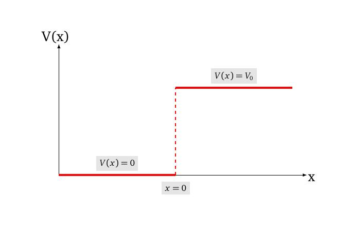
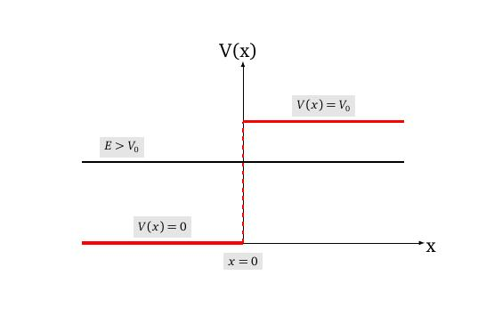
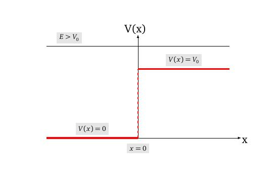

layout: true
background-size: contain

<div class="my-footer"><span>Flaviano Williams Fernandes</span></div>

```{r, include=FALSE, eval=FALSE, echo=FALSE}
  xaringan::inf_mr()
```

```{r setup, include=FALSE}
  options(htmltools.dir.version = FALSE)
  library("ggplot2")
  library("gganimate")
  library("latex2exp")
#  knitr::opts_chunk$set(fig.path = 'img')
```

```{r, load_refs, echo=FALSE, message=FALSE}
  library(RefManageR)
  BibOptions(check.entries = FALSE, bib.style = "authoryear", style = "markdown",
           dashed = TRUE)
  bib <- ReadBib("references.bib", check = FALSE)
```

---
class: middle

<div class="my-header"><span>Sumário</span></div>

1. O potencial degrau ($E<V_0$)

2. O potencial degrau ($E>V_0$)

3. O potencial barreira

4. Algumas aplicações em química

5. Apêndice A

6. Bibliografia

<div class="footnote">
  <ul>
  <hr>
  <li> Esta apresentação está disponível para download em <a href="https://flavianowilliams.github.io/education">flavianowilliams.github.io/education</a>;
  <li> Este material está sujeito a modificações. Recomenda-se acompanhamento permanente.
  </ul>
</div>

---
class: middle

<div class="my-header"><span>Potencial degrau(E < V0) - exemplo real</span></div>

.pull-left[
Imagine um elétron se movendo na direção do eixo x de um sistema formado por dois eletrodos ligeiramente separados, assim como mostra a figura ao lado. Esses eletrodos produzem uma diferença de potencial $V_0$ justamente na posição de separação $x=0$. Do ponto de vista de mecânica clássica, poderíamos imaginar uma partícula se movendo livremente até $x=0$. A partir daí a partícula sofreria a ação de uma força atuando no sentido contrário a x. Caso a energia da partícula fosse menor que $V_0$, ela 
seria impedida de continuar o seu movimento para $x>0$.

```{r, echo=FALSE, fig.align='center',fig.cap='Dois eletrodos sujeitos a uma d.d.p. $V_0$.',out.width="75%",fig.asp=1}
  knitr::include_graphics("img/potencial-degrau-representacao.jpeg")
```

]
.pull-right[
Graficamente podemos representar o potencial no qual a partícula está submetida assim como mostra a figura abaixo,

```{r, echo=FALSE, fig.align='center',fig.cap='Representação gráfica da energia  potencial.',out.width="75%",fig.asp=1}
  
```

Temos assim duas regiões distintas no qual o elétron estaria sendo submetido. Para $x<0$ o elétrons estaria livre de qualquer interação, se comportando assim como uma partícula livre, e para $x\ge 0$ o elétron estaria sujeito a ação de um potencial constante $V_0$.

]

---
class: middle

<div class="my-header"><span>Potencial degrau(E < V0) - Solução para x < 0</span></div>

.pull-left[
Considere uma situação onde a energia do elétron é menor que a energia potencial $V_0$. A figura abaixo mostra graficamente uma situação deste tipo,

```{r, echo=FALSE, fig.align='center',fig.cap='Representação gráfica da energia  potencial.',out.width="75%",fig.asp=1}
  
```

Do ponto de vista da mecânica clássica, o elétron estaria impedido de se mover para regiões além de $x=0$, mas será que isso também acontece na mecânica quântica? Para verificar isso, vamos determinar a função de onda do elétron para $x<0$ e para $x>0$.

]
.pull-right[
Para $x<0$, onde $V(x)=0$, a **equação de Schrodinger independente do tempo** se torna
\begin{aligned}
  -\frac{\hbar^2}{2m}\frac{d^2\psi(x)}{dx^2} = E\psi(x),
\end{aligned}
que corresponde justamente a equação da partícula livre. A solução desta equação já foi obtida anteriormente e seria
\begin{aligned}
  \psi(x) & = c_1e^{ik_1x}+c_2e^{-ik_1x}.
\end{aligned}
Para $x\ge 0$ a equação de Schrodinger se torna
\begin{aligned}
  -\frac{\hbar^2}{2m}\frac{d^2\psi(x)}{dx^2}+V_0\psi(x) & = E\psi(x),\\
  -\frac{\hbar^2}{2m}\frac{d^2\psi(x)}{dx^2}+V_0\psi(x)-E\psi(x) & =0,\\
  \frac{\hbar^2}{2m}\frac{d^2\psi(x)}{dx^2}-(V_0-E)\psi(x) & =0.
\end{aligned}

]

---
class: middle

<div class="my-header"><span>Potencial degrau(E < V0) - Solução para x > 0</span></div>

.pull-left[
Multiplicando ambos os lados da equação por $2m/\hbar^2$, onde m é a massa do elétron, teremos
\begin{aligned}
  \frac{d^2\psi(x)}{dx^2}-\frac{2m}{\hbar^2}(V_0-E)\psi(x) & =0,\\
  \frac{d^2\psi(x)}{dx^2}-\kappa^2\psi(x) & =0,
\end{aligned}
onde definimos $\kappa=\frac{\sqrt{2m(V_0-E)}}{\hbar}$. Uma possível solução desta equação seria $\psi(x)=c_3e^{-\kappa x}$. Outra solução seria $\psi(x)=c_4e^{\kappa x}$, ou seja, temos a solução geral $\psi(x)=c_3e^{-\kappa x}+c_4e^{\kappa x}$. Assim, podemos escrever a solução completa da função de onda na forma mais compacta, como mostrado abaixo,
\begin{aligned}
\psi(x)=
  \begin{cases}
    c_1e^{ik_1x}+c_2e^{-ik_1x},\quad & (x<0),\\
    c_3e^{-\kappa x}+c_4e^{\kappa x},\quad & (x\ge 0).
  \end{cases}
\end{aligned}
Podemos ver que a solução ainda não está completa, pois faltam as constantes $c_1$, $c_2$, $c_3$ e $c_4$.
]
.pull-right[
Para obtê-las, como sugestão seria empregar as condições de analiticidade da função de onda. Uma delas seria que $\psi$ deve ser finita quando $x\rightarrow\pm\infty$. Com isso impomos $c_4=0$, pois $\psi(\infty)=c_4e^{\infty}\rightarrow\infty$. Outro fato seria que a função de onda e sua derivada devem ser contínuas para todo valor de x, ou seja,
\begin{aligned}
  \left[ c_1e^{ik_1x}+c_2e^{-ik_1x}\right]_{x=0} & = \left[ c_3e^{-\kappa x}\right]_{x=0},\\
  \left[ c_1ik_1e^{ik_1x}-c_2ik_1e^{-ik_1x}\right]_{x=0} & = \left[-c_3\kappa e^{-\kappa x}\right]_{x=0}.
\end{aligned}
Substituindo $x=0$ nas equações acima, teremos
\begin{aligned}
  c_1+c_2 & = c_3,\\
  (c_1-c_2)ik_1 & = -c_3\kappa.
\end{aligned}
Multiplicando a primeira equação por $ik_1$ e adicionando a segunda equação chegaremos a
\begin{aligned}
  c_1 = \frac{c_3(k_1+i\kappa)}{2k_1}.
\end{aligned}
]

---
class: middle

<div class="my-header"><span>Potencial degrau(E < V0) - solução geral</span></div>

.pull-left[

Agora multiplicando a primeira equação por $-ik_1$ e somando com a segunda teremos
\begin{aligned}
  c_2 = \frac{c_3(k_1-i\kappa)}{2k_1}.
\end{aligned}
Assim, podemos substituir na solução de $\psi(x)$, chegando a
\begin{aligned}
\psi(x)=
  \begin{cases}
    \frac{c_3(k_1+i\kappa)}{2k_1}e^{ik_1x}+\frac{c_3(k_1-i\kappa)}{2k_1}e^{-ik_1x},\; & (x<0),\\
    c_3e^{-\kappa x},\; & (x\ge 0).
  \end{cases}
\end{aligned}
O comportamento físico interessante poderia ser obtida através da densidade de probabilidade, $|\psi(x)|^2$ (para mais detalhes, veja o apêndice A),
\begin{aligned}
|\psi(x)|^2\Rightarrow
  \begin{cases}
    \left[\cos(k_1x)-\frac{\kappa}{k_1}\sin(k_1x)\right]^2, & (x<0),\\
    e^{-2\kappa x}, & (x\ge 0).
  \end{cases}
\end{aligned}

]
.pull-right[

**Pode-se perceber que para $x<0$ a densidade de probabilidade é uma função senoidal devido a combinação das ondas incidente e refletida do elétron. Entretanto, para $x\ge 0$ temos que a probabilidade de encontrar o elétron decai exponencialmente, à medida que e ele se afasta da origem. Isso pode ser visto através da exponencial decrescente.**

```{r, echo=FALSE, fig.align='center',fig.cap='Representação gráfica da densidade de probabilidade.',out.width="75%",fig.asp=1}
  knitr::include_graphics("img/potencial-degrau-probabilidade.jpeg")
```

]

---
class: middle

<div class="my-header"><span>Potencial degrau(E > V0) - solução para x > 0</span></div>

.pull-left[
Agora, considere uma situação onde a energia do elétron é maior ou igual a energia potencial $V_0$. A figura abaixo mostra graficamente uma situação deste tipo,

```{r, echo=FALSE, fig.align='center',fig.cap='Representação gráfica da densidade de probabilidade.',out.width="75%",fig.asp=1}
  
```

Assim como no caso $E<V_0$, podemos separar a solução do problema nas regiões $x<0$ e $x\ge 0$. Para $x<0$ ainda permanece a solução da partícula livre, onde

]
.pull-right[

\begin{aligned}
  \psi(x) & = c_1e^{ik_1x}+c_2e^{-ik_1x}.
\end{aligned}
Neste caso $k_1=\frac{\sqrt{2mE}}{\hbar}$. 

Para $x\ge 0$ a equação de Schrodinger se torna
\begin{aligned}
  -\frac{\hbar^2}{2m}\frac{d^2\psi(x)}{dx^2}+V_0\psi(x) & = E\psi(x),\\
  -\frac{\hbar^2}{2m}\frac{d^2\psi(x)}{dx^2}+V_0\psi(x)-E\psi(x) & =0,\\
  \frac{d^2\psi(x)}{dx^2}+\frac{2m}{\hbar^2}(E-V_0)\psi(x) & =0.
\end{aligned}
Podemos ver que a solução geral desta equação seria $\psi(x)=c_3e^{ik_2x}+c_4e^{-ik_2x}$, onde
\begin{aligned}
  k_2 = \frac{\sqrt{2m(E-V_0)}}{\hbar}.
\end{aligned}
*(Observação. Percebe-se que $k_2<k_1$)*.
]

---
class: middle

<div class="my-header"><span>Potencial degrau (E > V0) - solução geral</span></div>

.pull-left[

Podemos escrever a solução completa da função de onda na forma mais compacta, como mostrado abaixo,
\begin{aligned}
\psi(x)=
  \begin{cases}
    c_1e^{ik_1x}+c_2e^{-ik_1x},\quad & (x<0),\\
    c_3e^{ik_2x}+c_4e^{-ik_2x},\quad & (x\ge 0).
  \end{cases}
\end{aligned}
Podemos ver que o termo $e^{-ik_2x}$ representa uma onda se propagando da direita para a esquerda, desde $x\rightarrow\infty$ até $x=0$. Se impusermos que os elétrons saem inicialmente de $x\rightarrow-\infty$, podemos impor $c_4=0$, afim de impor a condição de que não existem elétrons partindo de $x\rightarrow\infty$. Para obter as constantes $c_1$, $c_2$ e $c_3$, empregamos a condição de analiticidade da função de onda e sua deriva. Isso resulta nas equações abaixo,
\begin{aligned}
  c_1+c_2 & = c_3,\\
  (c_1-c_2)ik_1 & = ik_2c_3.
\end{aligned}
Multiplicando a primeira equação por $ik_1$ e substituindo na segunda teremos

]
.pull-right[

\begin{aligned}
      c_1 & = \frac{k_1+k_2}{2k_1}c_3.
\end{aligned}
Multiplicando a primeira equação por $-ik_1$ e substituindo na segunda teremos
\begin{aligned}
      c_2 & = \frac{k_1-k_2}{2k_1}c_3.
\end{aligned}
Substituindo $c_1$ e $c_2$ em $\psi$ chegamos na solução
\begin{aligned}
\psi(x)=
  \begin{cases}
    \frac{c_3(k_1+k_2)}{2k_1}e^{ik_1x}+\frac{c_3(k_1-k_2)}{2k_1}e^{-ik_1x}, & (x<0),\\
    c_3e^{ik_2x}, & (x\ge 0).
  \end{cases}
\end{aligned}
O comportamento físico interessante poderia ser obtida através da densidade de probabilidade, $|\psi(x)|^2$ (para mais detalhes, veja o apêndice B),
\begin{aligned}
|\psi(x)|^2\Rightarrow
  \begin{cases}
    \left[\cos^2(k_1x)+\frac{k_2^2}{k_1^2}\sin^2(k_1x)\right], & (x<0),\\
    \text{constante}, & (x\ge 0).
  \end{cases}
\end{aligned}

]

---
class: middle

<div class="my-header"><span>Potencial degrau (E > V0) - densidade de probabilidade</span></div>

.pull-left[

**Pode-se perceber que para $x<0$ a densidade de probabilidade é uma função senoidal devido a combinação das ondas incidente e refletida do elétron, assim como no caso $E<V_0$. Para $x\ge 0$, o elétron se comporta como a partícula livre, onde a densidade de probabilidade é uma função constante.**

A figura abaixo mostra a densidade de probabilidade para $x<0$ e para $x\ge 0$.

```{r, echo=FALSE, fig.align='center',fig.cap='Representação gráfica da densidade de probabilidade.',out.width="75%",fig.asp=1}
  knitr::include_graphics("img/potencial-degrau-probabilidade2.jpeg")
```


]
.pull-right[

]

---
class: middle

<div class="my-header"><span>Potencial barreira - </span></div>

.pull-left[

Considere uma situação onde o elétron se propaga entre três regiões. A primeira e a terceira regiões, o elétron estaria sujeito a um potencial nulo, se comportanto como uma partícula livre. A segunda região, $0<x<a$, o elétron estaria sujeito a um potencial constante $V_0$. Essa região chamamos de barreira de potencial, de largura a e altura $V_0$. A figura abaixo mostra graficamente uma situação deste tipo,

```{r, echo=FALSE, fig.align='center',fig.cap='Representação gráfica da energia no  potencial barreira.',out.width="100%",fig.asp=1}
  knitr::include_graphics("img/potencial-barreira-grafico.jpeg")
```


]
.pull-right[

Assim como foi feito no caso do potencial degrau, iremos analisar a função de onda nas três regiões separadamente. Para $x<0$ e $0<x<a$ valem os resultados obtidos anteriormente. Para $x\ge a$, como foi dito a solução seria a mesma da partícula livre,
\begin{aligned}
  \psi_{x\ge a}(x) = c_4e^{ik_2x}+c_5e^{-ik_2x}.
\end{aligned}
Supondo que não existe elétrons se propagando no sentido contrário ao eixo x, dentro da região $x\ge a$, poderemos impor $c_5=0$. Temos assim
\begin{aligned}
\psi(x)=
  \begin{cases}
    c_1e^{ik_1x}+c_2e^{-ik_1x},\quad & (x<0),\\
    c_3e^{-\kappa x}+c_4e^{\kappa x},\quad & (x\ge 0),\\
    c_5e^{ik_1x}.
  \end{cases}
\end{aligned}
Dois detalhes devem ser levados em consideração:
* Percebe-se que $k_1$ é o mesmo número de onda na região $x<0$,
* O termo $e^{\kappa x}$ deve ser incluído neste caso.

]

---
class: middle

<div class="my-header"><span>Potencial barreira - </span></div>

.pull-left[

]
.pull-right[

]

---
class: middle

<div class="my-header"><span>Apêndice A - densidade de probabilidade do potencial degrau (E < V0) </span></div>

.pull-left[

Agora vamos determinar a densidade de probabilidade de encontrar o elétron por unidade de comprimento x, $\psi^*(x)\psi(x)$. Para $x<0$ teremos
\begin{aligned}
  |\psi(x)|^2 & = \left[c_3\frac{(k_1+i\kappa)}{2k_1}e^{ik_1x}+c_3\frac{(k_1-i\kappa)}{2k_1}e^{-ik_1x}\right]^*\times,\\
  & \times \left[c_3\frac{(k_1+i\kappa)}{2k_1}e^{ik_1x}+c_3\frac{(k_1-i\kappa)}{2k_1}e^{-ik_1x}\right],\\
   & = \frac{|c_3|^2}{4}\left[(e^{ik_1x}+e^{-ik_1x})+\frac{\kappa}{k_1}i(e^{ik_1x}-e^{-ik_1x})\right]^*\times\\
   & \times \left[(e^{ik_1x}+e^{-ik_1x})+\frac{\kappa}{k_1}i(e^{ik_1x}-e^{-ik_1x})\right].
\end{aligned}
Sabendo que $e^{i\theta}=\cos\theta+i\sin\theta$ e $e^{-i\theta}=\cos\theta-i\sin\theta$ podemos dizer que
\begin{aligned}
  e^{i\theta}+e^{-i\theta} & = \cos\theta+i\sin\theta+\cos\theta-i\sin\theta,\\
  e^{i\theta}+e^{-i\theta} & = 2\cos\theta.
\end{aligned}

]
.pull-right[

O mesmo é válido para a equação abaixo,

\begin{aligned}
  e^{i\theta}-e^{-i\theta} & = \cos\theta+i\sin\theta-\cos\theta+i\sin\theta,\\
  e^{i\theta}-e^{-i\theta} & = 2i\sin\theta.
\end{aligned}

Substituindo em $|\psi(x)|^2$ teremos

\begin{aligned}
  |\psi(x)|^2 & = \frac{|c_3|^2}{4}\left[2\cos(k_1x)-\frac{2\kappa}{k_1}\sin(k_1x)\right]^*\times\\
  & \times\left[2\cos(k_1x)-\frac{2\kappa}{k_1}\sin(k_1x)\right],\\
  & = c_3|^2\left[\cos(k_1x)-\frac{\kappa}{k_1}\sin(k_1x)\right]^2.
\end{aligned}

Podemos ver que a densidade de probabilidade para $x<0$ é uma função senoidal. Para $x\ge 0$ teremos
\begin{aligned}
  |\psi(x)|^2 & = \left[c_3e^{-\kappa x}\right]^*\left[c_3e^{-\kappa x}\right].\\
  |\psi(x)|^2_{x\ge 0} & = |c_3|^2 e^{-2\kappa x}.
\end{aligned}

]

---
class: middle

<div class="my-header"><span>Apêndice B - densidade de probabilidade do potencial degrau (E > V0) </span></div>

.pull-left[

Agora vamos determinar a densidade de probabilidade, $|\psi(x)|^2$. Para $x<0$ teremos
\begin{aligned}
  |\psi(x)|^2 & = \frac{|c_3|^2}{4}\left[\frac{(k_1+k_2)}{k_1}e^{ik_1x}+\frac{(k_1-k_2)}{k_1}e^{-ik_1x}\right]^*\times\\
  & \times \left[\frac{(k_1+k_2)}{k_1}e^{ik_1x}+\frac{(k_1-k_2)}{k_1}e^{-ik_1x}\right],\\
  & = \frac{|c_3|^2}{4}\left[(e^{ik_1x}+e^{-ik_1x})+\frac{k_2}{k_1}(e^{ik_1x}-e^{-ik_1x})\right]^*\times\\
  & \times\left[(e^{ik_1x}+e^{-ik_1x})+\frac{k_2}{k_1}(e^{ik_1x}-e^{-ik_1x})\right].
\end{aligned}
De maneira similar ao caso $E<V_0$, teremos
\begin{aligned}
  |\psi(x)|^2 & = |c_3|^2\left[\cos(k_1x)+\frac{k_2}{k_1}i\sin(k_1x)\right]^*\times\\
  & \times \left[\cos(k_1x)+\frac{k_2}{k_1}i\sin(k_1x)\right].
\end{aligned}

]
.pull-right[

Para $z=x+iy$ temos $|z|^2=x^2+y^2$, portanto
\begin{aligned}
  |\psi(x)|^2_{x<0} & = |c_3|^2\left[\cos^2(k_1x)+\frac{k_2^2}{k_1^2}\sin^2(k_1x)\right].
\end{aligned}
Para $x\ge 0$ teremos
\begin{aligned}
  |\psi(x)|^2_{x\ge 0} & = \left[c_3e^{ik_2x}\right]^*\left[c_3e^{ik_2x}\right],\\
  |\psi(x)|^2_{x\ge 0} & = |c_3|^2.
\end{aligned}

]

---
class: middle

<div class="my-header"><span>Bibliografia</span></div>

```{r, results='asis', echo=FALSE, message=FALSE}
PrintBibliography(bib)
```

