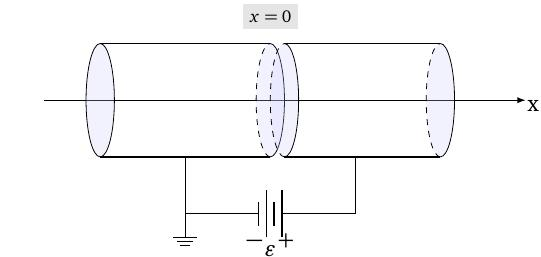
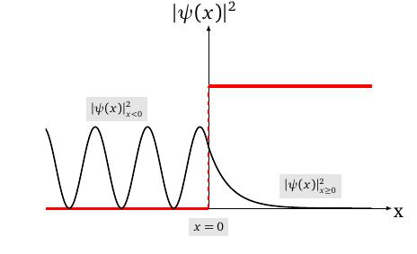

layout: true
background-size: contain

<div class="my-footer"><span>Flaviano Williams Fernandes</span></div>

```{r, include=FALSE, eval=FALSE, echo=FALSE}
  xaringan::inf_mr()
```

```{r setup, include=FALSE}
  options(htmltools.dir.version = FALSE)
  library("ggplot2")
  library("gganimate")
  library("latex2exp")
#  knitr::opts_chunk$set(fig.path = 'img')
```

```{r, load_refs, echo=FALSE, message=FALSE}
  library(RefManageR)
  BibOptions(check.entries = FALSE, bib.style = "authoryear", style = "markdown",
           dashed = TRUE)
  bib <- ReadBib("references.bib", check = FALSE)
```

---
class: middle

<div class="my-header"><span>Sumário</span></div>

1. O potencial degrau ($E<V_0$)

2. O potencial degrau ($E>V_0$)

3. O potencial barreira

4. Algumas aplicações em química

5. Apêndice A

6. Bibliografia

<div class="footnote">
  <ul>
  <hr>
  <li> Esta apresentação está disponível para download em <a href="https://flavianowilliams.github.io/education">flavianowilliams.github.io/education</a>;
  <li> Este material está sujeito a modificações. Recomenda-se acompanhamento permanente.
  </ul>
</div>

---
class: middle

<div class="my-header"><span>Aplicações da equação de Schrodinger - Potencial degrau(E < V0)</span></div>

.pull-left[
Imagine um elétron se movendo na direção do eixo x de um sistema formado por dois eletrodos ligeiramente separados, assim como mostra a figura ao lado. Esses eletrodos produzem uma diferença de potencial $V_0$ justamente na posição de separação $x=0$. Do ponto de vista de mecânica clássica, poderíamos imaginar uma partícula se movendo livremente até $x=0$. A partir daí a partícula sofreria a ação de uma força atuando no sentido contrário a x. Caso a energia da partícula fosse menor que $V_0$, ela 
seria impedida de continuar o seu movimento para $x>0$.

```{r, echo=FALSE, fig.align='center',fig.cap='Dois eletrodos sujeitos a uma d.d.p. $V_0$.',out.width="75%",fig.asp=1}
  
```

]
.pull-right[
Graficamente podemos representar o potencial no qual a partícula está submetida assim como mostra a figura abaixo,

```{r, echo=FALSE, fig.align='center',fig.cap='Representação gráfica da energia  potencial.',out.width="75%",fig.asp=1}
  knitr::include_graphics("img/potencial-degrau-grafico.jpeg")
```

Temos assim duas regiões distintas no qual o elétron estaria sendo submetido. Para $x<0$ o elétrons estaria livre de qualquer interação, se comportando assim como uma partícula livre, e para $x\ge 0$ o elétron estaria sujeito a ação de um potencial constante $V_0$.

]

---
class: middle

<div class="my-header"><span>Aplicações da equação de Schrodinger - Potencial degrau(E < V0)</span></div>

.pull-left[
Considere uma situação onde a energia do elétron é menor que a energia potencial $V_0$. A figura abaixo mostra graficamente uma situação deste tipo,

```{r, echo=FALSE, fig.align='center',fig.cap='Representação gráfica da energia  potencial.',out.width="75%",fig.asp=1}
  knitr::include_graphics("img/potencial-degrau-energia1.jpeg")
```

Do ponto de vista da mecânica clássica, o elétron estaria impedido de se mover para regiões além de $x=0$, mas será que isso também acontece na mecânica quântica? Para verificar isso, vamos determinar a função de onda do elétron para $x<0$ e para $x>0$.

]
.pull-right[
Para $x<0$, onde $V(x)=0$, a **equação de Schrodinger independente do tempo** se torna
\begin{aligned}
  -\frac{\hbar^2}{2m}\frac{d^2\psi(x)}{dx^2} = E\psi(x),
\end{aligned}
que corresponde justamente a equação da partícula livre. A solução desta equação já foi obtida anteriormente e seria
\begin{aligned}
  \psi(x) & = c_1e^{ik_1x}+c_2e^{-ik_1x}.
\end{aligned}
Para $x\ge 0$ a equação de Schrodinger se torna
\begin{aligned}
  -\frac{\hbar^2}{2m}\frac{d^2\psi(x)}{dx^2}+V_0\psi(x) & = E\psi(x),\\
  -\frac{\hbar^2}{2m}\frac{d^2\psi(x)}{dx^2}+V_0\psi(x)-E\psi(x) & =0,\\
  \frac{\hbar^2}{2m}\frac{d^2\psi(x)}{dx^2}-(V_0-E)\psi(x) & =0.
\end{aligned}

]

---
class: middle

<div class="my-header"><span>Aplicações da equação de Schrodinger - Potencial degrau(E < V0)</span></div>

.pull-left[
Multiplicando ambos os lados da equação por $2m/\hbar^2$, onde m é a massa do elétron, teremos
\begin{aligned}
  \frac{d^2\psi(x)}{dx^2}-\frac{2m}{\hbar^2}(V_0-E)\psi(x) & =0,\\
  \frac{d^2\psi(x)}{dx^2}-\kappa^2\psi(x) & =0,
\end{aligned}
onde definimos $\kappa=\frac{\sqrt{2m(V_0-E)}}{\hbar}$. Uma possível solução desta equação seria $\psi(x)=c_3e^{-\kappa x}$. Outra solução seria $\psi(x)=c_4e^{\kappa x}$, ou seja, temos a solução geral $\psi(x)=c_3e^{-\kappa x}+c_4e^{\kappa x}$. Assim, podemos escrever a solução completa da função de onda na forma mais compacta, como mostrado abaixo,
\begin{aligned}
\psi(x)=
  \begin{cases}
    c_1e^{ik_1x}+c_2e^{-ik_1x},\quad & (x<0),\\
    c_3e^{-\kappa x}+c_4e^{\kappa x},\quad & (x\ge 0).
  \end{cases}
\end{aligned}
Podemos ver que a solução ainda não está completa, pois faltam as constantes $c_1$, $c_2$, $c_3$ e $c_4$.
]
.pull-right[
Para obtê-las, como sugestão seria empregar as condições de analiticidade da função de onda. Uma delas seria que $\psi$ deve ser finita quando $x\rightarrow\pm\infty$. Com isso impomos $c_4=0$, pois $\psi(\infty)=c_4e^{\infty}\rightarrow\infty$. Outro fato seria que a função de onda e sua derivada devem ser contínuas para todo valor de x, ou seja,
\begin{aligned}
  \left[ c_1e^{ik_1x}+c_2e^{-ik_1x}\right]_{x=0} & = \left[ c_3e^{-\kappa x}\right]_{x=0},\\
  \left[ c_1ik_1e^{ik_1x}-c_2ik_1e^{-ik_1x}\right]_{x=0} & = \left[-c_3\kappa e^{-\kappa x}\right]_{x=0}.
\end{aligned}
Substituindo $x=0$ nas equações acima, teremos
\begin{aligned}
  c_1+c_2 & = c_3,\\
  (c_1-c_2)ik_1 & = -c_3\kappa.
\end{aligned}
Multiplicando a primeira equação por $ik_1$ e adicionando a segunda equação chegaremos a
\begin{aligned}
  c_1 = -\frac{c_3(\kappa-ik_1)}{2ik_1}.
\end{aligned}
]

---
class: middle

<div class="my-header"><span>Aplicações da equação de Schrodinger - Potencial degrau(E < V0)</span></div>

.pull-left[
Agora multiplicando a primeira equação por $-ik_1$ e somando com a segunda teremos
\begin{aligned}
  c_2 = \frac{c_3(\kappa-ik_1)}{2ik_1}.
\end{aligned}
Assim, podemos substituir na solução de $\psi(x)$, chegando a
\begin{aligned}
\psi(x)=
  \begin{cases}
    -\frac{c_3(\kappa-ik_1)}{2ik_1}e^{ik_1x}+\frac{c_3(\kappa-ik_1)}{2ik_1}e^{-ik_1x},\; & (x<0),\\
    c_3e^{-\kappa x},\; & (x\ge 0).
  \end{cases}
\end{aligned}
Para alcançar a solução final, precisamos de $c_3$. Ele pode ser obtido considerando que a probabilidade de encontrar a partícula em qualquer região é 100%,
\begin{aligned}
  \int^{\infty}_{\infty}|\psi(x)|^2dx & = 1.
\end{aligned}
Entretanto, é possível fazer uma análise qualitativa sem saber o valor de $c_3$.
]
.pull-right[

Agora vamos determinar a densidade de probabilidade de encontrar o elétron por unidade de comprimento x, ou seja, $\psi^*(x)\psi(x)$ (*lembrando que $|\Psi(x,t)|^2\equiv |\psi(x)|^2$*). Para $x<0$ teremos
\begin{aligned}
  |\psi(x)|^2 & = \left[c_3\frac{(\kappa-ik_1)}{2ik_1}\left(e^{-ik_1x}-e^{ik_1x}\right)\right]^*\times,\\
  & \times \left[c_3\frac{(\kappa-ik_1)}{2ik_1}\left(e^{-ik_1x}-e^{ik_1x}\right)\right],\\
  & = |c_3|^2\frac{(\kappa^2+k_1^2)}{4k_1^2}\left(e^{-ik_1x}-e^{ik_1x}\right)^*\left(e^{-ik_1x}-e^{ik_1x}\right),\\
  & = |c_3|^2\frac{(\kappa^2+k_1^2)}{4k_1^2}\left[2-\left(e^{2ik_1x}+e^{-2ik_1x}\right)\right].
\end{aligned}
Usando a identidade $2\cos\theta=e^{i\theta}+e^{-i\theta}$ teremos
\begin{aligned}
  |\psi(x)|^2 = |c_3|^2\frac{(\kappa^2+k_1^2)}{2k_1^2}\left[1-\cos(2k_1x)\right].\\
\end{aligned}

]

---
class: middle

<div class="my-header"><span>Aplicações da equação de Schrodinger - Potencial degrau(E < V0)</span></div>

.pull-left[

Usando a identidade trigonométrica $\sin^2\theta=\frac{1}{2}\left(1-\cos2\theta\right)$ e supondo que $\theta=k_1x$ teremos
\begin{aligned}
  |\psi(x)|^2_{x<0} = |c_3|^2\frac{\kappa(\kappa^2+k_1^2)}{2k_1^2}\sin^2(k_1x).
\end{aligned}

Para $x\ge 0$ teremos
\begin{aligned}
  |\psi(x)|^2 & = \left[c_3e^{-\kappa x}\right]^*\left[c_3e^{-\kappa x}\right].\\
  |\psi(x)|^2_{x\ge 0} & = |c_3|^2 e^{-2\kappa x}.
\end{aligned}
**Pode-se perceber que para $x<0$, onde o elétron se comporta como uma partícula livre, a densidade de probabilidade é uma função senoidal. Entretanto, para $x\ge 0$ temos que a probabilidade de encontrar o elétron decai exponencialmente, à medida que e ele se afasta da origem.** No próximo slide será mostrado uma figura ilustrando este efeito.

]
.pull-right[

```{r, echo=FALSE, fig.align='center',fig.cap='Representação gráfica da energia  potencial.',out.width="75%",fig.asp=1}
  
```

]

---
class: middle

<div class="my-header"><span>Aplicações da equação de Schrodinger - Potencial degrau(E > V0)</span></div>

.pull-left[
Agora, considere uma situação onde a energia do elétron é maior ou igual a energia potencial $V_0$. A figura abaixo mostra graficamente uma situação deste tipo,

```{r, echo=FALSE, fig.align='center',fig.cap='Representação gráfica da densidade de probabilidade.',out.width="75%",fig.asp=1}
  knitr::include_graphics("img/potencial-degrau-energia2.jpeg")
```

Assim como no caso $E<V_0$, podemos separar a solução do problema nas regiões $x<0$ e $x\ge 0$. Para $x<0$ ainda permanece a solução da partícula livre, onde

]
.pull-right[

\begin{aligned}
  \psi(x) & = c_1e^{ik_1x}+c_2e^{-ik_1x}.
\end{aligned}
Neste caso $k_1=\frac{\sqrt{2mE}}{\hbar}$. 

Para $x\ge 0$ a equação de Schrodinger se torna
\begin{aligned}
  -\frac{\hbar^2}{2m}\frac{d^2\psi(x)}{dx^2}+V_0\psi(x) & = E\psi(x),\\
  -\frac{\hbar^2}{2m}\frac{d^2\psi(x)}{dx^2}+V_0\psi(x)-E\psi(x) & =0,\\
  \frac{d^2\psi(x)}{dx^2}+\frac{2m}{\hbar^2}(E-V_0)\psi(x) & =0.
\end{aligned}
Podemos ver que a solução geral desta equação seria $\psi(x)=c_3e^{ik_2x}+c_4e^{-ik_2x}$, onde
\begin{aligned}
  k_2 = \frac{\sqrt{2m(E-V_0)}}{\hbar}.
\end{aligned}
*(Observação. Percebe-se que $k_2<k_1$)*.
]

---
class: middle

<div class="my-header"><span>Aplicações da equação de Schrodinger - Potencial degrau (E > V0)</span></div>

.pull-left[

Podemos escrever a solução completa da função de onda na forma mais compacta, como mostrado abaixo,
\begin{aligned}
\psi(x)=
  \begin{cases}
    c_1e^{ik_1x}+c_2e^{-ik_1x},\quad & (x<0),\\
    c_3e^{ik_2x}+c_4e^{-ik_2x},\quad & (x\ge 0).
  \end{cases}
\end{aligned}
Podemos ver que o termo $e^{-ik_2x}$ representa uma onda se propagando da direita para a esquerda, desde $x\rightarrow\infty$ até $x=0$. Se impusermos que os elétrons saem inicialmente de $x\rightarrow-\infty$, podemos impor $c_4=0$, afim de impor a condição de que não existem elétrons partindo de $x\rightarrow\infty$. Para obter as constantes $c_1$, $c_2$ e $c_3$, empregamos a condição de analiticidade da função de onda e sua deriva. Isso resulta nas equações abaixo,
\begin{aligned}
  c_1+c_2 & = c_3,\\
  (c_1-c_2)ik_1 & = ik_2c_3.
\end{aligned}
Substituindo $c_3$ da primeira equação na segunda teremos

]
.pull-right[

\begin{aligned}
    (c_1-c_2)k_1 & = k_2(c_1+c_2),\\
    c_1k_1-c_2k_1 & = c_1k_2+c_2k_2,\\
    c_2 & = \frac{k_1-k_2}{k_1+k_2}c_1.
\end{aligned}
Substituindo $c_2$ na primeira equação teremos
\begin{aligned}
  c_1+c_2 & = c_3,\\
  c_1+\frac{k_1-k_2}{k_1+k_2}c_1 & = c_3,\\
  c_3 & = \frac{2k_1}{k_1+k_2}c_1.
\end{aligned}
Substituindo $c_2$ e $c_3$ em $\psi$ chegamos na solução
\begin{aligned}
\psi(x)=
  \begin{cases}
    c_1e^{ik_1x}+c_1\frac{k_1-k_2}{k_1+k_2}e^{-ik_1x},\quad & (x<0),\\
    c_1\frac{2k_1}{k_1+k_2}e^{ik_2x},\quad & (x\ge 0).
  \end{cases}
\end{aligned}
Para obter $c_1$, usamos a condição da probabilidade de 100% de encontrar a partícula em qualquer região.

]

---
class: middle

<div class="my-header"><span>Aplicações da equação de Schrodinger - Potencial degrau (E > V0)</span></div>

.pull-left[

Agora vamos determinar a densidade de probabilidade, $|\psi(x)|^2$. Para $x<0$ teremos
\begin{aligned}
  |\psi(x)|^2 & = |c_1|^2\left[e^{ik_1x}+\frac{k_1-k_2}{k_1+k_2}e^{-ik_1x}\right]^*\times\\
  & \times \left[e^{ik_1x}+\frac{k_1-k_2}{k_1+k_2}e^{-ik_1x}\right].
\end{aligned}
Consideremos o valor complexo $z=Ae^{i\theta}+Be^{-i\theta}$, onde A e B são valores reais. teremos
\begin{aligned}
  z^\star z & = \left(Ae^{i\theta}+Be^{-i\theta}\right)^*\left(Ae^{i\theta}+Be^{-i\theta}\right),\\
  & = A^2+B^2+ABe^{2i\theta}+ABe^{-2i\theta},\\
  z^\star z & = A^2+B^2+2AB\cos(2\theta).
\end{aligned}
Supondo $A=1$ e $B=\frac{k_1-k_2}{k_1+k_2}$ na equação acima,
\begin{aligned}
  |\psi(x)|^2 = |c_1|^2\left[1+\frac{(k_1-k_2)^2}{(k_1+k_2)^2}+2\frac{k_1-k_2}{k_1+k_2}\cos(2k_1x)\right].
\end{aligned}

]
.pull-right[

Para $x\ge 0$ teremos
\begin{aligned}
  |\psi(x)|^2_{x\ge 0} & = \left[c_1\frac{2k_1}{k_1+k_2}e^{ik_2x}\right]^*\left[c_1\frac{2k_1}{k_1+k_2}e^{ik_2x}\right].\\
  |\psi(x)|^2_{x\ge 0} & = |c_1|^2\left(\frac{2k_1}{k_1+k_2}\right)^2.
\end{aligned}

A figura abaixo mostra a densidade de probabilidade para $x<0$ e para $x\ge 0$.

```{r, echo=FALSE, fig.align='center',fig.cap='Representação gráfica da densidade de probabilidade.',out.width="75%",fig.asp=1}
  
```

]

---
class: middle

<div class="my-header"><span>Bibliografia</span></div>

```{r, results='asis', echo=FALSE, message=FALSE}
PrintBibliography(bib)
```

