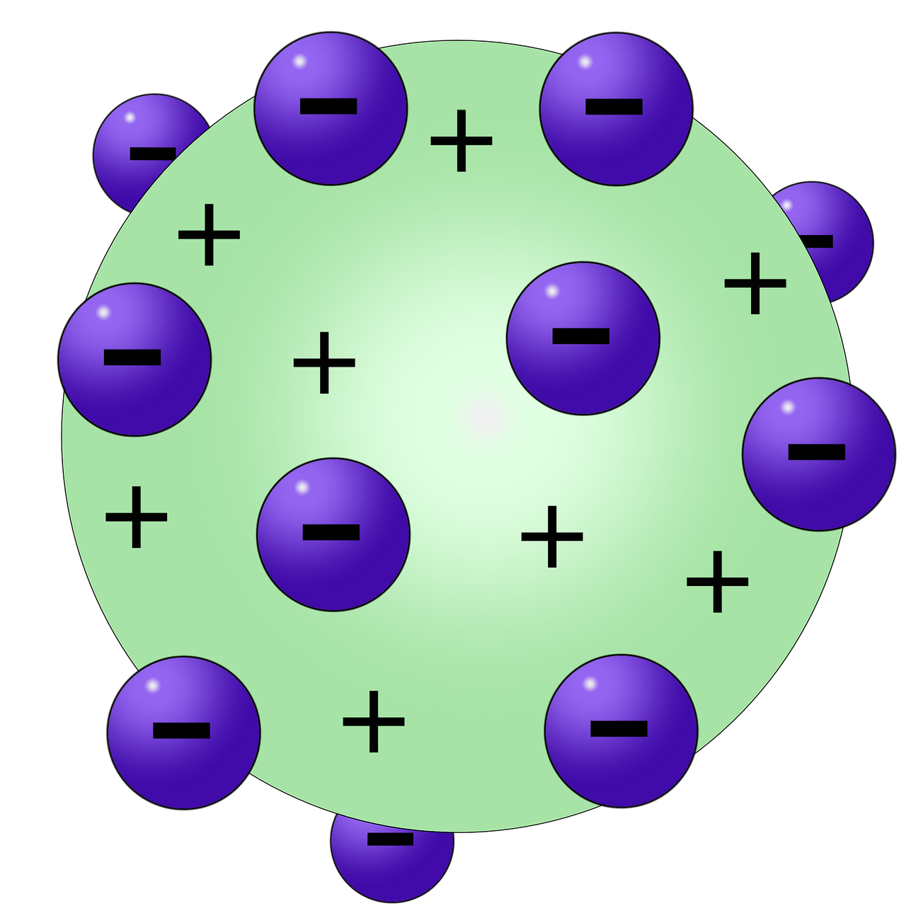
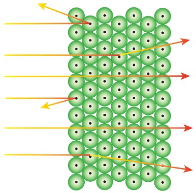

layout: true
background-size: contain

<div class="my-footer"><span>Flaviano Williams Fernandes</span></div>

```{r setup, include=FALSE}
  options(htmltools.dir.version = FALSE)
  library("ggplot2")
  library("gganimate")
  library("latex2exp")
#  knitr::opts_chunk$set(fig.path = 'img')
```

```{r, load_refs, echo=FALSE, message=FALSE}
  library(RefManageR)
  BibOptions(check.entries = TRUE, bib.style = "authoryear", style = "markdown",
           dashed = TRUE)
  bib <- ReadBib("references.bib", check = FALSE)
```

```{r, include=FALSE, eval=FALSE, echo=FALSE}
  xaringan::inf_mr()
```

---
class: middle

<div class="my-header"><span>Sumário</span></div>

1. Modelo atômico de Bohr

2. Espectro do átomo de hidrogênio

3. Princípio da correspondência

2. Apêndice - xxxxx

6. Bibliografia

<div class="footnote">
  <ul>
  <hr>
  <li> Esta apresentação está disponível para download em <a href="https://flavianowilliams.github.io/education">flavianowilliams.github.io/education</a>;
  <li> Este material está sujeito a modificações. Recomenda-se acompanhamento permanente.
  </ul>
</div>

---
class: left, middle

<div class="my-header"><span>Modelos atômicos</span></div>

* O modelo de Thompson é chamado de pudim de passas. O átomo seria uma massa carregada positivamente e os elétrons estariam mergulhados, como as passas de um pudim. [`r Cite(bib, c("nussenzveig","tipler","mcquarrie","braga","eisberg"))`];
* No modelo de Rutherford, as cargas positivas estariam concentradas em uma pequena região que chamamos de núcleo atômico, e os elétrons orbitariam ao redor do núcleo. Rutherford desenvolveu o seu modelo a partir do experimento de Geiger-Marsden.

.pull-left[
```{r, echo=FALSE, fig.align='center',fig.cap='Modelo de Thompson.',out.width="40%",fig.asp=1,fig.ncol=2}
  
```
]
.pull-right[
```{r, echo=FALSE, fig.align='center',fig.cap='Modelo de Rutherford.',out.width="40%",fig.asp=1,fig.ncol=2}
  
```
]

---
class: left, middle

<div class="my-header"><span>Modelo clássico do átomo de hidrogênio</span></div>

.pull-left[
* Os elétrons se movem ao redor do núcleo, idêntico ao modelo planetário;
* Pelas leis do eletromagnetismo, o elétron em movimento emite radiação e com isso a sua energia deveria diminuir à medida que se move ao redor do núcleo;
* Com o colapso do elétron no interior do núcleo, não seria possível a formação de moléculas ou demais combinações envolvendo átomos.
]
.pull-right[
```{r, echo=FALSE, fig.align='center',fig.cap='Modelo de Rutherford.',out.width="100%",fig.asp=1,fig.ncol=2}
  
```
]

---
class: left, middle

<div class="my-header"><span>Modelo clássico do átomo de hidrogênio (continuação)</span></div>

.pull-left[
  Pela lei de Coulomb, o elétron ao redor do núcleo é submetido a uma força dado pela equação abaixo,
  \begin{aligned}
    F = \frac{Kze^2}{r^2}=\frac{mv^2}{r}.
  \end{aligned}
  Isolando a velocidade na equação teremos
  \begin{aligned}
    v= \left(\frac{kze^2}{mr}\right)^{1/2}.
  \end{aligned}
  Substituindo a velocidade do elétron na expressão da energia cinética K temos
  \begin{aligned}
    K = \frac{kze^2}{2r},
  \end{aligned}
  Se o elétron perdesse energia cinética K devido a emissão de radiação, então o raio r da órbita diminuiria sucessivamente. Assim a colisão seria inevitável!!!
]
.pull-right[
  Considerando que a energia potencial U é dado por
  \begin{aligned}
    U &= -\frac{kze^2}{r},
  \end{aligned}
  temos que a energia total E, somando a energia cinética e potencial, é dado por
  \begin{aligned}
    E = \frac{kze^2}{2r}-\frac{kze^2}{r} = -\frac{kze^2}{2r},
  \end{aligned}
  onde podemos considerar que
  \begin{aligned}
    E\;\alpha -\frac{1}{r}.
  \end{aligned}
  Seguindo o modelo clássico, o elétron poderia assumir qualquer valor de energia até a sua colisão com o núcleo.
]

---
class: left, middle

<div class="my-header"><span>Espectro do átomo de hidrogênio</span></div>

---
class: left, middle

<div class="my-header"><span>Princípio da correspondência</span></div>

---
class: middle

<div class="my-header"><span>Bibliografia</span></div>

```{r, results='asis', echo=FALSE, message=FALSE}
PrintBibliography(bib)
```

