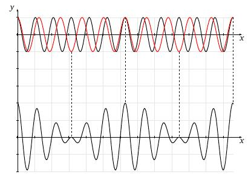

layout: true
background-size: contain

<div class="my-footer"><span>Flaviano Williams Fernandes</span></div>

```{r, include=FALSE, eval=FALSE, echo=FALSE}
  xaringan::inf_mr()
```

```{r setup, include=FALSE}
  options(htmltools.dir.version = FALSE)
  library("ggplot2")
  library("gganimate")
  library("latex2exp")
#  knitr::opts_chunk$set(fig.path = 'img')
```

```{r, load_refs, echo=FALSE, message=FALSE}
  library(RefManageR)
  BibOptions(check.entries = TRUE, bib.style = "authoryear", style = "markdown",
           dashed = TRUE)
  bib <- ReadBib("references.bib", check = FALSE)
```

---
class: middle

<div class="my-header"><span>Sumário</span></div>

1. Discrepâncias no modelo de de Broglie

2. Pacotes de onda

2. Interpretação probabilística da função de onda

3. Princípio filosófico da física quântica

6. Bibliografia

<div class="footnote">
  <ul>
  <hr>
  <li> Esta apresentação está disponível para download em <a href="https://flavianowilliams.github.io/education">flavianowilliams.github.io/education</a>;
  <li> Este material está sujeito a modificações. Recomenda-se acompanhamento permanente.
  </ul>
</div>

---
class: left, middle

<div class="my-header"><span>Discrepâncias no modelo de de Broglie</span></div>

.pull-left[
A energia de uma partícula livre é dada por
\begin{aligned}
  E = \frac{1}{2}mv^2=\frac{p^2}{2m}.
\end{aligned}
Dividindo por p teremos
\begin{aligned}
  \frac{E}{p} = \frac{mv^2}{2mv},
\end{aligned}
ou seja, 
\begin{aligned}
  v_{\text{partícula}} = \frac{E}{2p}
\end{aligned}
Sabemos desde os postulados de de Broglie [`r Cite(bib, c("nussenzveig","tipler","mcquarrie","braga","eisberg"))`] que
]
.pull-right[
\begin{aligned}
  E & = h\nu;\\\
  p & = \frac{h}{\lambda}.
\end{aligned}
Substituindo na equação da velocidade acima encontramos
\begin{aligned}
  v & = \frac{h\nu}{2\left(\frac{h}{\lambda}\right)},\\\
    & = \frac{\lambda\nu}{2}.
\end{aligned}
A velocidade de uma onda progressiva é dado por
\begin{aligned}
  v_{\text{onda}} = \lambda\nu,
\end{aligned}
portanto, <font class="red">podemos perceber que se adotarmos o movimento da partícula equivalente a apenas o movimento de uma onda progressiva, a sua velocidade não irá coincidir com a velocidade da onda</font>.
]

---
class: left, middle

<div class="my-header"><span>Pacotes de onda - Definição</span></div>

.pull-left[
Considere duas ondas harmônicas que possuem números de onda $k_1$ e $k_2$ e frequência angular $\omega_1$ e $\omega_2$, respectivamente. A superposição do encontro dessas duas ondas é dado por
\begin{aligned}
  y(x,t) & = y_1(x,t)+y_2(x,t),\\\
         & = y_m\cos(k_1x-\omega_1t)+y_m\cos(k_2x-\omega_2t).
\end{aligned}
Definindo as diferenças $\Delta k=k_2-k_1$ e $\Delta \omega = \omega_2-\omega_1$, e os valores médios $\bar{k}=(k_1+k_2)/2$ e  $\bar{\omega}=(\omega_1+\omega_2)/2$ encontramos o valor do pacote de onda, como mostra a figura ao lado (para maiores detalhes, veja o apêndice A),
\begin{aligned}
  y(x,t) = 2y_m\cos\left(\frac{\Delta k}{2}x-\frac{\Delta \omega}{2}t\right)\cos\left(\bar{k}x-\bar{\omega}t\right).
\end{aligned}
Lembrando que
\begin{aligned}
  k = \frac{2\pi}{\lambda};\quad  \omega = 2\pi\nu.
\end{aligned}
]
.pull-right[
```{r, echo=FALSE, fig.align='center',fig.cap='Superposição de duas ondas harmônicas com números de onda e frequências diferentes.',out.width="100%",fig.asp=1,fig.ncol=2}
  
```
]

---
class: left, middle

<div class="my-header"><span>Pacotes de onda - Velocidade de um pacote de onda</span></div>

.pull-left[
]
.pull-right[
```{r, echo=FALSE, fig.align='center',fig.cap='Superposição de duas ondas harmônicas.',out.width="100%",fig.asp=1,fig.ncol=2}
  
```
]

---
class: left, middle

<div class="my-header"><span>Pacotes de onda - Pacotes de onda da matéria</span></div>

.pull-left[
]
.pull-right[
]

---
class: left, middle

<div class="my-header"><span>Princípio filosófico da física quântica</span></div>

---
class: middle

<div class="my-header"><span>Apêndice A</span></div>

.pull-left[
Definindo as diferenças $\Delta k=k_2-k_1$ e $\Delta \omega = \omega_2-\omega_1$, e os valores médios $\bar{k}=(k_1+k_2)/2$ e  $\bar{\omega}=(\omega_1+\omega_2)/2$ podemos dizer que
\begin{aligned}
  k_1 & = \bar{k}-\Delta K;\quad k_2 = \bar{k}+\Delta K,\\\
  \omega_1 & = \bar{\omega}-\Delta \omega;\quad \omega_2 = \bar{\omega}+\Delta \omega.
\end{aligned}
Para obter a função de onda resultante é conveniente usarmos a fórmula de Euler, onde $e^{i\theta}=\cos\theta+i\sin\theta$, onde apenas nos interessa a parte real,
\begin{aligned}
  y(x,t) & = y_m\left[\cos(k_1x-\omega_1t)+\cos(k_2x-\omega_2t)\right],\\
         & = y_m\Re\left[e^{i(k_1x-\omega_1t)}+e^{i(k_2x-\omega_2t)}\right],\\
         & = y_m\Re\left[e^{i[(\bar{k}-\Delta k)x-(\bar{\omega}-\Delta \omega)t]}+e^{i[(\bar{k}+\Delta K)x-(\bar{\omega}+\Delta \omega)t]}\right],\\
         & = y_m\Re\left[e^{i(\bar{k}x-\Delta Kx-\bar{\omega}t+\Delta \omega t)}+e^{i(\bar{k}x+\Delta Kx-\bar{\omega}t-\Delta \omega t)}\right],\\
         & = y_m\Re\left[e^{i(\bar{k}x-\bar{\omega}t)}e^{-i(\Delta Kx-\Delta \omega t)}\right.+\\
         & + \left.e^{i(\bar{k}x-\bar{\omega}t)}e^{i(\Delta Kx-\Delta \omega t)}\right],
\end{aligned}
]
.pull-right[
\begin{aligned}
  y(x,t) & = y_m\left(e^{-i(\Delta Kx-\Delta \omega t)}+e^{i(\Delta Kx-\Delta \omega t)}\right)\Re\left[e^{i(\bar{k}x-\bar{\omega}t)}\right].
\end{aligned}
Pela fórmula de Euler, podemos usar a identidade
\begin{aligned}
  \cos\theta = \frac{e^{i\theta}+e^{-i\theta}}{2}.
\end{aligned}
Substituindo teremos
\begin{aligned}
  y(x,t) & = y_m\left(2\cos\left(\Delta Kx-\Delta \omega t\right)\right)\Re\left[e^{i(\bar{k}x-\bar{\omega}t)}\right].
\end{aligned}
Isolando a parte real do termo $e^{i(\bar{k}x-\bar{\omega}t)}$ chegaremos na função de onda resultante,
\begin{aligned}
  \boxed{y(x,t) = 2y_m\cos\left(\frac{\Delta k}{2}x-\frac{\Delta \omega}{2}t\right)\cos\left(\bar{k}x-\bar{\omega}t\right).}
\end{aligned}
]

---
class: middle

<div class="my-header"><span>Bibliografia</span></div>

```{r, results='asis', echo=FALSE, message=FALSE}
PrintBibliography(bib)
```

