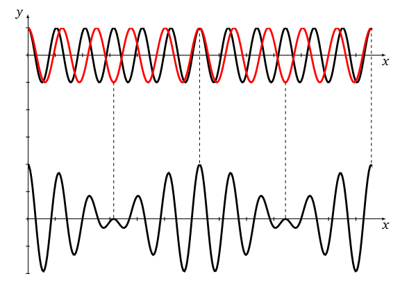
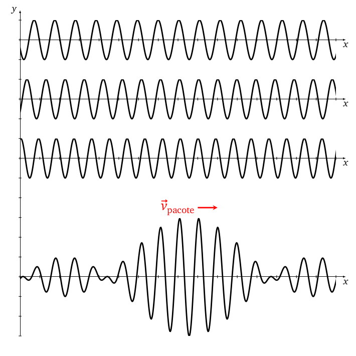
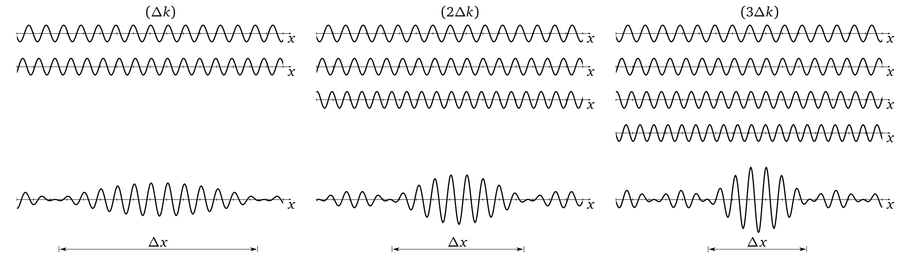

layout: true
background-size: contain

<div class="my-footer"><span>Flaviano Williams Fernandes</span></div>

```{r, include=FALSE, eval=FALSE, echo=FALSE}
  xaringan::inf_mr()
```

```{r setup, include=FALSE}
  options(htmltools.dir.version = FALSE)
  library("ggplot2")
  library("gganimate")
  library("latex2exp")
#  knitr::opts_chunk$set(fig.path = 'img')
```

```{r, load_refs, echo=FALSE, message=FALSE}
  library(RefManageR)
  BibOptions(check.entries = TRUE, bib.style = "authoryear", style = "markdown",
           dashed = TRUE)
  bib <- ReadBib("references.bib", check = FALSE)
```

---
class: middle

<div class="my-header"><span>Sumário</span></div>

1. Discrepâncias no modelo de de Broglie

2. Pacotes de onda

2. Interpretação probabilística da função de onda

3. Princípio filosófico da física quântica

6. Bibliografia

<div class="footnote">
  <ul>
  <hr>
  <li> Esta apresentação está disponível para download em <a href="https://flavianowilliams.github.io/education">flavianowilliams.github.io/education</a>;
  <li> Este material está sujeito a modificações. Recomenda-se acompanhamento permanente.
  </ul>
</div>

---
class: left, middle

<div class="my-header"><span>Discrepâncias no modelo de de Broglie</span></div>

.pull-left[
A energia de uma partícula livre é dada por
\begin{aligned}
  E = \frac{1}{2}mv^2=\frac{p^2}{2m}.
\end{aligned}
Dividindo por p teremos
\begin{aligned}
  \frac{E}{p} = \frac{mv^2}{2mv},
\end{aligned}
ou seja, 
\begin{aligned}
  v_{\text{partícula}} = \frac{E}{2p}
\end{aligned}
Sabemos desde os postulados de de Broglie [`r Cite(bib, c("nussenzveig","tipler","mcquarrie","braga","eisberg"))`] que
\begin{aligned}
  E & = h\nu;
\end{aligned}
]
.pull-right[
\begin{aligned}
  p & = \frac{h}{\lambda}.
\end{aligned}
Substituindo na equação da velocidade acima encontramos
\begin{aligned}
  v & = \frac{h\nu}{2\left(\frac{h}{\lambda}\right)},\\\
    & = \frac{\lambda\nu}{2}.
\end{aligned}
A velocidade de uma onda progressiva é dado por
\begin{aligned}
  v_{\text{onda}} = \lambda\nu,
\end{aligned}
portanto, <font class="red">podemos perceber que se adotarmos o movimento da partícula equivalente a apenas o movimento de uma onda progressiva, a sua velocidade não irá coincidir com a velocidade da onda</font>.
]

---
class: left, middle

<div class="my-header"><span>Pacotes de onda - Definição</span></div>

.pull-left[
Considere duas ondas harmônicas que possuem números de onda $k_1$ e $k_2$ e frequência angular $\omega_1$ e $\omega_2$, respectivamente. A superposição do encontro dessas duas ondas é dado por
\begin{aligned}
  \psi(x,t) & = y_1(x,t)+y_2(x,t),\\\
         & = y_m\cos(k_1x-\omega_1t)+y_m\cos(k_2x-\omega_2t).
\end{aligned}
Definindo as diferenças $\Delta k=k_2-k_1$ e $\Delta \omega = \omega_2-\omega_1$, e os valores médios $\bar{k}=(k_1+k_2)/2$ e  $\bar{\omega}=(\omega_1+\omega_2)/2$ encontramos o valor do pacote de onda, como mostra a figura ao lado (para maiores detalhes, veja o apêndice A),
\begin{aligned}
  \psi(x,t) = 2y_m\cos\left(\frac{\Delta k}{2}x-\frac{\Delta \omega}{2}t\right)\cos\left(\bar{k}x-\bar{\omega}t\right).
\end{aligned}
Lembrando que
\begin{aligned}
  k = \frac{2\pi}{\lambda};\quad  \omega = 2\pi\nu.
\end{aligned}
]
.pull-right[
```{r, echo=FALSE, fig.align='center',fig.cap='Superposição de duas ondas harmônicas com números de onda e frequências angulares diferentes.',out.width="100%",fig.asp=1,fig.ncol=2}
  
```
]

---
class: left, middle

<div class="my-header"><span>Pacotes de onda - Velocidade de um pacote de onda</span></div>

.pull-left[
Da velocidade de uma onda temos que
\begin{aligned}
  v_{\text{onda}} & = \lambda\nu,\\
    & = \left(\frac{2\pi}{k}\right)\left(\frac{\omega}{2\pi}\right),\\
    & = \frac{\omega}{k}.
\end{aligned}
No caso do pacote de onda formado por duas ondas harmônicas, pela expressão da função de onda podemos dizer que
\begin{aligned}
  v_{\text{pacote}} & = \frac{\Delta \omega}{\Delta k}.
\end{aligned}
Expandindo a definição para um pacote de onda formado por uma inifinidade de ondas harmônicas, onde o número de onda varia por um valor $\Delta k << 1$,
\begin{aligned}
  \boxed{v_{\text{pacote}} = \lim_{\Delta k\rightarrow 0} \frac{\Delta \omega}{\Delta k} = \frac{d\omega}{dk}.}
\end{aligned}
]
.pull-right[
```{r, echo=FALSE, fig.align='center',fig.cap='Pacote de onda formado pela superposição de três ondas harmômicas, cujo número de onda k de cada onda varia por um intervalo &Delta; k.',out.width="100%",fig.asp=1,fig.ncol=2}
  
```
]

---
class: left, middle

<div class="my-header"><span>Pacotes de onda - Pacotes de onda da matéria</span></div>

.pull-left[
Pelos postulados de de Broglie, temos para a energia do elétron
\begin{aligned}
  E & = h\nu,\\
  E & = \left(2\pi\hbar\right)\left(\frac{\omega}{2\pi}\right),\\
  E & = \hbar\omega.
\end{aligned}
Para o momento do elétron temos a seguinte expressão
\begin{aligned}
  p & = \frac{h}{\lambda},\\
  p & = \frac{2\pi\hbar}{2\pi/k},\\
  p & = \hbar k.
\end{aligned}
Da equação acima podemos dizer que $\omega(k)=E(k)/\hbar$. Calculando a derivada de $\omega$ encontramos a velocidade do pacote de onda para um elétron que se propaga livremente com velocidade v,
]
.pull-right[
\begin{aligned}
  v_{\text{pacote}} & = \frac{d\omega(k)}{dk},\\
  v_{\text{pacote}} & = \frac{d\omega}{dE}\frac{dE}{dk},\\
  v_{\text{pacote}} & = \underbrace{\frac{d\omega}{dE}}_{1/\hbar}\underbrace{\frac{dE}{dp}}_{2p/2m}\underbrace{\frac{dp}{dk}}_{\hbar},\\
  v_{\text{pacote}} & = \left(\frac{1}{\hbar}\right)\left(\frac{2p}{2m}\right)\left(\hbar\right),\\
  v_{\text{pacote}} & = \frac{p}{m},\\
  v_{\text{pacote}} & \equiv v.
\end{aligned}
Portanto, o pacote de onda $\psi$ se propaga com a velocidade do elétron. <font class="red">Isso demonstra o fato que o movimento ondulatório da matéria devemos tratá-lo como um pacote de ondas, ao invés de apenas uma onda progressiva.</font>
]

---
class: left, middle

<div class="my-header"><span>Interpretação probabilística da função de onda - O caso da fenda dupla</span></div>

.pull-left[
Considere o experimento da fenda dupla. Explicando o fenômeno usando o conceito de fótons dado pelo efeito fotoelétrico. Ao incidir na fenda um feixe de luz de baixa intensidade I, ou seja, com uma quantidade razoável de fótons, podemos ver a formação de pontos localizados nas regiões de interferências construtivas. Assim deve haver uma relação com a probabilidade de localizar um fóton com o quadrado da amplitude do campo elétrico, já que $I \sim E^2_m$ (veja a figura ao lado `r Cite(bib, c("myles"))`).

Do ponto de vista do eletromagnetismo, a função de onda neste caso refere-se a função da onda eletromagnética $\psi(x,t)=E_m\cos(kx-\omega t)$, mas à medida que a intensidade da luz aumenta, a sobreposição dos fótons impede a observação de pontos localizados, estando no lugar as franjas de interferência de acordo com a teoria ondulatória. Neste caso os efeitos quânticos já não são mais observados.
]
.pull-right[
As figuras de interferência também pode ser observado com a matéria, onde em 
analogia com a luz, onde a probabilidade de localizar um fóton está relacionado com $E^2_m$, a grandeza $|\psi|^2$ deve ser proporcional à probabilidade de que um elétron seja encontrado em uma certa região no espaço.

```{r, echo=FALSE, message=FALSE, fig.align='center',fig.cap='Experimento da fenda dupla com baixa intensidade.',out.width="100%",fig.asp=1,fig.ncol=2}
  
```
]

---
class: left, middle

<div class="my-header"><span>Interpretação probabilística da função de onda - A relação com a mecânica estatística</span></div>

.pull-left[
De acordo com a interpretação probabilística da matéria, a probabilidade em localizar um elétron em uma certa região no espaço é dado por $|\psi|^2$. Supondo um elétron propagando na direção x, podemos dizer que a probabilidade de ser encontrado no intevalo dx é dado por $|\psi|^2dx$.

Neste caso $\psi$ pode ter partes complexas, com a intenção de representar a incerteza na medição. Portanto, não basta apenas fazer o produto $\psi^2$, pois <font class="red">devemos multiplicar a função de onda pelo seu complexo conjugado, precisamos de um valor real para representar a localização do elétron</font>.

Chamamos a probabilidade em localizar o elétron no intervalo dx por $P(x)dx$, onde
\begin{aligned}
  P(x)dx = |\psi|^2dx.
\end{aligned}
]
.pull-right[
O vídeo abaixo mostra a comparação do experimento da fenda dupla realizado com ondas luminosas e elétrons. Percebe-se claramente o comportamento quântico do elétron ao formar franjas de interferência, idêntico a teoria ondulatória da luz.

<iframe width="560" height="315" src="https://www.youtube.com/embed/UtPf0XYQzfI" title="YouTube video player" frameborder="0" allow="accelerometer; autoplay; clipboard-write; encrypted-media; gyroscope; picture-in-picture" allowfullscreen></iframe>
]

---
class: justify, middle

<div class="my-header"><span>Interpretação probabilística da função de onda - A incerteza no momento e posição </span></div>

Para entender melhor a incerteza na medição ao adotar a função de onda para representar o elétron, analisemos dois casos extremos.

Para diminuir a incerteza na localização da partícula deveremos ter um pacote de onda curto, bem localizado, cujo comprimento $\Delta x$ é o menor possível. Isso se deve ao fato que a localização do elétron está associado a amplitude da onda. No entanto, para obter um pacote de onda bem localizado, deveríamos ter uma quantidade infinita de ondas, cuja onda resultante produziria tal pacote. Isso por sua vez acarreta no aumento da incerteza do número de onda, ou seja, se $\Delta x\rightarrow 0$ acarreta em $\Delta k\rightarrow\infty$,

```{r, echo=FALSE, message=FALSE, fig.align='center',fig.cap='Formação de pacotes de onda para diversos valores &Delta; k.',out.width="80%",fig.asp=0.5}
  
```

---
class: left, middle

<div class="my-header"><span>Interpretação probabilística da função de onda - A incerteza no momento e posição (continuação) </span></div>

.pull-left[
Entretanto, se tivermos apenas uma única onda progressiva com número de onda k para representar o movimento do elétron, teríamos $\Delta k = 0$, assim o número de onda do elétron seria totalmente determinado. Porém, consequentemente também teríamos $\Delta x\rightarrow\infty$, pois assim não teríamos um pacote de onda definido. Assim, é impossível obter com total certeza a localização e o número de onda do elétron simultaneante. A total certeza de um acarreta na completa incerteza de outro. Porém, para qualquer pacote de onda podemos observar que
\begin{aligned}
  \Delta x\Delta k \approx 1.
\end{aligned}
Podemos obter algo semelhante analisando a incerteza na frequência angular e o intervalo de tempo $\Delta t$, ao invés de $\Delta k$ na figura anterior, onde
\begin{aligned}
  \Delta \omega\Delta t \approx 1.
\end{aligned}
]
.pull-right[
Agora, qual é a relação entre a incerteza nas medições da posição, número de onda e momento do elétron? Sabemos a partir dos postulados de de Broglie que $p=\hbar k$, assim
\begin{aligned}
  \Delta p = \hbar\Delta k.
\end{aligned}
Multiplicando os dois lados da relação anterior e identificando $\Delta p$ da equação acima teremos
\begin{aligned}
    \hbar\Delta x\Delta k \approx \hbar,\\
    \Delta x(\hbar\Delta k) \approx \hbar,\\
    \Delta x\Delta p \approx \hbar.
\end{aligned}
Para a frequência angular temos que $E=\hbar\omega$, assim
\begin{aligned}
  \Delta E = \hbar\Delta\omega.
\end{aligned}
Multiplicando $\Delta\omega\Delta t\approx 1$ por $\hbar$ teremos
\begin{aligned}
  \Delta E\Delta t\approx \hbar.
\end{aligned}
]
---
class: left, middle

<div class="my-header"><span>Princípio filosófico da física quântica - A interpretação de Copenhague</span></div>

.pull-left[
Foi defendido por Niels Bohr e Wener Heisenberg em 1927, logo após a conferência de Solvay, a interpretação de Copenhague, que consistia dos seguintes preceitos:
* Na mecânica quântica os resultados são indeterminísticos;
* A física é a ciência onde os resultados são obtidos através de um processo de medida;
* O simples ato de observar destrói a certeza da medição, causando o colapso da função de onda.

Para entender como o observador interfere na medição, vamos supor que gostaríamos de medir a posição de um elétron, para isso emitimos um feixe de luz que possui um determinado comprimento de onda. Ao incidir a luz no elétron, ocorre troca de momento entre o fóton e o elétron, alterando o comprimento de onda da luz refletida e o momento do elétron.
]
.pull-right[
A localização do elétron pode ser determinada a partir do ângulo de espalhamento $\theta$, obtido a partir equação de Compton abaixo,
\begin{aligned}
  \lambda_2-\lambda_1 = \frac{h}{mc}(1-\cos\theta).
\end{aligned}
Portanto, o simples fato de incidir um feixe de luz no elétron com a intenção de obter a sua posição, modificou substancialmente o seu momento linear.

```{r, echo=FALSE, message=FALSE, fig.align='center',fig.cap='Espalhamento Compton.',out.width="65%",fig.asp=1}
  
```
]

---
class: middle

<div class="my-header"><span>Princípio filosófico da física quântica - Conferência de Solvay</span></div>

A figura abaixo mostra a ilustre Conferência de Solvay, em 1927 (a princípio, uma das mais famosas imagens da física moderna). Nesta conferência Bohr e Heisenberg defenderam as suas idéias a respeito da incerteza na medição, no qual serviram como base para a formulação da equação de Schroedinger e o surgimento da mecânica quântica moderna.

```{r, echo=FALSE, message=FALSE, fig.align='center',fig.cap='Participantes da Quinta Conferência de Solvay. Destaca-se a presença da única mulher no grupo: Marie Curie.',out.width="100%",fig.asp=1}
  
```

---
class: middle

<div class="my-header"><span>Apêndice A</span></div>

.pull-left[
Definindo as diferenças $\Delta k=k_2-k_1$ e $\Delta \omega = \omega_2-\omega_1$, e os valores médios $\bar{k}=(k_1+k_2)/2$ e  $\bar{\omega}=(\omega_1+\omega_2)/2$ podemos dizer que
\begin{aligned}
  k_1 & = \bar{k}-\Delta K;\quad k_2 = \bar{k}+\Delta K,\\\
  \omega_1 & = \bar{\omega}-\Delta \omega;\quad \omega_2 = \bar{\omega}+\Delta \omega.
\end{aligned}
Para obter a função de onda resultante é conveniente usarmos a fórmula de Euler, $e^{i\theta}=\cos\theta+i\sin\theta$, onde apenas nos interessa a parte real,
\begin{aligned}
  \psi(x,t) & = y_m\left[\cos(k_1x-\omega_1t)+\cos(k_2x-\omega_2t)\right],\\
         & = y_m\Re\left[e^{i(k_1x-\omega_1t)}+e^{i(k_2x-\omega_2t)}\right],\\
         & = y_m\Re\left[e^{i[(\bar{k}-\Delta k)x-(\bar{\omega}-\Delta \omega)t]}+e^{i[(\bar{k}+\Delta K)x-(\bar{\omega}+\Delta \omega)t]}\right],\\
         & = y_m\Re\left[e^{i(\bar{k}x-\Delta Kx-\bar{\omega}t+\Delta \omega t)}+e^{i(\bar{k}x+\Delta Kx-\bar{\omega}t-\Delta \omega t)}\right],\\
         & = y_m\Re\left[e^{i(\bar{k}x-\bar{\omega}t)}e^{-i(\Delta Kx-\Delta \omega t)}\right.+\\
         & + \left.e^{i(\bar{k}x-\bar{\omega}t)}e^{i(\Delta Kx-\Delta \omega t)}\right],
\end{aligned}
]
.pull-right[
\begin{aligned}
  \psi(x,t) & = y_m\left(e^{-i(\Delta Kx-\Delta \omega t)}+e^{i(\Delta Kx-\Delta \omega t)}\right)\Re\left[e^{i(\bar{k}x-\bar{\omega}t)}\right].
\end{aligned}
Pela fórmula de Euler, podemos usar a identidade
\begin{aligned}
  \cos\theta = \frac{e^{i\theta}+e^{-i\theta}}{2}.
\end{aligned}
Substituindo teremos
\begin{aligned}
  \psi(x,t) & = y_m\left(2\cos\left(\Delta Kx-\Delta \omega t\right)\right)\Re\left[e^{i(\bar{k}x-\bar{\omega}t)}\right].
\end{aligned}
Isolando a parte real do termo $e^{i(\bar{k}x-\bar{\omega}t)}$ chegaremos na função de onda resultante,
\begin{aligned}
  \boxed{\psi(x,t) = 2y_m\cos\left(\frac{\Delta k}{2}x-\frac{\Delta \omega}{2}t\right)\cos\left(\bar{k}x-\bar{\omega}t\right).}
\end{aligned}
]

---
class: middle

<div class="my-header"><span>Bibliografia</span></div>

```{r, results='asis', echo=FALSE, message=FALSE}
PrintBibliography(bib)
```

