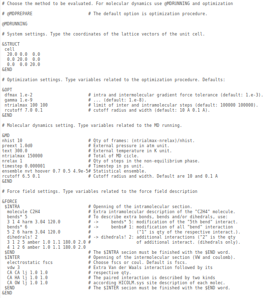

layout: true

```{r setup, include=FALSE}
  options(htmltools.dir.version = FALSE)
#  knitr::opts_chunk$set(fig.path = 'img')
```

```{r, include=FALSE, eval=FALSE, echo=FALSE}
  xaringan::inf_mr()
```

<div class="my-footer"><span>Flaviano Williams Fernandes</span></div>

---
class: middle

<div class="my-header"><span>Flaviano Williams Fernandes</span></div>

# Sumário

1. Cenário atual no campus Irati e pretensões futuras
2. A questão ambiental
3. As vantagens e desvantagens da simulação computacional
4. Mecânica molecular versus Ab initio
5. O método de dinâmica molecular
6. Implementações no programa HICOLM

---
class: middle

<div class="my-header"><span>Cenário atual no campus Irati e pretensões futuras</span></div>

# Cenário atual

1. Um projeto de pesquisa cadastrado no siscope.
2. Dois alunos de iniciação científica (PIAP, Pibic-Jr).
3. Uma publicação em revista nacional indexada na base scopus.
4. Apresentação de um trabalho no colóquio.
5. Recursos materiais:
  * Um servidor xeon quadi-core (PIAP).
  * Cenapad-Unicamp.

---
class: middle

<div class="my-header"><span>Cenário atual no campus Irati e pretensões futuras</span></div>

# Pretensões futuras

1. Dois projetos de pesquisa cadastrados no siscope.
2. No mínimo dois alunos de iniciação científica bolsistas (Pibic e Pibic-Jr).
3. Alunos de iniciação científica voluntários (sem bolsa).
4. Publicações em revistas nacionais e internacionais.
5. Participações em eventos nacionais e internacionais (aluno e/ou professor).
6. Desenvolvimento de softwares na área da química computacional.
7. Apresentação de resultados da pesquisa no colóquio.
8. Ampliação do ambiente computacional (expansão para um cluster do tipo bewoulf de alta performance).
9. Projetos de extensão (<alert>minicursos</alert>).

---
class: left

<div class="my-header"><span>A questão ambiental</span></div>

A equação abaixo não funciona...

\begin{eqnarray}
  f(x) & = & ax+b,\\
  g(x) & = & ax^2-bx+c.
\end{eqnarray}

No entanto tem outra melhor...

\begin{equation}
  \boxed{h(x)=\left<\psi|\psi\right>.}
\end{equation}

---
class: left

<div class="my-header"><span>As vantagens e desvantagens da simulação computacional</span></div>

.pull-left[
  A figura a seguir mostra o [repositório](https://github.com/flavianowilliams) do programa HICOLM.
]
.pull-right[
xxxx
]

A figura a seguir

```{r, echo=FALSE,out.width="100%",fig.cap='Figura',fig.align='center'}
  knitr::include_graphics("img/pagina-github.png")
```

---
class: center, middle

<div class="my-header"><span>Mecânica molecular versus Ab initio</span></div>

<figure>
  
  <figcaption>animacao</figcaption>
</figure>

```{r, echo=FALSE, fig.align='center',fig.cap='gif animado',out.width="25%"}
  knitr::include_graphics("img/Ar-373K.gif")
```

---

<div class="my-header"><span>O método de dinâmica molecular</span></div>

# teste

---
class: left

<div class="my-header"><span>Implementações no programa HICOLM</span></div>

# Critérios adotados para tornar o programa inclusivo

* Fácil instalação exigindo o mínimo de bibliotecas externas e outras dependências (atualmente para a instalação são necessários os programas gfortran e r-base).

* Simplicidade na preparação dos arquivos de entrada com a quantidade mínima de flags obrigatórias.

* Campo de força implementado por padrão:
  * O programa possui uma biblioteca interna contendo os parâmetros dos potenciais baseados no modelo AMBER99;
  * As coordenadas internas (ligação, angular e torsão) são obtidas automaticamente através da matriz Z;
  * As interações intermoleculares são obtidas automaticamente;
  * O usuário tem a opção de otimizar manualmente o campo de força;
  * Um relatório detalhado do campo de força é apresentado em um arquivo de log. afim de conferência.
* Algoritmos de minimização da energia vem sendo trabalhado afim de tornar a etapa de otimização simples e rápida.
* Suporte gráfico para análise de dados e geração de relatórios com a ferramenta R.
* Documentação [online](https://github.com/flavianowilliams/HICOLM/wiki).

---
class: left

<div class="my-header"><span>Implementações no programa HICOLM</span></div>

# O processo de instalação

* Inicialmente o usuário baixa o programa do repositório online através do comando

```
$ wget github.com/flavianowilliams/HICOLM/archive/releases/v2.0.1.zip
```

* Em seguida ele descompacta o arquivo e executa o script de instalação,

```
$ sudo ./install
```

```{r, echo=FALSE, fig.align='center',fig.cap='Etapas de instalação do programa',out.width="65%"}
  knitr::include_graphics("img/hicolm-instalacao.png")
```

---
class: left

<div class="my-header"><span>Implementações no programa HICOLM</span></div>

Arquivos de entrada

.pull-left[

* Seção `&STRUCT`:

```
&STRUCT
 cell 10 0 0
      0 10 0
      0 0 10
&END
```

* Seção `&MD`:

```
&STRUCT
 cell 10 0 0
      0 10 0
      0 0 10
&END
```

* Seção `&FORCE`:

```
&STRUCT
 cell 10 0 0
      0 10 0
      0 0 10
&END
```
]
.pull-right[
```{r, echo=FALSE, fig.align='center',fig.cap='HICOLM.in contendo parâmetros da simulação',out.width="85%"}
  
```
]

---
class: left

<div class="my-header"><span>Implementações no programa HICOLM</span></div>

# Propostas futuras

* Impressão de mensagens de aviso e erro contendo dicas e sugestões para a solução do problema;

* Melhoria nas rotinas de minimização de energia (gradiente conjugado, etc...);

* Melhoria na impressão de relatórios e visualização gráfica.

* Documentação mais completa e didaticamente apresentável.

* Compreensão detalhada de interações atômicas e moleculares e contribuição do campo de força

  * Ampliação da base de dados utilizando protocolos específicos de parametrização.
  * Implementação de novos algoritmos e métodos (machine learning, QM/MM, etc...).

* Ofertas de minicursos na área da física, química e ciência de dados.

---
class: middle

<div class="my-header"><span>Agradecimentos</span></div>

1. Proeppi pelo suporte financeiro:

  * Pibic-Jr
  * Piap
  
2. Cenapad-Unicamp pelo suporte técnico.
