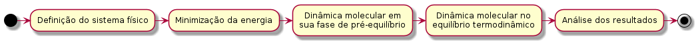
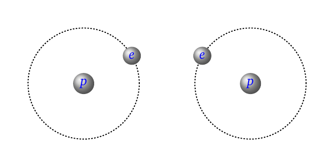

layout: true

```{r setup, include=FALSE}
  options(htmltools.dir.version = FALSE)
  library("ggplot2")
  library("gganimate")
  library("latex2exp")
#  knitr::opts_chunk$set(fig.path = 'img')
```

```{r, include=FALSE, eval=FALSE, echo=FALSE}
  xaringan::inf_mr()
```

<div class="my-footer"><span>Flaviano Williams Fernandes</span></div>

---
class: middle

<div class="my-header"><span>Flaviano Williams Fernandes</span></div>

# Sumário

1. Motivação

2. Cenário atual no campus Irati e pretensões futuras

3. A simulação computacional

4. Ambiente computacional no campus Irati

5. Apêndice A (Campo de força)

6. Apêndice B (Resultados com glifosato)

---
class: left, middle

<div class="my-header"><span>Motivação</span></div>

# A questão ambiental

.pull-left70[
* Aquecimento global;
* Surgimento de vírus e outras entidades patológicas;
* Uso desenfreado de agrotóxicos;
* Poluição de mares e rios ([Olivatto et al](img/artigo-microplasticos.pdf));
* Destruição da fauna e flora.
]
.pull-right30[
```{r, echo=FALSE, fig.align='center',fig.cap='Fonte: BBC Brasil.',out.width="90%",fig.asp=1,fig.ncol=2}
  knitr::include_graphics("img/montagem.png")
```
]
.pull-left30[
```{r, echo=FALSE, fig.align='center',out.width="70%",fig.asp=1,fig.ncol=2}
  knitr::include_graphics("img/agrotoxicos-parana.png")
```
]
.pull-right70[
* O Brasil é o maior consumidor de agrotóxicos no mundo e região Sul representa 30% desse consumo ([Carla Vanessa Alves Lopes et al](https://doi.org/10.1590/0103-1104201811714));
* Impactos ambientais em rios e lagos vem sendo causados em diversas cidades do Paraná e outros estados (Cascavel, Castro, Fortaleza, etc) devido ao uso de agrotóxicos;
* Interferência na produção de alimentos como morango, laranja, tomate, etc;
* Certos agrotóxicos podem interferir na habilidade de vôo de abelhas polinizadoras.
]

---
class: left, middle

<div class="my-header"><span>Motivação</span></div>

# Gastos financeiros e oportunidades envolvendo a questão ambiental

* A Lei de crimes ambientais (n. 9.605 de 1998) determina que as empresas poderão pagar multas de até R$ 50 milhões por danos ao meio ambiente, e por despejar [resíduo infectante](https://g1.globo.com/pe/petrolina-regiao/noticia/2018/08/24/empresa-textil-e-multada-por-cometer-crime-ambiental-em-petrolina-pe.ghtml) em local impróprio.

* Recentemente o [CNPQ](http://resultado.cnpq.br/0896397702392489) lançou uma chamada no valor de um milhão de reais para pesquisas na área ambiental.

* De acordo com [Flavio Tayra et al](https://scielosp.org/article/sausoc/2012.v21n3/760-775/pt/) estimou-se que os custos relacionados diretamente à poluição atmosférica no município de Cubatão, para o período de 2000 a 2009 foram de R$ 3,44 milhões.

* *"Considerando a média de consumo diário de 150 litros por pessoa, precisaríamos investir R$ 22 bilhões apenas para proteger bacias e nascentes"* (Édison Carlos, presidente executivo do Instituto Trata Brasil).

> Apesar de possuir as maiores reservas naturais do mundo, o país enfrenta o encarecimento da distribuição desse líquido essencial à população. Sem os impostos, produto engarrafado tem valor de produção menor.
> "[Agência Nacional de Águas e Saneamento Básico](https://www.ana.gov.br/noticias-antigas/agua-fica-cada-vez-mais-cara.2019-03-15.6087230157)"

---
class: left, middle

<div class="my-header"><span>Cenário atual no campus Irati e pretensões futuras</span></div>

# Linhas de pesquisa

* Cálculo de moléculas orgânicas e inorgânicas em soluções aquosas por dinâmica molecular;
* Análise fisico-química de poluentes em meio aquoso;
* Análise de permeabilidade seletiva de polímeros e demais materiais;
* <alert>Compreensão detalhada de interações intra/intermolecular de átomos e moléculas.</alert>

# Cenário atual

.pull-left70[
1. Um projeto de pesquisa cadastrado no siscope.
2. Dois alunos de iniciação científica (PIAP, Pibic-Jr).
3. Uma publicação em revista indexada na base scopus.
4. Apresentação de um trabalho no colóquio.
5. Recursos materiais:
  * Um servidor xeon quadi-core (PIAP).
  * Cenapad-Unicamp.
]
.pull-right30[
```{r, echo=FALSE, fig.align='center',out.width="65%"}
  knitr::include_graphics("img/servidor.jpeg")
```
]

---
class: middle

<div class="my-header"><span>Cenário atual no campus Irati e pretensões futuras</span></div>

# Pretensões futuras

1. Dois projetos de pesquisa cadastrados no siscope.

2. No mínimo dois alunos de iniciação científica bolsistas (Pibic e Pibic-Jr).

3. Alunos de iniciação científica voluntários (sem bolsa).

4. Publicações em revistas nacionais e internacionais.

5. Participações em eventos nacionais e internacionais (aluno e/ou professor).

6. Desenvolvimento de softwares na área da química computacional.

7. Apresentação de resultados da pesquisa no colóquio.

8. Ampliação do ambiente computacional (expansão para um cluster do tipo bewoulf de alta performance).

9. Projetos de extensão (<alert>minicursos na área de física, química e ciência de dados</alert>).

---
class: left, middle

<div class="my-header"><span>A simulação computacional</span></div>

# Vantagens da mecânica molecular

* O trabalho pode ser realizado de maneira não-presencial.
* O custo financeiro devido a infraestrutura pode ser amenizado com o desenvolvimento de novas metodologias, softwares melhores e processadores cada vez mais rápidos.
* A quantidade de publicações envolvendo dinâmica molecular ou monte carlo vem crescendo a cada ano desde 2014 ([Lam et al](https://doi.org/10.1038/s41598-020-71936-5));

.pull-left[
```{r, echo=FALSE, fig.align='center',fig.cap='Publicações anuais (CAFE).',out.width="58%"}
x=c(2014,2015,2016,2017,2018,2019)
y0=c(28458,34066,30618,33535,38529,39834)
df=data.frame(x,y=c(rep(min(y0),6),y0),z=c(rep("a",6),rep("b",6)))
ggplot(data=df,mapping = aes(x,y,label=y))+
  geom_col()+
  geom_label(size=5)+
  labs(x="Ano",y="Publicações")+
  theme(text = element_text(size = 18))
  #transition_states(z,transition_length = 2,state_length = 1)
```
]
.pull-right[
```{r, echo=FALSE, fig.align='center',fig.cap='Publicações envolvendo as palavras-chave "molecular dynamics" <alert>ou</alert> "monte carlo".',fig.width=13}
scielo=c(55,66,50,54,70,42)
scielo=scielo-scielo[1]
webofscience=c(24226,25668,27104,28318,29596,30724)
webofscience=webofscience-webofscience[1]
scopus=c(30009,31542,31988,32178,32866,34706)
scopus=scopus-scopus[1]
bs=c(scielo,webofscience,scopus)
Base=c(rep("Scielo",6),rep("Web of Science",6),rep("Scopus",6))
df2=data.frame(x,Base,bs)
ggplot(data=df2,mapping = aes(x,bs,color=Base))+
  geom_line(size=1.5)+
  geom_point(size=2.5)+
  labs(x="Ano",y="Crescimento em relação a 2014")+
  theme(legend.position = "right",text = element_text(size = 18),aspect.ratio = 1)
  #transition_reveal(x)
```
]

---
class: left, middle

<div class="my-header"><span>A simulação computacional</span></div>

# Mecânica molecular versus Ab initio

.pull-left[
```{r, echo=FALSE, fig.align='center',fig.cap='Métodos utilizados em diversos sistemas físicos.',out.width="95%"}
  knitr::include_graphics("img/metodos-comparacao.png")
```
]
.pull-right[
* O custo computacional aumenta com a quantidade de átomos e interações;
* A precisão diminui com a quantidade de átomos;
* Para reduzir o custo computacional, a estratégia seria diminuir o nível de detalhamento.
```{r, echo=FALSE, fig.align='center',fig.cap='Escala de tempo de cada sistema e seu comportamento (Leandro Martínez - IFSC).',out.width="90%"}
  
```
]

---
class: left, middle

<div class="my-header"><span>A simulação computacional</span></div>

# Como funciona a dinâmica molecular

```{r, echo=FALSE, fig.align='center',fig.cap='Fluxograma mostrando o ciclo MD.',out.width="85%"}
  knitr::include_graphics("img/ciclo-MD.png")
```

---
class: left, middle

<div class="my-header"><span>A simulação computacional</span></div>

# A dinâmica molecular na prática

1 Inicialmente montamos o sistema contendo a quantidade de átomos, tipos atômicos e suas coordenadas espaciais;

2 Em seguida minimizamos a energia através de processos de otimização, como gradiente conjugado, etc;

3 Aplicamos a dinâmica molecular até atingir o equilíbrio termodinâmico;

4 Realizamos a dinâmica molecular em um intervalo de tempo pré-estabelecido anteriormente;

5 Obtemos a análise de dados a partir das variáveis canônicas posição, momento e força.

```{r, echo=FALSE, fig.align='center',fig.cap='Fluxograma mostrando as etapas de um processo de simulação através da dinâmica molecular.',out.width="90%"}
  
```

---
class: left, middle

<div class="my-header"><span>Ambiente computacional no campus Irati</span></div>

# Programa utilizado para a MD

**Para o desenvolvimento do projeto algumas etapas estão sendo providenciadas.**

* Ferramentas para o trabalho em equipe e online (softwares <alert>open source</alert> e ambiente computacional);
* Qualificação de alunos cadastrados em projetos no SISCOPE;
* Colaborações com professores teóricos e experimentais.

A figura a seguir mostra o [repositório](https://github.com/flavianowilliams) do programa HICOLM <alert>(leia o arquivo Readme!!!)</alert>.

.pull-left[
```{r, echo=FALSE,out.width="90%",fig.cap='Página inicial no GitHub.',fig.align='center'}
  knitr::include_graphics("img/pagina-github.png")
```
]
.pull-left[
```{r, echo=FALSE,out.width="90%",fig.cap='Repositório do programa.',fig.align='center'}
  
```
]

---
class: left, middle

<div class="my-header"><span>Ambiente computacional no campus Irati</span></div>

# Programas utilizados para a simulação computacional

* Atualmente temos disponível um servidor xeon com oito unidades de processamento.
* Também temos acesso aos servidores da Unicamp (Cenapad-Unicamp).

*No servidor diversos softwares (open source) foram instalados e configurados para o desenvolvimento do trabalho, como o [gânglia](http://192.168.0.105/ganglia) para o monitoramento online.*

```{r, echo=FALSE, fig.align='center',fig.cap='Exemplos de programas open source utilizados para a simulação computacional.',out.width="57%"}
  
```

---
class: left, middle

<div class="my-header"><span>Ambiente computacional no campus Irati</span></div>

# Critérios adotados para tornar o programa inclusivo

* Fácil instalação exigindo o mínimo de bibliotecas externas e outras dependências (atualmente para a instalação são necessários os programas gfortran e r-base).
* Simplicidade na preparação dos arquivos de entrada com a quantidade mínima de parâmetros obrigatórias.
* Campo de força implementado por padrão:
  * O programa possui uma biblioteca interna contendo os parâmetros dos potenciais baseados no modelo AMBER99;
  * As coordenadas internas (ligação, angular e torsão) são obtidas automaticamente através da matriz Z;
  * As interações intermoleculares são obtidas automaticamente;
  * O usuário tem a opção de otimizar manualmente o campo de força;
  * Um relatório detalhado do campo de força é apresentado em um arquivo de log. afim de conferência.
* Algoritmos de minimização da energia vem sendo trabalhado afim de tornar a etapa de otimização simples e rápida.
* Suporte gráfico para análise de dados e produção de relatórios estatísticos com a ferramenta R.
* Documentação [online](https://github.com/flavianowilliams/HICOLM/wiki).

---
class: left, middle

<div class="my-header"><span>Ambiente computacional no campus Irati</span></div>

# Instalação do programa responsável pela dinâmica molecular

Inicialmente o usuário baixa o programa do repositório online através do comando

```
$ wget github.com/flavianowilliams/HICOLM/archive/releases/v2.0.1.zip
```

Em seguida ele descompacta o arquivo e executa o script de instalação,

```
$ sudo ./install
```

Para executar o programa basta digitar

```
$ hicolm
```

Algumas perguntas intuitivas são feitas:
.pull-left70[
```
Please, type the compiler or press ENTER (default: gfortran)

Please, type the instructions of compilation or press ENTER

Please, type the installation directory or press ENTER (default: /usr/local/bin)

Please, type the auxiliary directory or press ENTER (default: /usr/local/share)

Would you like to install HICOLM with graphical support? (default: no)
```
]
.pull-right30[
```{r, echo=FALSE, fig.align='center',fig.cap='Etapas de instalação do programa',out.width="90%"}
  
```
]

---
class: left, middle

<div class="my-header"><span>Ambiente computacional no campus Irati</span></div>

# Parâmetros da simulação que o aluno poderá fornecer

**Existem parâmetros obrigatórios e opcionais. No caso dos opcionais, se forem omitidos o programa utilizará o valor padrão correspondente.**

.pull-left[
Praticamente o arquivo HICOLM.in é constituído por

* Cabeçalho: @MDPREPARE ou @MDRUNNING

* Seção `&FORCE`:

```
  &FORCE
    $INTRA
      molecule C2H4
        bends* 5
          3 1 4 harm 3.04 120.0
        bends* 6
          5 2 6 harm 3.04 120.0
        dihedrals! 2
          3 1 2 5 amber 1.0 1.1 180.0 2.0
          4 1 2 6 amber 1.0 1.1 180.0 2.0
    $END
  &END
```

]
.pull-right[

* Seção `&MD`:

```
  &MD
    teext 298
    preext 1.0
    ntrialmax 100000
    ensemble nve
    rcutoff 9.0 0.2
  &END
```

* Seção `&STRUCT`:

```
&STRUCT
  cell
    20.0  0.0 0.0
     0.0 20.0 0.0
     0.0 0.0 20.0
     reuse 0
     translate 0.5 0.5 0.5
&END
```

]

---
class: left, middle

<div class="my-header"><span>Ambiente computacional no campus Irati</span></div>

# Suporte gráfico e estatístico através da ferramenta [R](https://www.r-graph-gallery.com/).

.pull-left70[
  O programa gera um [relatório](img/report.pdf) no final da simulação contendo uma análise estatística das principais variáveis termodinâmicas. A partir do relatório o usuário poderá fazer aferições a respeito da simulação, como a verificação se o equilíbrio termodinâmico foi alcançado, a precisão dos resultados a partir do valor médio e desvio padrão.
]
.pull-right30[
```{r, echo=FALSE, fig.align='center',out.width="80%"}
  
```
]

.pull-left30[
```{r, echo=FALSE, fig.align='center',out.width="80%"}
  
```
]
.pull-right70[
  Durante a simulação o programa abre uma janela gráfica onde mostra a evolução temporal das principais variáveis termodinâmicas (no caso da dinâmica molecular). Assim o aluno poderá acompanhar em tempo real a evolução do sistema ao longo do tempo.
]

---
class: left, middle

<div class="my-header"><span>Ambiente computacional no campus Irati</span></div>

# Propostas futuras

* Impressão de mensagens de aviso e erro contendo dicas e sugestões para a solução de problemas.

* Melhoria nas rotinas de minimização de energia (gradiente conjugado, etc...).

* Melhoria na impressão de relatórios e visualização gráfica com a ferramenta R.

* Documentação mais completa e didaticamente apresentável.

* Compreensão detalhada de interações atômicas e moleculares e contribuição do campo de força

  * Ampliação da base de dados utilizando protocolos específicos de parametrização.
  * Implementação de novos algoritmos e métodos (machine learning, QM/MM, etc...).

---
class: middle

<div class="my-header"><span>Agradecimentos</span></div>

1. Proeppi pelo suporte financeiro:

  * Pibic-Jr
  * Piap
  
2. Cenapad-Unicamp pelo suporte técnico.

---
class: left, middle

<div class="my-header"><span>Apêndice A (Campo de força)</span></div>

# Análise da interação: da escala quântica a microscópica

As interações intra/intermoleculares ocorrem em nível subatômico, onde devemos tratar o sistema a partir da equação de Schroedinger,
\begin{equation}
  H\Phi = E\Phi.
\end{equation}
A hamiltoniana deve incluir todas as interações possíveis, envolvendo o núcleo atômico  e os elétrons na eletrosfera,

.pull-left[
\begin{eqnarray*}
  H = & - & \overbrace{\sum_{A=1}^{M}\frac{1}{2}\nabla^2_A+\sum_{A=1}^{M}\sum_{B>A}^{M}\frac{Z_AZ_B}{R_{AB}}}^{\text{parte nuclear}}-\\
  & - & \overbrace{\sum_{i=1}^{N}\frac{1}{2}\nabla^2_i-\sum_{i=1}^{N}\sum_{A=1}^{M}\frac{Z_A}{r_{iA}}+\sum_{i=1}^{N}\sum_{j>1}^{N}\frac{1}{i_{ij}}.}^{\text{parte eletrônica}}
\end{eqnarray*}
]
.pull-right[
```{r, echo=FALSE, fig.align='center',out.width="80%"}
  
```
]

O número de interações é dado por $\frac{n}{2}(n+1)$. Para a molécula de $H_2$ tériamos n=4, o que resultaria em 6 interações.

---
class: left, middle

<div class="my-header"><span>Apêndice A (Campo de força)</span></div>

# O que fazer com a parte nuclear?

Para que uma partícula seja tratada classicamente, o seu comprimento de onda de de Broglie deve ser muito menor que a distância média entre as partículas,
\begin{equation}
\lambda = \left(\frac{2\pi\hslash^2}{mk_BT}\right)^{1/2}.
\end{equation}

*"Como exemplo citamos a bola de beisebol, de acordo com o postulado de de Broglie o seu comprimento de onda é dado por $\lambda=\frac{h}{mv}$. Se a bola se mover a velocidade de $47,5\;m/s$, o seu comprimento de onda será de aproximadamente $9,3\times 10^{-33}\;cm$, que corresponde a um valor muito menor que o seu diâmetro."*

No caso da molécula de hidrogênio a uma temperatura de 298 K teremos o comprimento de onda de aproximadamente $0,7\;\unicode{xC5}$, menor que o diâmetro de cada átomo!

** Portanto, podemos dizer com certa garantia que poderemos tratar a parte nuclear usando métodos da física clássica.**

---
class: left, middle

<div class="my-header"><span>Apêndice A (Campo de força)</span></div>

# O que fazer com a parte eletrônica?

* Se na parte eletrônica não considerarmos o movimento dos núcleos, podemos utilizar a aproximação de Born-Oppenheimer e resolver a parte eletrônica usando a equação de Schroedinger;

* Os valores podem ser obtidos a partir de dados semi-empíricos;

* A partir das idéias da mecânica molecular, a parte eletrônica pode ser **aproximada** por potenciais analíticos e parametrizáveis (**campo de força**).

# Como obter os parâmetros que definem o campo de força?

* Os parâmetros podem ser ajustados afim de reproduzir certas propriedades fisico-químicas, como a entalpia de vaporização, densidade e modos normais de vibração.

* Os parâmetros também podem ser ajustados comparando os resultados da mecânica molecular com aqueles obtidos através da mecânica quântica.

No caso da molécula de $H_2$ o número de interações se reduziria a apenas uma, ao invés de seis se considerarmos a distribuição eletrônica.

---
class: left, middle

<div class="my-header"><span>Apêndice A (Campo de força)</span></div>

# Campo de força mais populares e seus protocolos

* Com base na Mecânica Molecular (MM), as moléculas são tratadas como uma coleção de 
átomos que pode ser descrita por forças newtonianas, ou seja, são tratadas como uma coleção de partículas mantidas unidas por forças harmônicas ou elásticas.
* Cada campo de força foi desenvolvido de maneira independente, seguindo um protocolo específico para uma determinada classe.
* Escolher um modelo que melhor represente o seu sistema, não significa necessariamente que encontrará todos os potenciais de que necessita (**Obter um conjunto de parâmetros que represente qualquer molécula ainda é um enorme desafio a ser alcançado**).

<table style="margin-top: 1cm; margin-bottom: 1cm; float: center; text-align: center">
  <col width="150px">
  <col width="200px">
  <col width="550px">
  <col width="150px">
  <thead>
    <tr>
      <th>Campo de força</th>
      <th>Identificação</th>
      <th>Características</th>
    </tr>
  </thead>
  <tbody>
    <tr>
      <td>MM</td>
      <td>Molecular Mechanics</td>
      <td style="text-align: left">Originalmente criado para representar hidrocarbonetos. Posteriormente se extendeu para outras moléculas orgânicas.</td>
    </tr>
    <tr>
      <td>AMBER</td>
      <td>Assisted Model Building and Energy Refinement</td>
      <td style="text-align: left">Criado para representar especialmente aminoácidos, proteínas e ácidos nucleicos.</td>
    </tr>
    <tr>
      <td>CHARMM</td>
      <td>Chemistry at Harvard Molecular Mechanics</td>
      <td style="text-align: left">Muito utilizado para tratar moléculas pequenas ou macromoléculas.</td>
    </tr>
    <tr>
      <td>UFF</td>
      <td>Universal Force Field</td>
      <td style="text-align: left">Tem o propósito geral de alcançar todos os átomos da tabela periódica.</td>
    </tr>
    <tr>
      <td>OPLS-AA</td>
      <td>Optimized Potentials for Liquid Simulations</td>
      <td style="text-align: left">Utilizado para representar sistemas condensados contendo moléculas orgânicas e peptídeos.</td>
    </tr>
  </tbody>
</table>

---
class: left, middle

<div class="my-header"><span>Apêndice A (Campo de força)</span></div>

# Exemplo de um modelo para descrever o campo de força

O campo de força pode ser representado por

\begin{equation}
  U =\sum_{{i=1\atop j<i}}U_{ij}^{coul}+\sum_{{i=1\atop     j<i}}U_{ij}^{vw}+\sum_{bond}U^{bond}+\sum_{bend}U^{bend}+\sum_{tors}U^{tors},
\end{equation}
onde
.pull-left[
\begin{align}
  U_{LJ}^{vw}\left(R\right) & =4\varepsilon\left[\left(\frac{\sigma}{R}\right)^{12}-\left(\frac{\sigma}{R}\right)^{6}\right],\\
U^{coul}\left(R\right) & =\frac{1}{4\pi\varepsilon_0}\frac{q_1q_2}{R},\\
U^{bond}\left(r\right) & =\frac{K}{2}\left(r-r_{0}\right)^{2},\\
U^{bend}\left(\theta\right) & =\frac{\kappa}{2}\left(\theta-\theta_{0}\right)^{2},\\
U^{tors}\left(\phi\right) & =\sum_{i=0}^{5}C_{i}\cos^i\left(\phi-\phi_{0}\right).
\end{align}
]
.pull-right[
```{r, echo=FALSE, fig.align='center',out.width="90%"}
  
```
]

---
class: left, middle

<div class="my-header"><span>Apêndice B (Resultados com glifosato)</span></div>

# Contribuição dos potenciais de torsão (diedros)

.pull-left[
```{r, echo=FALSE, fig.align='center',out.width="65%"}
  
```
]
.pull-right[
```{r, echo=FALSE, fig.align='center',out.width="65%"}
  
```
]

.pull-left[
```{r, echo=FALSE, fig.align='center',out.width="70%"}
  knitr::include_graphics("img/GLYP.png")
```
]
.pull-right[
```{r, echo=FALSE, fig.align='center',out.width="65%"}
  knitr::include_graphics("img/group2.png")
```
]

---
class: left

<div class="my-header"><span>Apêndice B (Resultados com glifosato)</span></div>

# Contribuição dos potenciais harmônicos de ligação e angular

.pull-left[

Para determinar as frequências foi utilizado o cálculo Hartree-Fock com a base polarizada 6-31G* (Utilizamos o programa [NwChem](https://nwchemgit.github.io) que já se encontra instalado e configurado no servidor). Das frequências já calculadas, foram selecionadas aquelas que melhor representa o modo normal de vibração correspondente.

]
.pull-right[
```{r, echo=FALSE, fig.align='center',out.width="50%"}
  
```
]

.pull-left[
<table style="margin-top: 1cm; margin-bottom: 1cm; float: center; text-align: center">
  <thead>
    <tr>
      <th>Coordenadas</th>
      <th>Frequência (cm<sup>-1</sup>)</th>
      <th>k (kcal/mol)</th>
      <th>r (<span>&#8491;</span>)</th>
    </tr>
  </thead>
  <tbody>
    <tr>
      <td>P1-O2</td>
      <td>1198</td>
      <td>55,8</td>
      <td>1,470</td>
    </tr>
    <tr>
      <td>O4-H5</td>
      <td>4112</td>
      <td>58,5</td>
      <td>0,948</td>
    </tr>
    <tr>
      <td>P1-O4</td>
      <td>0889</td>
      <td>30,7</td>
      <td>1,631</td>
    </tr>
    <tr>
      <td>P1-C6</td>
      <td>0771</td>
      <td>18,9</td>
      <td>1,854</td>
    </tr>
    <tr>
      <td>C6-H9</td>
      <td>3267</td>
      <td>36,2</td>
      <td>1,082</td>
    </tr>
    <tr>
      <td>C6-N7</td>
      <td>1149</td>
      <td>42,0</td>
      <td>1,489</td>
    </tr>
    <tr>
      <td>N7-H11</td>
      <td>3657</td>
      <td>45,9</td>
      <td>1,011</td>
    </tr>
    <tr>
      <td>N7-H12</td>
      <td>3459</td>
      <td>41,1</td>
      <td>1,022</td>
    </tr>
    <tr>
      <td>...</td>
      <td>...</td>
      <td>...</td>
      <td>...</td>
    </tr>
  </tbody>
</table>
]
.pull-right[
<table style="margin-top: 1cm; margin-bottom: 1cm; float: center; text-align: center">
  <thead>
    <tr>
      <th>Coordenadas</th>
      <th>Frequência (cm<sup>-1</sup>)</th>
      <th>k (kcal/mol)</th>
      <th>r (<span>&#8491;</span>)</th>
    </tr>
  </thead>
  <tbody>
    <tr>
      <td>H5-O4-P1</td>
      <td>1162</td>
      <td>4,8</td>
      <td>117,9</td>
    </tr>
    <tr>
      <td>O4-P1-O2</td>
      <td>426</td>
      <td>5,3</td>
      <td>107,4</td>
    </tr>
    <tr>
      <td>H8-C6-H9</td>
      <td>1622</td>
      <td>4,8</td>
      <td>109,0</td>
    </tr>
    <tr>
      <td>H15-C10-H14</td>
      <td>1628</td>
      <td>4,83</td>
      <td>108,0</td>
    </tr>
    <tr>
      <td>H11-N7-H12</td>
      <td>1778</td>
      <td>5,8</td>
      <td>111,5</td>
    </tr>
    <tr>
      <td>O16-C13-O17</td>
      <td>956</td>
      <td>26,8</td>
      <td>130,2</td>
    </tr>
    <tr>
      <td>O16-C13-C10</td>
      <td>551</td>
      <td>7,7</td>
      <td>115,6</td>
    </tr>
    <tr>
      <td>C6-N7-C10</td>
      <td>456</td>
      <td>4,6</td>
      <td>116,3</td>
    </tr>
    <tr>
      <td>...</td>
      <td>...</td>
      <td>...</td>
      <td>...</td>
    </tr>
  </tbody>
</table>
]