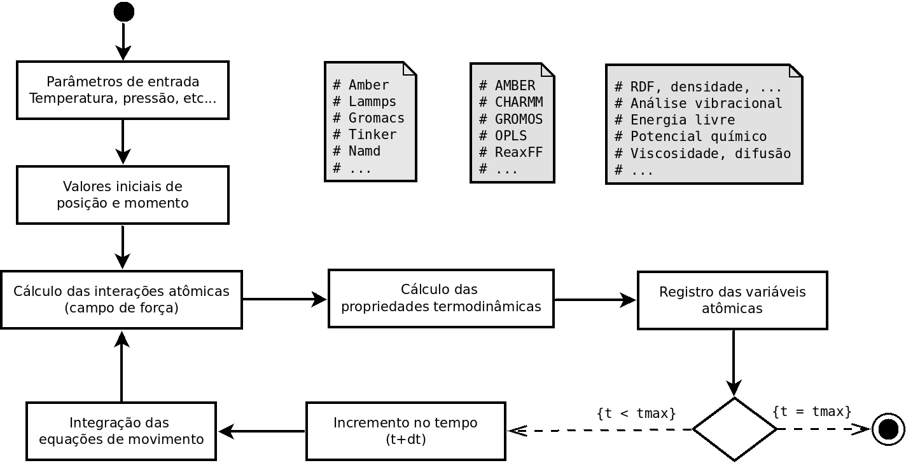

layout: true

```{r setup, include=FALSE}
  options(htmltools.dir.version = FALSE)
#  knitr::opts_chunk$set(fig.path = 'img')
```

```{r, include=FALSE, eval=FALSE, echo=FALSE}
  xaringan::inf_mr()
```

<div class="my-footer"><span>Flaviano Williams Fernandes</span></div>

---
class: middle

<div class="my-header"><span>Flaviano Williams Fernandes</span></div>

# Sumário

1. Cenário atual no campus Irati e pretensões futuras
2. A questão ambiental
3. As vantagens e desvantagens da simulação computacional
4. Mecânica molecular versus Ab initio
5. O método de dinâmica molecular
6. Implementações no programa HICOLM

---
class: middle

<div class="my-header"><span>Cenário atual no campus Irati e pretensões futuras</span></div>

# Linhas de pesquisa

* Cálculo de moléculas orgânicas e inorgânicas em soluções aquosas por dinâmica molecular;
* Análise fisico-química de poluentes em meio aquoso;
* Análise de permeabilidade seletiva de polímeros e demais materiais;
* <alert>Desenvolvimento de campos de força e análise de interação intra/intermolecular de átomos e moléculas.</alert>

# Cenário atual

.pull-left70[
1. Um projeto de pesquisa cadastrado no siscope.
2. Dois alunos de iniciação científica (PIAP, Pibic-Jr).
3. Uma publicação em revista nacional indexada na base scopus.
4. Apresentação de um trabalho no colóquio.
5. Recursos materiais:
  * Um servidor xeon quadi-core (PIAP).
  * Cenapad-Unicamp.
]
.pull-right30[
```{r, echo=FALSE, fig.align='center',out.width="65%"}
  
```
]

---
class: middle

<div class="my-header"><span>Cenário atual no campus Irati e pretensões futuras</span></div>

# Pretensões futuras

1. Dois projetos de pesquisa cadastrados no siscope.
2. No mínimo dois alunos de iniciação científica bolsistas (Pibic e Pibic-Jr).
3. Alunos de iniciação científica voluntários (sem bolsa).
4. Publicações em revistas nacionais e internacionais.
5. Participações em eventos nacionais e internacionais (aluno e/ou professor).
6. Desenvolvimento de softwares na área da química computacional.
7. Apresentação de resultados da pesquisa no colóquio.
8. Ampliação do ambiente computacional (expansão para um cluster do tipo bewoulf de alta performance).
9. Projetos de extensão (<alert>minicursos</alert>).

---
class: left, middle

<div class="my-header"><span>A questão ambiental</span></div>

.pull-left70[
* Aquecimento global;
* Surgimento de vírus e outras entidades patológicas;
* Uso desenfreado de agrotóxicos;
* Poluição de mares e rios.
]
.pull-right30[
```{r, echo=FALSE, fig.align='center',fig.cap='Fonte: BBC Brasil.',out.width="120%",fig.asp=1,fig.ncol=2}
  knitr::include_graphics("img/montagem.png")
```
]
.pull-left30[
```{r, echo=FALSE, fig.align='center',out.width="90%",fig.asp=1,fig.ncol=2}
  knitr::include_graphics("img/agrotoxicos-parana.png")
```
]
.pull-right70[
* O Brasil é o maior consumidor de agrotóxicos no mundo e o estado do Paraná representa 30% desse consumo ([doi:10.1590/0103-1104201811714](https://doi.org/10.1590/0103-1104201811714));
* Impactos ambientais vem sendo causados em diversas cidades do estado do Paraná devido ao uso de agrotóxicos;
* Agrotóxicos e os danos na saúde humana;
]

---
class: center, middle

<div class="my-header"><span>Mecânica molecular versus Ab initio</span></div>

.pull-left[
```{r, echo=FALSE, fig.align='center',fig.cap='Métodos utilizados em diversos sistemas físicos.',out.width="100%"}
  knitr::include_graphics("img/metodos-comparacao.png")
```
]
.pull-right[
* O custo computacional aumenta com a quantidade de átomos;
* A precisão diminui com a quantidade de átomos;
* O nível de detalhamento aumenta de coarse-grained para cálculos de estrutura eletrônica;
* Quanto maior o nível de detalhamento maior será o custo computacional.
```{r, echo=FALSE, fig.align='center',fig.cap='Escala de tempo de cada sistema e seu comportamento (Leandro Martínez - IFSC).',out.width="90%"}
  knitr::include_graphics("img/escala-tempo.png")
```
]

---

<div class="my-header"><span>O método de dinâmica molecular</span></div>

```{r, echo=FALSE, fig.align='center',fig.cap='Fluxograma mostrando o ciclo MD.',out.width="100%"}
  
```

---
class: left, middle

<div class="my-header"><span>Publicações envolvendo dinâmica molecular</span></div>

.pull-left[
* Pesquisa feita no google scholar revelou aproximadamente 2760 publicações em 2020 envolvendo as palavras chaves "molecular dynamics" e "COVID-19";
]
.pull-right[
```{r, echo=FALSE, fig.align='center',fig.cap='Número de publicações anuais (google scholar).',out.width="80%"}
  
```
]

---
class: left, middle

<div class="my-header"><span>Programa utilizado para a MD</span></div>

# Para o desenvolvimento do projeto algumas etapas estão sendo providenciadas:

* Ferramentas para o trabalho em equipe e online (softwares <alert>open source</alert> e ambiente computacional);
* Qualificação de alunos cadastrados em projetos no SISCOPE;
* Colaborações com professores teóricos e experimentais.

A figura a seguir mostra o [repositório](https://github.com/flavianowilliams) do programa HICOLM <alert>(leia o arquivo Readme!!!)</alert>.

.pull-left[
```{r, echo=FALSE,out.width="90%",fig.cap='Página inicial no GitHub.',fig.align='center'}
  knitr::include_graphics("img/pagina-github.png")
```
]
.pull-left[
```{r, echo=FALSE,out.width="90%",fig.cap='Repositório do programa.',fig.align='center'}
  knitr::include_graphics("img/repositorio-github.png")
```
]

---
class: left, middle

<div class="my-header"><span>Ambiente computacional</span></div>

* Atualmente temos disponível um servidor xeon com oito unidades de processamento.
* Também temos acesso aos servidores da Unicamp (Cenapad-Unicamp).

*No servidor diversos softwares (open source) foram instalados e configurados para o desenvolvimento do trabalho, como o [gânglia](http://192.168.0.107/ganglia) para o monitoramento online.*

.pull-left[
```{r, echo=FALSE, fig.align='center',fig.cap='http://localhost/ganglia',out.width="100%"}
  knitr::include_graphics("img/ganglia.png")
```
]
.pull-right[
```{r, echo=FALSE, fig.align='center',fig.cap='Visualização de processos pelo htop.',out.width="100%"}
  knitr::include_graphics("img/htop.png")
```
]

---
class: left

<div class="my-header"><span>Implementações no programa HICOLM</span></div>

# Critérios adotados para tornar o programa inclusivo

* Fácil instalação exigindo o mínimo de bibliotecas externas e outras dependências (atualmente para a instalação são necessários os programas gfortran e r-base).

* Simplicidade na preparação dos arquivos de entrada com a quantidade mínima de flags obrigatórias.

* Campo de força implementado por padrão:
  * O programa possui uma biblioteca interna contendo os parâmetros dos potenciais baseados no modelo AMBER99;
  * As coordenadas internas (ligação, angular e torsão) são obtidas automaticamente através da matriz Z;
  * As interações intermoleculares são obtidas automaticamente;
  * O usuário tem a opção de otimizar manualmente o campo de força;
  * Um relatório detalhado do campo de força é apresentado em um arquivo de log. afim de conferência.
* Algoritmos de minimização da energia vem sendo trabalhado afim de tornar a etapa de otimização simples e rápida.
* Suporte gráfico para análise de dados e geração de relatórios com a ferramenta R.
* Documentação [online](https://github.com/flavianowilliams/HICOLM/wiki).

---
class: left

<div class="my-header"><span>Implementações no programa HICOLM</span></div>

# O processo de instalação

Inicialmente o usuário baixa o programa do repositório online através do comando

```
$ wget github.com/flavianowilliams/HICOLM/archive/releases/v2.0.1.zip
```

Em seguida ele descompacta o arquivo e executa o script de instalação,

```
$ sudo ./install
```

Para executar o programa basta digitar

```
$ hicolm
```

.pull-left70[
```
Please, type the compiler or press ENTER (default: gfortran)

Please, type the instructions of compilation or press ENTER

Please, type the installation directory or press ENTER (default: /usr/local/bin)

Please, type the auxiliary directory or press ENTER (default: /usr/local/share)

Would you like to install HICOLM with graphical support? (default: no)
```
]
.pull-right30[
```{r, echo=FALSE, fig.align='center',fig.cap='Etapas de instalação do programa',out.width="90%"}
  knitr::include_graphics("img/hicolm-instalacao.png")
```
]

---
class: left, middle

<div class="my-header"><span>Implementações no programa HICOLM</span></div>

.pull-left[
Praticamente o arquivo HICOLM.in é constituído por
* Cabeçalho:

@MDPREPARE ou @MDRUNNING

* Seções `&STRUCT`, `&MD` e `&FORCE`:

* Cada seção deve ser finalizada com a linha `&END`.
* Existem parâmetros obrigatórios e opcionais. No caso dos opcionais, se forem omitidos o programa utilizará o valor padrão correspondente.
]
.pull-right[
```{r, echo=FALSE, fig.align='center',fig.cap='HICOLM.in contendo parâmetros da simulação',out.width="90%"}
  
```
]

---
class: left

# Suporte gráfico e estatístico através da ferramenta [R](https://www.r-graph-gallery.com/).

.pull-left[
```{r, echo=FALSE, fig.align='center',out.width="70%"}
  knitr::include_graphics("img/report-1.png")
```
]

.pull-right[
```{r, echo=FALSE, fig.align='center',out.width="70%"}
  
```
]

---
class: left

<div class="my-header"><span>Implementações no programa HICOLM</span></div>

# Propostas futuras

* Impressão de mensagens de aviso e erro contendo dicas e sugestões para a solução do problema;

* Melhoria nas rotinas de minimização de energia (gradiente conjugado, etc...);

* Melhoria na impressão de relatórios e visualização gráfica.

* Documentação mais completa e didaticamente apresentável.

* Compreensão detalhada de interações atômicas e moleculares e contribuição do campo de força

  * Ampliação da base de dados utilizando protocolos específicos de parametrização.
  * Implementação de novos algoritmos e métodos (machine learning, QM/MM, etc...).

* Ofertas de minicursos na área da física, química e ciência de dados.

---
class: middle

<div class="my-header"><span>Agradecimentos</span></div>

1. Proeppi pelo suporte financeiro:

  * Pibic-Jr
  * Piap
  
2. Cenapad-Unicamp pelo suporte técnico.
